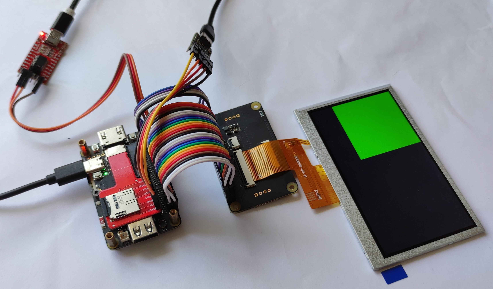
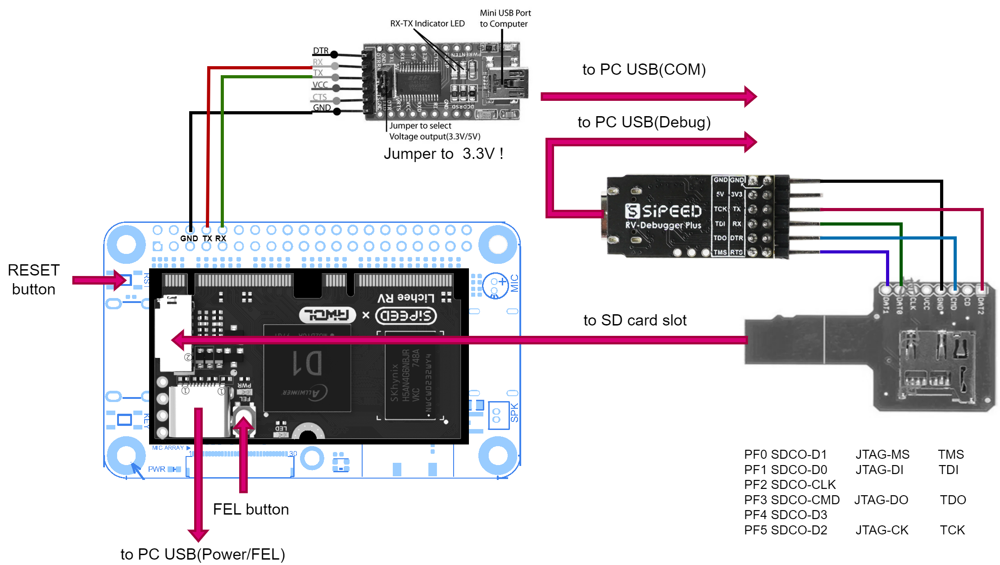
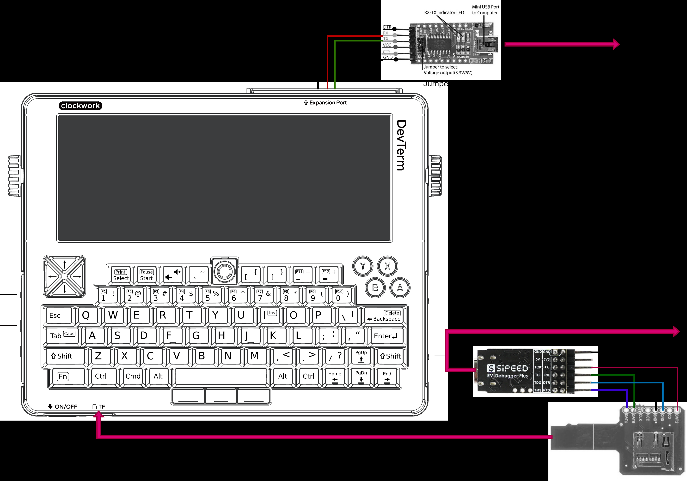
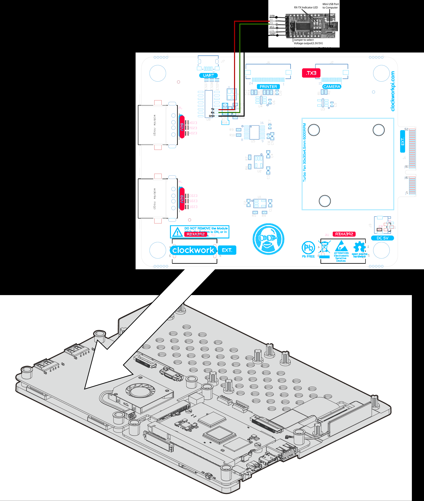

# Overview
This is an experimentation with the [RT-Thread Operating System](https://www.rt-thread.io/) with the [Allwinner D1H](https://d1.docs.aw-ol.com/en/) RISC-V SOC and a Collection of Bootloaders and Developer environment for programming and debugging.  

Executed at hardware such as [Sipeed Lichee RV + Dock](https://wiki.sipeed.com/hardware/en/lichee/RV/Dock.html) and [ClockworkPi DevTerm R01](https://www.clockworkpi.com/home-devterm).  

The intention is to easily run peripherals in D1, exactly Display. RT-Thread OS was chosen because it looks like has the most extensive HAL layer for D1, similar to the [Linux kernel](https://github.com/cuu/last_linux-5.4/tree/master/drivers/video/fbdev/sunxi/) but not so overcomplicated.

At the original repository [RT-Thread](https://github.com/RT-Thread/rt-thread) the compilation is not streamlined for D1H [issue 9063](https://github.com/RT-Thread/rt-thread/issues/9063). So was performed fork from [v5.0.2](https://github.com/RT-Thread/rt-thread/releases/tag/v5.0.2) and introduced several changes to make it runnable in D1H. Added also bootloaders, compiler, debugger, build system.

Introduced code changes described in [Code_changes](documentation/Code_changes.md) document.

## Current progress
RT-Thread could run in Sipeed Lichee RV and manage RGB LCD Display  




# Installation
In repository exist prebuilded images for SD card in folder [image](image), need to flash it to SD card and install to device.
- For Sipeed Lichee RV board please use [image/sd_image_lichee.img](image/sd_image_lichee.img)
- For ClockworkPi DevTerm R01 board please use [image/sd_image_devterm.img](image/sd_image_devterm.img)

## Windows
Could use https://etcher.balena.io/#download-etcher for flash image to SD card.

## Linux
Could use command 
```sh
make sd_burn
```
Or
```sh
sudo dd if=image/sd_image_lichee.img of=/dev/sdb bs=512 seek=16 conv=sync
```
*where /dev/sdb - your SD card device

# Run
Configyre UART adapter to 115200 baudrate, 8N1. And connect to UART pins as shown in [Hardware section](#hardware).    

Insert flashed SD card to device and power on, should see at the end of output like this:
```
 \ | /
- RT -     Thread Smart Operating System
 / | \     5.0.2 build Jun  9 2024 21:11:05
 2006 - 2022 Copyright by RT-Thread team
hal_sdc_create 0
card_detect insert
Initial card success. capacity :15200MB
sdmmc bytes_per_secotr:200, sector count:1db0000
not found partition of mbr, construct sd0 at offset 8M, size:0xffffffffb5800000
[D/FAL] (fal_flash_init:47) Flash device |                  sdcard0 | addr: 0x00000000 | len: 0xb6000000 | blk_size: 0x00000200 |initialized finish.
[I/FAL] ==================== FAL partition table ====================
[I/FAL] | name       | flash_dev |   offset   |    length  |
[I/FAL] -------------------------------------------------------------
[I/FAL] | download   | sdcard0   | 0x00800000 | 0x00800000 |
[I/FAL] | easyflash  | sdcard0   | 0x01000000 | 0x00100000 |
[I/FAL] | filesystem | sdcard0   | 0x01100000 | 0x00c00000 |
[I/FAL] =============================================================
[I/FAL] RT-Thread Flash Abstraction Layer initialize success.
Hello RISC-V
msh />Mount "sd0p0" on "/" fail
```
## Repo structure
```sh
$tree -L 2

RT-Thread-on-Allwinner-D1H
    ├── bootloaders
    │   ├── opensbi
    │   ├── sun20i_d1_spl
    │   ├── u-boot (will be created by make !)
    │   └── xfel
    │   ├── opensbi_config
    ├── build
    │   ├── sd.bin
    │   ├── sun20i-d1-lichee-rv-dock.dtb
    │   ├── toc1_D1H.cfg
    │   └── .gdbinit
    ├── debugger (will be created by make !)
    │   ├── bl702_cklink_whole_img_v2.2.bin
    │   ├── blisp
    ├── documentation
    │   ├── Allwinner_D1H
    │   ├── ClockworkPi_DevTerm
    │   ├── RISC-V    
    │   └── Sipeed_Lichee_RV
    ├── image
    │   ├── sd_image_devterm.img
    │   └── sd_image_lichee.img
    ├── rt-thread
    │   ├── bsp/allwinner/d1s_d1h/
    │   ...
    ├── toolchain (will be created by make !)
    │   └── riscv64-linux-musleabi_for_x86_64-pc-linux-gnu
    │   └── riscv64-glibc-gcc-thead_20200702     
    │   └── T-HEAD_DebugServer
    ├── Makefile
    ├── environment.sh
    ├── LICENSE
    └── README.md
```
## Environment
Tested on Ubuntu 22.04.3 64x. On machine need to be installed make enviroment:
```sh
sudo apt install git make build-essential scons libusb-1.0-0-dev libncurses5-dev
```
If needed to specify installation folders for toolchain and u-boot please modify environment.sh script to specify this variables 
- TOOLCHAIN_INSTALL_DIR - path for installation dir for toolchain ex.: $HOME/toolchain
- U_BOOT_INSTALL_DIR - path for installation dir for u-boot bootloader ex.: $HOME/u-boot   

Then execute due each session:
```sh
 source ./environment.sh
```
### Enviroment setup with virtual machine
In my case I was use Windows 10 64x as a host with IDE VSCode and Ubuntu 22.04.3 64x virtual machine as a guest for compilation.   
Repo was downloaded to a shared folder in Windows mounted in Ubuntu, /etc/fstab example
```sh
.host:/ /mnt/hgfs       fuse.vmhgfs-fuse    defaults,allow_other    0    0
```
Notice: in a virtual machine with a mounted shared folder, it isn't possible to create hard links.   
So as toolchain and u-boot use hard links it is impossible to extract toolchain and u-boot files to this mounted folder. Need to use internal filesystem in a virtual machine.   
For this was provided installation folders in environment.sh script described above.

## Build toolchain
Installing toolchain
```sh
make toolchain

* T-HEAD_DebugServer will request specify installation dir: 'Set full installing path:'
  Could be seted as $HOME/toolchain or RT-Thread-on-Allwinner-D1H/toolchain folder
```
Will be installed:
- riscv64-linux-musleabi_for_x86_64-pc-linux-gnu (Used by RT-Thread compilation)
- riscv64-glibc-gcc-thead_20200702 (Need for using GDB)
- T-HEAD_DebugServer (Need for using JTAG connetion)

## Build bootloaders
To compile bootloaders use command
```sh
make bootloaders
```
Will be installed:
- sun20i_d1_spl (first bootloader after BROM, used for init DRAM and load TOC image from MMC)
- u-boot (could used to load Linux image but now just tool to creat TOC image)
- opensbi (Supervisor Binary Interface for platform in M mode)
- xfel (used for debug when platform in FEL mode)

## Build RT-Thread
For configure RT-Thread:
```sh
make rt-conf
```
In menuconfig chooses "General Drivers Configuration" -> "Choose Board" and then choose "Sipeed Lichee RV board" or "ClockworkPi DevTerm R01 board" depend what board do you use.

To compile RT-Thread use command:
```sh
make rt
```
For clean:
```sh
make rt-clean
```
## Build SD card image
To create SD card image in [image](image) folder:
```sh
make sd
```
For flash to SD card:
```sh
make sd_burn
```

## Debugging
For debbugging used Sipeed RV-Debuggr Plus with [T-Head CKLink firmware](https://github.com/bouffalolab/bouffalo_sdk/tree/master/tools/cklink_firmware).   
To connect debugger to board need use MicroSD brakout board because in D1H JTAG pins mapped to SD Card [pins](https://linux-sunxi.org/JTAG) as shown in [Hardware section](#hardware).  

For flash firmware to Sipeed RV-Debuggr Plus - Press and hold the boot pin then plug the usb in the computer to go to the boot mode. And execte command:
```sh
make debug-burn
```
To start GDB session need to use FEL button but surprisedly this works even without it somehow just after power up. Anyway in device that have FEL button (Sipeed Lichee RV) - press and hold the FEL button then press RESET button to go to the FEL mode, then execte command or just execute command (for Clockwork Devterm):
```sh
make debug
```
Should see at the output the like this:
```
+---                                                    ---+
|  T-Head Debugger Server (Build: Oct 21 2022)             |
   User   Layer Version : 5.16.05
   Target Layer version : 2.0
|  Copyright (C) 2022 T-HEAD Semiconductor Co.,Ltd.        |
+---                                                    ---+

...

GDB connection command for CPUs(CPU0):
        target remote 127.0.0.1:1025

...

0x000000000000a22a in ?? ()
Restoring binary file bootloaders/opensbi/build/platform/generic/firmware/fw_dynamic.bin into memory (0x40000000 to 0x40042790)
Restoring binary file build/sun20i-d1-lichee-rv-dock.dtb into memory (0x40200000 to 0x40207b23)
Restoring binary file rt-thread/bsp/allwinner/d1s_d1h/rtthread.bin into memory (0x40400000 to 0x404f0840)
```

## Hardware
- [Sipeed Lichee RV + Dock](https://wiki.sipeed.com/hardware/en/lichee/RV/Dock.html)
- Lichee RV Dock extension LCD adapter board
- 4.3 RGB LCD Display (043026-N6(ML)) with IC ST7001s (SPI)
- [ClockworkPi DevTerm R01](https://www.clockworkpi.com/home-devterm)
- FTDI 2248-c USB/UART adapter
- Sipeed RV-Debuggr Plus
- MicroSD_Sniffer

### Sipeed Lichee RV assembly


### ClockworkPi DevTerm R01 assembly


I figureout that integrated UART work very unstable. Acording [discussion](https://forum.clockworkpi.com/t/devterm-r-01-ext-board-uart-is-read-only/8704)
"The problem is that the CH340C provides 5 V logic levels, whereas the D1 only supports 3.3 V I/O...A better solution would be to solder wires to pins 2 and 3 of the CH340C and use a different USB-UART adapter that runs at the correct voltage." So I do this:


## Links
- https://linux-sunxi.org/Allwinner_Nezha  
- https://andreas.welcomes-you.com/boot-sw-debian-risc-v-lichee-rv-2/  

## TODO
- Twi power control
- Mipi dsi
- Keyboard, trackball
- Build env and RTT gui


