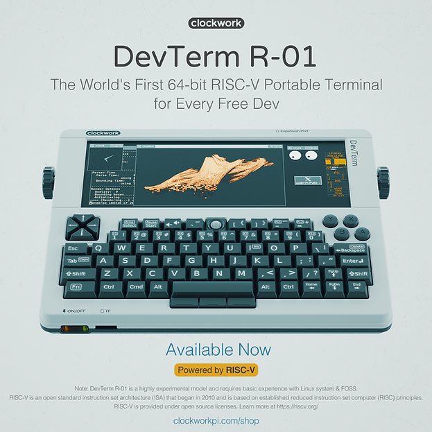

# D1-1. Introduction
[Index](D1_0_index.md) | [Next chapter](D1_2_boot_process.md)

With this introduction I am beginning a series of articles about hobby experimentation with [Allwinner D1H](https://d1.docs.aw-ol.com/en/) RISC-V MCU and the [RT-Thread](https://www.rt-thread.io/) Operating System. The code is available at: https://github.com/ylyamin/RT-Thread-on-Allwinner-D1H  

Next chapters will describe:
- [D1-2. Boot process](D1_2_boot_process.md) - Existing best practices for Allwinner D1H bootloaders, examples of booting Linux and RT-Thread, using JTAG and GDB.
- [D1-3. RT-Thread overview and Build](D1_3_rtt_overview_and_build.md) - An overview of the RT-Thread structure and libraries. Compile RT-Thread for the Allwinner D1H platform.
- [D1-4. Makefile and Hardware changes](D1_4_make_and_hw.md) - My repository structure, Makefile and Hardware changes that needed to be done.
- [D1-5. LCD Display driver](D1_5_lcd_driver.md) - Display driver for [ClockworkPi DevTerm R-01](https://www.clockworkpi.com/home-devterm), [uConsole R-01](https://www.clockworkpi.com/uconsole) and [Sipeed Lichee RV](https://wiki.sipeed.com/hardware/en/lichee/RV/Dock.html).
- [D1-6. USB Keyboard](D1_6_usb_keyboard.md) - USB Keyboard driver for ClockworkPi DevTerm, still not work.

Long story short: 
Initially my dream was to understand how Operating System work at a low level mean: scheduler, memory management and drivers. 
And with Allwinner D1H my dream has come true ... sort of. 
Now seems my hobby is reverse engineering Allwinner products. 

I'm not professional programmer, at the beginning thought that studying OS by diving to Linux Kernel will be too complex and I need to start from ground. Interested in the RISC-V architecture. Play with RISC-V virtualizer is good but not so fun. I want real hardware but without lots of wires, oscilloscope and soldering, just ready-made solution with user input and output to a display (later at some point I bought a soldering iron). 

Found [ClockworkPi DevTerm](https://www.clockworkpi.com/home-devterm) Open Source Portable retro-entertainment Terminal with supports  various core ARM and RISC-V. 

And an additional it can have module: R-01 core with 64-bit RISC-V MCU and 1GB DDR3 memory. Inside R-01 Allwinner D1H  RISC-V SoC - and is where I found pain. 

I thought if Linux can run on this chip, then I could definitely implement some bare-metal drivers. But in reality, the Allwinner documentation very limited regarding peripherals - there are no examples and no standalone libraries.  
Allwinner Drivers in Linux consist of thousand lines of code mixed with all Allwinner platforms and Linux libraries, I can't convert it to bare-metal. 
Why is this so ? Who knows. Maybe the peripherals in the SoC is intellectual property from external suppliers and can only be provided if you have a commercial agreement. 
Anyway, we have enthusiasts who are trying to do something: https://linux-sunxi.org/Allwinner_Nezha, https://github.com/hno/Allwinner-Info.

At one point, I discovered that in the RT-Thread OS (which is an small embedded OS) there is a HAL layer (Hardware Abstraction Layer) for the D1. This HAL is separated from the OS and is located in one place. A closer look reveals that this HAL quite similar to Linux drivers. Also [Melis OS](https://github.com/Tina-Linux/d1s-melis/) looks like RTOS from Allwinner and is has a similar HAL. 
I focused in RT-Thread spent a lot of time to understand boot process, debugging, run RT-Thread in D1H and manage to run MIPI DSI Display by HAL, also have a good progress with USB stack. 

So, this series of articles will cover the knowledge and experience I gained from working with the Allwinner D1H and RT-Thread. 
I hope someone finds something useful, RT-Thread have big potential as a bare-metal experimentation platform for the D1, as it includes many packages for GUI, audio, Ethernet, and more. 
Maybe someone can help me with USB driver, please. I am ready for issue reports and pull requests. 
Lets go to the next chapter. 

[Index](D1_0_index.md) | [Next chapter](D1_2_boot_process.md)

TODO:
- try [PR](https://github.com/RT-Thread/rt-thread/pull/9142) for d1s in d1h
- create RTT mirror and new PR for d1h common folder
- create new PR for display drivers

