# D1-5. LCD Display driver
[Prev chapter](D1_4_make_and_hw.md) | [Index](D1_0_index.md) | [Next chapter](D1_6_usb_keyboard.md)

In this chapter we will learn haw control display in Devterm (found is MIPI DSI LCD display).<br>
And some experiment with uConsole dispaly.<br>
Also I have Sipeed Lichee RV with 4.3 RGB LCD Display. That we will bring up too, will be described at the end. 

## DevTerm display

### Define Display type
DevTerm use 6.86 inch LCD Display.<br>
How I can control this display ? First of all what interfaces and chip this display have ?<br>

So looking to ClockworkPi repository can found folder 'patch' for d1 https://github.com/clockworkpi/DevTerm/tree/main/Code/patch/d1 and we found file board.dts. DTS is Linux Device Tree Source file that describes the system's hardware layout.

<details><summary>board.dts file:</summary>

```
&lcd0 {
	lcd_used            = <1>;
	lcd_driver_name     = "icn9707_480x1280";
	lcd_backlight       = <50>;
	lcd_if              = <4>;
```
</details>
<br>
Defined lcd_driver_name	= icn9707_480x1280 and lcd_if = 4 <br>
And below in comments say "lcd_if: 0:hv(sync+de); 1:8080; 2:ttl; 3:lvds; 4:dsi; 5:edp; 6:extend dsi" so our case we have icn9707 with DSI.

Also in https://github.com/clockworkpi/DevTerm/tree/main/Schematics we have Datasheet for icn9707 - [ICNL9707_Datasheet.pdf](ClockworkPi_DevTerm/ICNL9707_Datasheet.pdf) where in Description say:

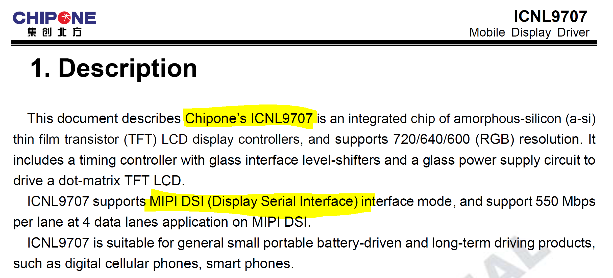 

Ok our Display is 6.86 inch LCD Display with MIPI DSI interface and inc9707 IC (integrated chip), great.<br>
What is MIPI DSI ? According https://en.wikipedia.org/wiki/Display_Serial_Interface:

"The Display Serial Interface (DSI) is a specification by the Mobile Industry Processor Interface (MIPI) Alliance aimed at reducing the cost of display controllers in a mobile device."

"At the physical layer, DSI specifies a high-speed (e.g., 4.5 Gbit/s/lane for D-PHY 2.0[3]) differential signaling point-to-point serial bus. This bus includes one high speed clock lane and one or more data lanes. Each lane is carried on two wires (due to differential signaling). "

"The communication protocol describes two sets of instructions. The Display Command Set (DCS) ... Manufacturer Command Set (MCS) ... There are Short and Long Packets, Short Packet is 4 bytes long; Long Packet can be of any length up to 216 bytes."

In [ICNL9707_Datasheet.pdf](ClockworkPi_DevTerm/ICNL9707_Datasheet.pdf) we can see used 4 lines D0-D3 (each line is two wires N/P)
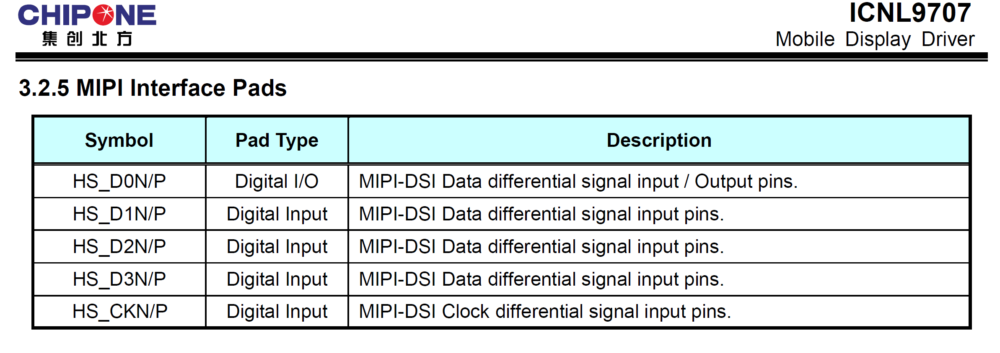 

### Dispaly connection

Lets look how is connected to D1H. Display connected to Mainboard by 40pins ribbon cable: 

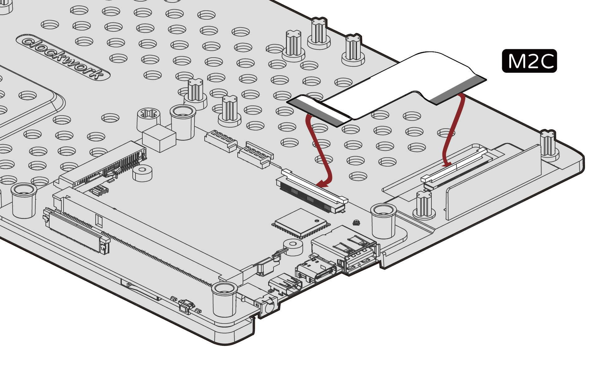

From Devterm Mainboard PCB outline file [pcb_3.14_botton.pdf](ClockworkPi_DevTerm/pcb_3.14_botton.pdf) we can see is connected to J302 connector:

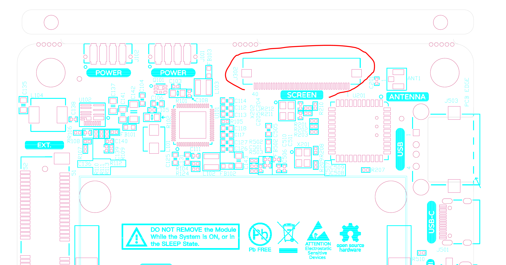

That J302 we can find in  Mainboard schematic file [clockwork_Mainboard_V3.14_V5_Schematic.pdf](ClockworkPi_DevTerm/clockwork_Mainboard_V3.14_V5_Schematic.pdf)

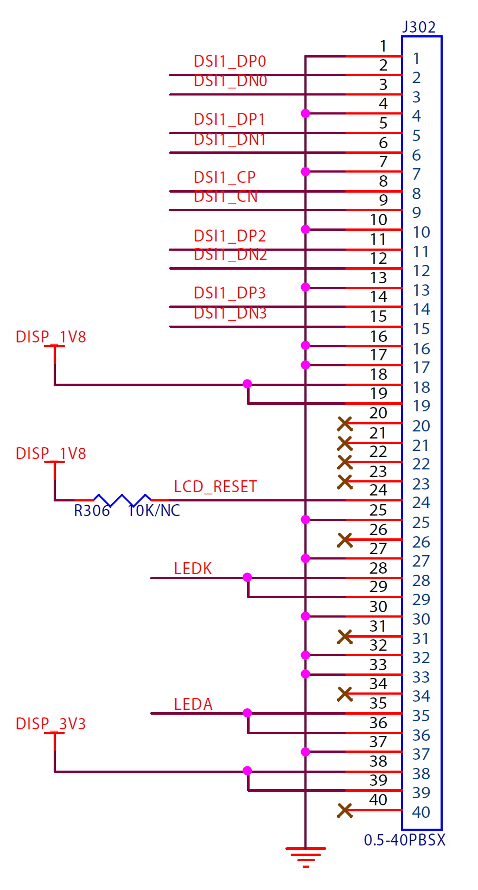

4 line of MIPI DSI go to core connector:

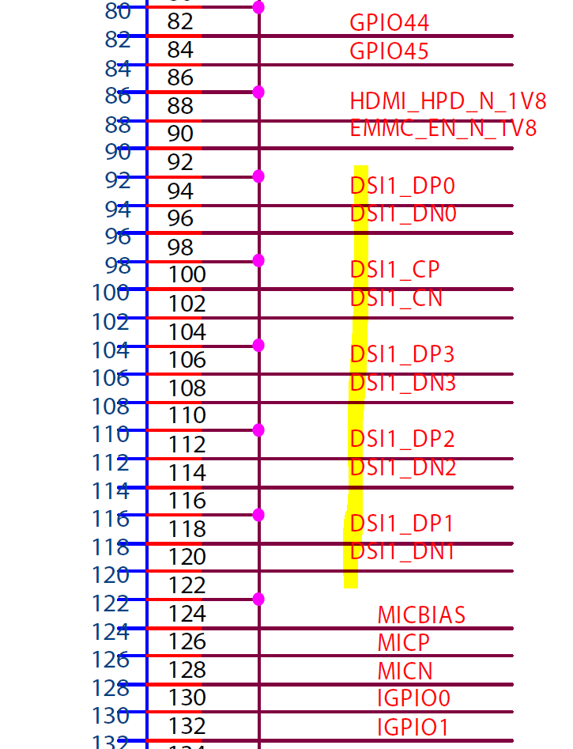

And then to R01 Core and to D1H chip pins PD0-PD9:

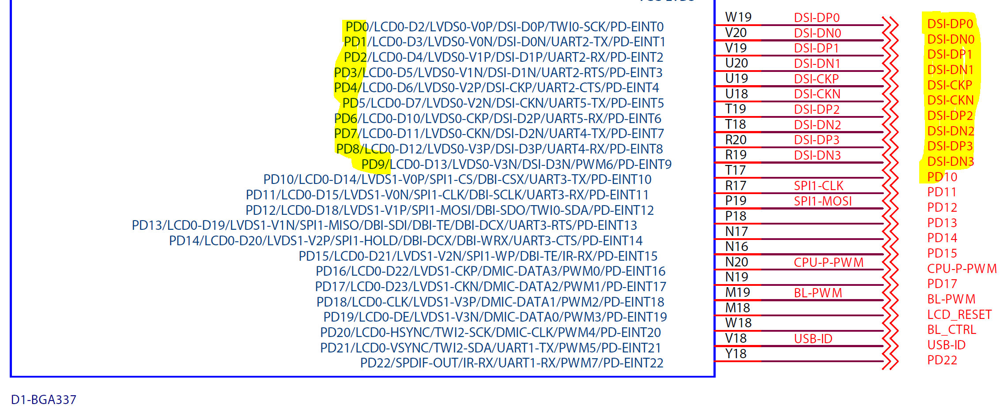

Good. Understand how is connected to D1H, next how to control it ?

### D1H Documentation

Looking to the D1H User manual [D1_User_Manual_V0.1_Draft_Version.pdf](Allwinner_D1H/D1_User_Manual_V0.1_Draft_Version.pdf)<br>
What we have about how control Video out and MIPI DSI ? Not too much: 
* TCON LCD controller short overview
* Registers list
* Short Overview of MIPI DSI capabilities

From manual is not clear how to control it.<br>

### Display HAL driver

As is no explanation how is should be initialized in documentation need to look to code.<br>
In RTT sunxi-hal we have folder **disp2** [rt-thread/bsp/allwinner/libraries/sunxi-hal/hal/source/disp2](rt-thread/bsp/allwinner/libraries/sunxi-hal/hal/source/disp2).<br>
File sunxi-hal/hal/SConscript defined build rules about HAL for RTT.  

<details><summary>SConscript file:</summary>

```python
disp2_src = Split('''
./source/disp2/disp/de/disp_manager.c
./source/disp2/disp/de/disp_lcd.c
.
'''

if GetDepend('DISP2_SUNXI'):
    CPPPATH += disp2_path
    src += disp2_src + disp2_test_src
```
</details>
<br>
<details><summary>So lets define this in config:</summary>

```patch
diff --git a/rt-thread/bsp/allwinner/d1s_d1h/.config b/rt-thread/bsp/allwinner/d1s_d1h/.config
index 17f622d73..25fa3db03 100644
--- a/rt-thread/bsp/allwinner/d1s_d1h/.config
+++ b/rt-thread/bsp/allwinner/d1s_d1h/.config

+CONFIG_RT_USING_LCD=y
+CONFIG_BSP_USING_LCD=y
+CONFIG_DISP2_SUNXI=y
```
</details>

Lets run board and see what happen. Notfing shown in console about display.<br>
Need to change debug level in file rt-thread\bsp\allwinner\libraries\libos\include\log.h

```patch
-#define DBG_LVL DBG_ERROR
+#define DBG_LVL DBG_INFO
```

Now in console present information about disp driver. I captured console out not at this moment I am much later, but the essence does not change.

<details><summary>Console out:</summary>

```sh
Hello RISC-V
[I/DBG] disp:[disp_probe 1078][DISP]disp_probe
[I/DBG] disp:[disp_init 824]disp_init start
[I/DBG] disp:[parser_disp_init_para 517]of_property_read screen0_output_format fail
[I/DBG] disp:[parser_disp_init_para 524]of_property_read screen0_output_bits fail
[I/DBG] disp:[parser_disp_init_para 531]of_property_read screen0_output_eotf fail
[I/DBG] disp:[parser_disp_init_para 538]of_property_read screen0_output_cs fail
[I/DBG] disp:[parser_disp_init_para 545]of_property_read screen0_output_dvi_hdmi fail
[I/DBG] disp:[parser_disp_init_para 552]of_property_read screen0_output_range fail
[I/DBG] disp:[parser_disp_init_para 559]of_property_read screen0_output_scan fail
[I/DBG] disp:[parser_disp_init_para 566]of_property_read screen0_output_aspect_ratio fail
[I/DBG] disp:[parser_disp_init_para 599]of_property_read screen1_output_mode fail
[I/DBG] disp:[parser_disp_init_para 606]of_property_read screen1_output_format fail
[I/DBG] disp:[parser_disp_init_para 614]of_property_read screen1_output_bits fail
[I/DBG] disp:[parser_disp_init_para 622]of_property_read screen1_output_eotf fail
[I/DBG] disp:[parser_disp_init_para 630]of_property_read screen1_output_cs fail
[I/DBG] disp:[parser_disp_init_para 638]of_property_read screen1_output_dvi_hdmi fail
[I/DBG] disp:[parser_disp_init_para 647]of_property_read screen1_output_range fail
[I/DBG] disp:[parser_disp_init_para 655]of_property_read screen1_output_scan fail
[I/DBG] disp:[parser_disp_init_para 664]read screen1_output_aspect_ratio fail
[I/DBG] disp:[parser_disp_init_para 678]of_property_read disp_init.fb0_format fail
[I/DBG] disp:[parser_disp_init_para 684]of_property_read fb0_width fail
[I/DBG] disp:[parser_disp_init_para 690]of_property_read fb0_height fail
[I/DBG] disp:[parser_disp_init_para 715]====display init para begin====
[I/DBG] disp:[parser_disp_init_para 716]b_init:1
[I/DBG] disp:[parser_disp_init_para 717]disp_mode:0
[I/DBG] disp:[parser_disp_init_para 719]output_type[0]:1
[I/DBG] disp:[parser_disp_init_para 720]output_mode[0]:0
[I/DBG] disp:[parser_disp_init_para 719]output_type[1]:0
[I/DBG] disp:[parser_disp_init_para 720]output_mode[1]:0
[I/DBG] disp:[parser_disp_init_para 723]buffer_num[0]:2
[I/DBG] disp:[parser_disp_init_para 724]format[0]:0
[I/DBG] disp:[parser_disp_init_para 725]fb_width[0]:0
[I/DBG] disp:[parser_disp_init_para 726]fb_height[0]:0
[I/DBG] disp:[parser_disp_init_para 723]buffer_num[1]:0
[I/DBG] disp:[parser_disp_init_para 724]format[1]:0
[I/DBG] disp:[parser_disp_init_para 725]fb_width[1]:0
[I/DBG] disp:[parser_disp_init_para 726]fb_height[1]:0
[I/DBG] disp:[parser_disp_init_para 728]====display init para end====
[I/DBG] disp:[disp_init 842]mod 0, base=0x5000000, irq=0
[I/DBG] disp:[disp_init 842]mod 1, base=0x5460000, irq=0
[I/DBG] disp:[disp_init 842]mod 2, base=0x5461000, irq=106
[I/DBG] disp:[disp_init 842]mod 3, base=0x5470000, irq=107
[I/DBG] disp:[disp_init 842]mod 4, base=0x0, irq=0
[I/DBG] disp:[disp_init 842]mod 5, base=0x0, irq=0
[I/DBG] disp:[disp_init 842]mod 6, base=0x5450000, irq=108
[I/DBG] disp:[disp_init 842]mod 7, base=0x0, irq=0
[I/DBG] disp:[disp_init 842]mod 8, base=0x0, irq=0
[I/DBG] disp:[disp_init 842]mod 9, base=0x0, irq=0
[I/DBG] disp:[disp_init 842]mod 10, base=0x0, irq=0
[I/DBG] disp:[disp_init 842]mod 11, base=0x0, irq=0
[I/DBG] disp:[disp_init 842]mod 12, base=0x0, irq=0
[I/DBG] disp:[disp_init 842]mod 13, base=0x0, irq=0
[I/DBG] disp:[disp_init 842]mod 14, base=0x0, irq=0
[I/DBG] disp:[de_rtmx_set_gld_reg_base 485]sel=0x0, addr=0x0x00000000405e9d20
[I/DBG] disp:[de_rtmx_init 291]disp_sys_malloc memory ok(0x0x00000000405e9d60) for video channel    
[I/DBG] disp:[de_rtmx_set_overlay_reg_base 524]sel=0x0, overlayer 0, addr=0x0x00000000405e9d60
[I/DBG] disp:[de_rtmx_set_overlay_reg_base 524]sel=0x0, overlayer 1, addr=0x0x00000000405ea2b0      
[I/DBG] disp:[de_rtmx_set_bld_reg_base 502]sel=0, base=0x0x00000000405ea7e0
[I/DBG] disp:[de_vsu_set_reg_base 196]sel=0, chno=0, base=0x0x00000000405ea908
[I/DBG] disp:[de_gsu_set_reg_base 160]sel=0, chno=0, base=0x0x00000000405eb1b0
[I/DBG] disp:[de_rtmx_set_gld_reg_base 485]sel=0x1, addr=0x0x00000000405eb418
[I/DBG] disp:[de_rtmx_init 291]disp_sys_malloc memory ok(0x0x00000000405eb458) for video channel    
[I/DBG] disp:[de_rtmx_set_overlay_reg_base 524]sel=0x1, overlayer 0, addr=0x0x00000000405eb458      
[I/DBG] disp:[de_rtmx_set_bld_reg_base 502]sel=1, base=0x0x00000000405eb9f8
[I/DBG] disp:[de_vsu_set_reg_base 196]sel=1, chno=0, base=0x0x00000000405ebb20
[I/DBG] disp:[de_lti_init 69]sel 0, lti_base[0]=0x0x00000000051a4000
[I/DBG] disp:[de_peak_init 79]sel 0, peak_base[0]=0x0x00000000051a6000
[I/DBG] disp:[de_peak_set_reg_base 44]sel=0, chno=0, base=0x0x00000000405ed4e8
[I/DBG] disp:[de_ase_init 68]sel 0, ase_base[0]=0x0x00000000051a8000
[I/DBG] disp:[de_ccsc_set_reg_base 48]sel=0, chno=0, base=0x0x00000000405ed640
[I/DBG] disp:[de_ccsc_init 212]sel0, Icsc_base[0]=0x0x00000000051a0040
[I/DBG] disp:[de_icsc_set_reg_base 56]sel=0, chno=0, base=0x0x00000000405ed6b0
[I/DBG] disp:[de_ccsc_set_reg_base 48]sel=1, chno=0, base=0x0x00000000405ed6f0
[I/DBG] disp:[de_dcsc_init 177]sel 0, Dcsc_base=0x0x00000000051b0000
[I/DBG] disp:[de_dcsc_set_reg_base 40]sel=0, base=0x0x00000000405ed760
[I/DBG] disp:[de_dcsc_init 177]sel 1, Dcsc_base=0x0x00000000052b0000
[I/DBG] disp:[de_dcsc_set_reg_base 40]sel=1, base=0x0x00000000405ed7d0
[I/DBG] disp:[wb_ebios_set_reg_base 71]sel=0, base=0x0x0000000005010000
[I/DBG] disp:[disp_init_lcd 2529]disp_init_lcd
[I/DBG] disp:[disp_init_lcd 2598]total number of clk in dsi:1
[I/DBG] disp:[disp_init_lcd 2600]lcd 0, irq_no=106, irq_no_dsi=108
[I/DBG] disp:[lcd_clk_init 512]lcd 0 clk init
[I/DBG] disp:[disp_init_mgr 1666]disp_init_mgr
[I/DBG] disp:[disp_init_mgr 1698]mgr 0, 0x0x00000000405ef790
[I/DBG] disp:[disp_init_mgr 1698]mgr 1, 0x0x00000000405ef8f8
[I/DBG] disp:[disp_init_lyr 684]disp_init_lyr
[I/DBG] disp:[disp_init_enhance 685]disp_init_enhance
[I/DBG] disp:[disp_init_connections 421]disp_init_connections
[I/DBG] disp:[disp_get_layer_1 121]disp0 layer0: 0,0,0
[I/DBG] disp:[disp_get_layer_1 121]disp0 layer1: 0,0,1
[I/DBG] disp:[disp_get_layer_1 121]disp0 layer2: 0,0,2
[I/DBG] disp:[disp_get_layer_1 121]disp0 layer3: 0,0,3
[I/DBG] disp:[disp_get_layer_1 121]disp0 layer4: 0,1,0
[I/DBG] disp:[disp_get_layer_1 121]disp0 layer5: 0,1,1
[I/DBG] disp:[disp_get_layer_1 121]disp0 layer6: 0,1,2
[I/DBG] disp:[disp_get_layer_1 121]disp0 layer7: 0,1,3
[I/DBG] disp:[disp_device_set_manager 22]device 0, mgr 0
[I/DBG] disp:[disp_get_layer_1 121]disp1 layer8: 1,0,0
[I/DBG] disp:[disp_get_layer_1 121]disp1 layer9: 1,0,1
[I/DBG] disp:[disp_get_layer_1 121]disp1 layer10: 1,0,2
[I/DBG] disp:[disp_get_layer_1 121]disp1 layer11: 1,0,3
```
</details>
<br>

But board just stuck (freeze) in some point. Stop respond to command.<br>
Need to debug where in code is happen.

#### Change driver initialization
In original RTT repo LCD driver init as a application inside main() function, in this case is impossible to debug it in GDB as is executed in RTT thread. Maybe I can do something to use gdb thread command but didn't know how.<br>
So change it to init display driver as a device that executed before scheduler start.

<details><summary>Change main:</summary>

```patch
git diff bde29ac...36594b5 rt-thread/ > diff.patch

diff --git a/rt-thread/bsp/allwinner/d1s_d1h/applications/main.c b/rt-thread/bsp/allwinner/d1s_d1h/applications/main.c
index 902db7082..994011733 100644
--- a/rt-thread/bsp/allwinner/d1s_d1h/applications/main.c
+++ b/rt-thread/bsp/allwinner/d1s_d1h/applications/main.c
@@ -13,11 +13,5 @@
 int main(void)
 {
     printf("Hello RISC-V\n");
-
-#ifdef BSP_USING_LCD
-    extern int rt_hw_lcd_init(void);
-    rt_hw_lcd_init();
-#endif // BSP_USING_LCD
-
     return 0;
 }

diff --git a/rt-thread/bsp/allwinner/libraries/drivers/drv_lcd.c b/rt-thread/bsp/allwinner/libraries/drivers/drv_lcd.c
index 327aa777f..0b1737df2 100644
--- a/rt-thread/bsp/allwinner/libraries/drivers/drv_lcd.c
+++ b/rt-thread/bsp/allwinner/libraries/drivers/drv_lcd.c
@@ -750,7 +750,7 @@ int rt_hw_lcd_init(void)
 
     return RT_EOK;
 }
-// INIT_DEVICE_EXPORT(rt_hw_lcd_init);
+ INIT_DEVICE_EXPORT(rt_hw_lcd_init); //when init as a device and not a application in main then could be debugged by gdb
```
</details>

#### LCD driver stuck
With GDB I understander that with original implementation board stuck by some reason in function hal_msleep() that call rt_thread_mdelay(), replace it to rt_hw_us_delay() then is help.

<details><summary>Change disp_sys_intf.c:</summary>

```patch
diff --git a/rt-thread/bsp/allwinner/libraries/sunxi-hal/hal/source/disp2/disp/disp_sys_intf.c b/rt-thread/bsp/allwinner/libraries/sunxi-hal/hal/source/disp2/disp/disp_sys_intf.c
index 09c64b396..31f370d3d 100644
--- a/rt-thread/bsp/allwinner/libraries/sunxi-hal/hal/source/disp2/disp/disp_sys_intf.c
+++ b/rt-thread/bsp/allwinner/libraries/sunxi-hal/hal/source/disp2/disp/disp_sys_intf.c
@@ -157,13 +157,22 @@ hal_clk_id_t disp_sys_clk_get_parent(hal_clk_id_t clk)
 
 s32 disp_delay_ms(u32 ms)
 {
-    return hal_msleep(ms);
+    /*
+        with original implementation hal_msleep() 
+        board stuck by some reason, replace to rt_hw_us_delay()
+    */
+    //return hal_msleep(ms);
+    rt_hw_us_delay(ms*1000);
 }
 
 s32 disp_delay_us(u32 us)
 {
-
-    return hal_usleep(us);
+    /*
+        with original implementation hal_msleep() 
+        board stuck by some reason, replace to rt_hw_us_delay()
+    */
+    //return hal_usleep(us);
+    rt_hw_us_delay(us);
 }
```
</details>

Now is Not stuck but display still blank.<br>
Try run test command:
```sh
lcd_draw_point 100 100
```
Nothing shown in display. So I do conclusion is not work properly.

### Example in Linux

So looks like RTT sunxi-hal do something with display but is not run properly. Need to look to code that run in correctly. lets look how it work in Linux.<br> 
First need to find proper Linux version.<br>
In Clockworkpi wiki https://github.com/clockworkpi/DevTerm/wiki/Create-DevTerm-R01-OS-image-from-scratch#how-to-compile-kernel says they used https://github.com/cuu/last_linux-5.4.git<br>
"it is a mirror kernel code from tina_d1_h of all winner with all patched for devterm R-01"

And also looking to Clockworkpi repository is have patch for display https://github.com/clockworkpi/DevTerm/blob/main/Code/patch/d1/disp.patch that affect file linux/drivers/video/fbdev/sunxi/disp2/disp/dev_fb.c

So looking to https://github.com/cuu/last_linux-5.4.git to folder "linux/drivers/video/fbdev/sunxi/disp2/disp/"<br>
looks like prety the same structure as<br>
in RTT "sunxi-hal/hal/source/disp2/disp/"<br>
Looks like Allwinner create drivers for Linux first then converter it to HAL for RTT.<br> 

This display drivers based in **fbdev**.<br>
According https://en.wikipedia.org/wiki/Linux_framebuffer<br>
"The Linux framebuffer (fbdev) is a linux subsystem used to show graphics on a computer monitor, typically on the system console.[1]" <br>
"In most applications, fbdev has been superseded by the Linux Direct Rendering Manager subsystem" <br>

(And yes in latest Linux kernel sunxi fbdev suspended by **drm** in https://github.com/torvalds/linux/tree/master/drivers/video/fbdev folder is no folder sunxi but in DRM we have sunxi stuff https://github.com/torvalds/linux/tree/master/drivers/gpu/drm/sun4i. Also Smaeul fork work with DRM https://github.com/smaeul/linux/blob/d1/all/drivers/gpu/drm/panel/panel-clockwork-cwd686.c)

Anyway in RTT HAL use **fbdev** and we can figure out how it used in linux-5.4

### Add LCD Display driver   

In RTT folder disp2/disp/lcd/ - looks like is folder with specific display IC implementation, but is not contain anything about inc9707.<br>
In Linux the same folder sunxi/disp2/disp/lcd/ contain file https://github.com/cuu/last_linux-5.4/blob/master/drivers/video/fbdev/sunxi/disp2/disp/lcd/icn9707_480x1280.c.<br> 

So just copy from Linux to RTT:
```patch
+++ b/rt-thread/bsp/allwinner/libraries/sunxi-hal/hal/source/disp2/disp/lcd/icn9707_480x1280.c
+++ b/rt-thread/bsp/allwinner/libraries/sunxi-hal/hal/source/disp2/disp/lcd/icn9707_480x1280.h
```

<details><summary>Need add this driver file to RTT build:</summary>

```patch
diff --git a/rt-thread/bsp/allwinner/libraries/sunxi-hal/hal/SConscript b/rt-thread/bsp/allwinner/libraries/sunxi-hal/hal/SConscript
+if GetDepend('LCD_SUPPORT_ICN9707_480x1280'):
+    disp2_src += ['./source/disp2/disp/lcd/icn9707_480x1280.c']
```
</details>

<details><summary>And define config values:</summary>

```patch
diff --git a/rt-thread/bsp/allwinner/libraries/sunxi-hal/hal/source/disp2/disp/lcd/Kconfig b/rt-thread/bsp/allwinner/libraries/sunxi-hal/hal/source/disp2/disp/lcd/Kconfig 
+config LCD_SUPPORT_ICN9707_480x1280
+    bool "LCD support ICN9707_480x1280 panel"
+    default n
+    ---help---
+        If you want to support ICN9707_480x1280 panel for display driver, select it.
```
</details>

<details><summary>RTT cuts off CONFIG_ prefix so redefine this:</summary>

```patch
diff --git a/rt-thread/bsp/allwinner/libraries/sunxi-hal/hal/kconfig.h b/rt-thread/bsp/allwinner/libraries/sunxi-hal/hal/kconfig.h
+#if defined(LCD_SUPPORT_ICN9707_480x1280)
+#define CONFIG_LCD_SUPPORT_ICN9707_480x1280 1
+#endif
```
</details>

In icn9707_480x1280.c file defined function LCD_open_flow

<details><summary>LCD_open_flow:</summary>

```c
static s32 LCD_open_flow(u32 sel)
{
    printk("raoyiming +++ LCD_open_flow\n");
    LCD_OPEN_FUNC(sel, LCD_power_on, 100);   //open lcd power, and delay 50ms
    LCD_OPEN_FUNC(sel, LCD_panel_init, 0);   //open lcd power, than delay 200ms
    LCD_OPEN_FUNC(sel, sunxi_lcd_tcon_enable, 200);     //open lcd controller, and delay 100ms
    LCD_OPEN_FUNC(sel, LCD_bl_open, 0);     //open lcd backlight, and delay 0ms
    printk("raoyiming +++ LCD_open_flow finish\n");
    return 0;
}
```
</details>

LCD_open_flow call sequence of function to LCD power, LCD init, enable D1 TCON and then up LCD backlight.

In LCD init transfer by DSI some magic initialization settings:
<details><summary> lcd_init_setting:</summary>

```c
static struct lcd_setting_table lcd_init_setting[] = {

	{0xF0, 2, {0x5A, 0x59} },
	{0xF1, 2, {0xA5, 0xA6} },
	{0xB0, 14, {0x54,0x32,0x23,0x45,0x44,0x44,0x44,0x44,0x9F,0x00,0x01,0x9F,0x00,0x01} },
	{0xB1, 10, {0x32,0x84,0x02,0x83,0x29,0x06,0x06,0x72,0x06,0x06} },
	{0xB2, 1, {0x73} },
	{0xB3, 20, {0x0B,0x09,0x13,0x11,0x0F,0x0D,0x00,0x00,0x00,0x03,0x00,0x03,0x03,0x03,0x03,0x03,0x03,0x03,0x05,0x07} },
	{0xB4, 20, {0x0A,0x08,0x12,0x10,0x0E,0x0C,0x00,0x00,0x00,0x03,0x00,0x03,0x03,0x03,0x03,0x03,0x03,0x03,0x04,0x06} },
	{0xB6, 2, {0x13,0x13} },
	{0xB8, 4, {0xB4,0x43,0x02,0xCC} },
	{0xB9, 4, {0xA5,0x20,0xFF,0xC8} },
	{0xBA, 2, {0x88,0x23} },
	{0xBD, 10, {0x43,0x0E,0x0E,0x50,0x50,0x29,0x10,0x03,0x44,0x03} },
	{0xC1, 8, {0x00,0x0C,0x16,0x04,0x00,0x30,0x10,0x04} },
	{0xC2, 2, {0x21,0x81} },
```
</details>

Defined in icn9707_480x1280_panel structure with open_flow, close_flow functions that should called by sunxi-hal disp driver. 

<details><summary>icn9707_480x1280_panel:</summary>

```c
struct __lcd_panel icn9707_480x1280_panel = {
    /* panel driver name, must mach the name of lcd_drv_name in sys_config.fex */
    .name = "icn9707_480x1280",
    .func = {
        .cfg_panel_info = LCD_cfg_panel_info,
        .cfg_open_flow = LCD_open_flow,
        .cfg_close_flow = LCD_close_flow,
        .lcd_user_defined_func = LCD_user_defined_func,
    },
};
```
</details>
<br>
<details><summary>Need add this structure to panels.c/.h files to possibility to use by disp driver</summary>

```patch
diff --git a/rt-thread/bsp/allwinner/libraries/sunxi-hal/hal/source/disp2/disp/lcd/panels.c b/rt-thread/bsp/allwinner/libraries/sunxi-hal/hal/source/disp2/disp/lcd/panels.c 
+#ifdef CONFIG_LCD_SUPPORT_ICN9707_480x1280
+    &icn9707_480x1280_panel,
+#endif

diff --git a/rt-thread/bsp/allwinner/libraries/sunxi-hal/hal/source/disp2/disp/lcd/panels.h b/rt-thread/bsp/allwinner/libraries/sunxi-hal/hal/source/disp2/disp/lcd/panels.h
+#ifdef CONFIG_LCD_SUPPORT_ICN9707_480x1280
+extern struct __lcd_panel icn9707_480x1280_panel;
+#endif
```
</details>

### Add configuration for board   

Unlike Linux RTT contain special folder ***disp2/soc/*** looks like contain configs for different board specific's and is very similar that we can see in DTS's files but in format of C array of property structures.

Lets take >linux DTS https://github.com/clockworkpi/DevTerm/tree/main/Code/patch/d1/board.dts as golden source.
<details><summary>board.dts:</summary>

```yaml
&lcd0 {
	lcd_used            = <1>;
	lcd_driver_name     = "icn9707_480x1280";
	lcd_backlight       = <50>;
	lcd_if              = <4>;

	lcd_x               = <480>;
	lcd_y               = <1280>;
	lcd_width           = <60>;
	lcd_height          = <160>;
	lcd_dclk_freq       = <55>;
```
</details>
<br>
Convert this information to C array of structures and save in file rt-thread/bsp/allwinner/libraries/sunxi-hal/hal/source/disp2/soc/icn9707_mipi_config.c.

<details><summary>icn9707_mipi_config.c:</summary>

```c
struct property_t g_lcd0_config_soc[] = {
    {
        .name = "lcd_used",
        .type = PROPERTY_INTGER,
        .v.value = 1,
    },
    {
        .name = "lcd_driver_name",
        .type = PROPERTY_STRING,
        .v.str = "icn9707_480x1280",
    },
    {
        .name = "lcd_backlight",
        .type = PROPERTY_INTGER,
        .v.value = 50,
    },
    {
        .name = "lcd_if",
        .type = PROPERTY_INTGER,
        .v.value = 4,
    },
    {
        .name = "lcd_x",
        .type = PROPERTY_INTGER,
        .v.value = 480,
    },
    {
        .name = "lcd_y",
        .type = PROPERTY_INTGER,
        .v.value = 1280,
    },
    {
        .name = "lcd_width",
        .type = PROPERTY_INTGER,
        .v.value = 60,
    },
    {
        .name = "lcd_height",
        .type = PROPERTY_INTGER,
        .v.value = 160,
    },
    {
        .name = "lcd_dclk_freq",
        .type = PROPERTY_INTGER,
        .v.value = 55,
    },
```
</details>
<br>
Also in DTS defined infirmation about used pins:

<details><summary>board.dts contains:</summary>

```yaml
	lcd_gpio_0 =  <&pio PD 19 GPIO_ACTIVE_HIGH>;
	pinctrl-0  = <&dsi4lane_pins_a>;
```
</details>
<br>
Where dsi4lane_pins_a defined in https://github.com/cuu/last_linux-5.4/blob/master/arch/riscv/boot/dts/sunxi/sun20iw1p1.dtsi

<details><summary>sun20iw1p1.dtsi contains:</summary>

```yaml
		dsi4lane_pins_a: dsi4lane@0 {
				pins = "PD0", "PD1", "PD2", "PD3","PD4", "PD5","PD6", "PD7", "PD8", "PD9";
				function = "dsi";
				drive-strength = <30>;
				bias-disable;
			};
```
</details>
<br>

PD0 - PD9 is actually D1H pins where connected DSI lines D0-D3:


Need to configure this pins in the same way. Set for this pins parameters: function, drive-strength.<br> 

Looking to the D1H User manual [D1_User_Manual_V0.1_Draft_Version.pdf](Allwinner_D1H/D1_User_Manual_V0.1_Draft_Version.pdf)<br>

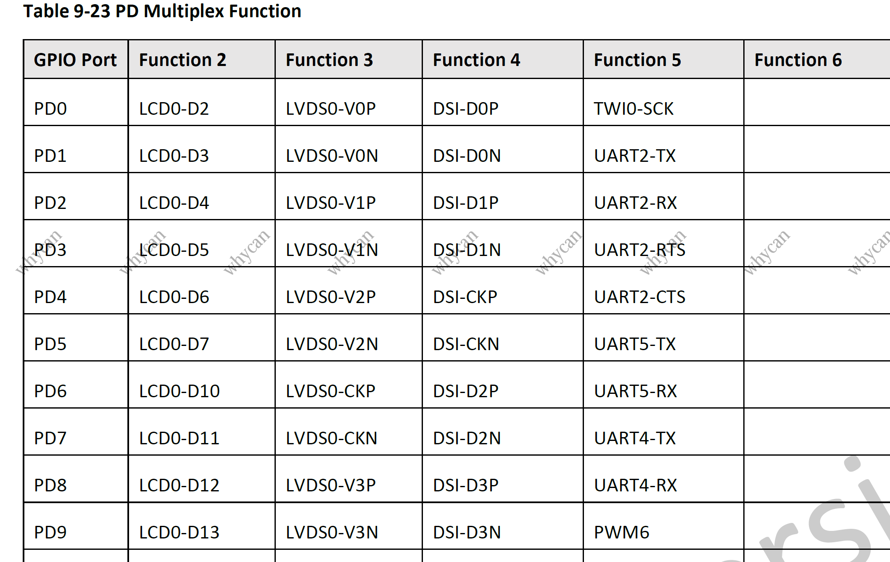 

**function = "dsi"** from DTS corresponding with function 4

 

**drive-strength = <30>;** from DTS assume is drv_level = 3

So lets define it in C array of structures:

<details><summary>icn9707_mipi_config.c:</summary>

```c
 	{
        .name = "LCD0_D0",
        .type = PROPERTY_PIN,
        .v.gpio_list = {
            .gpio = GPIOD(0),
            .mul_sel = 4,
            .pull = 0,
            .drv_level = 3,
        },
    },
    {
        .name = "LCD0_D1",
        .type = PROPERTY_PIN,
        .v.gpio_list = {
            .gpio = GPIOD(1),
            .mul_sel = 4,
            .pull = 0,
            .drv_level = 3,
        },
    },
```
</details>
<br>
<details><summary>Need add this config file to RTT build:</summary>

```patch
diff --git a/rt-thread/bsp/allwinner/libraries/sunxi-hal/hal/SConscript b/rt-thread/bsp/allwinner/libraries/sunxi-hal/hal/SConscript
+if GetDepend('MIPI_DSI_LCD_ICN9707'):
+    disp2_src += ['./source/disp2/soc/icn9707_mipi_config.c']
+
```
</details>
<br>
<details><summary>And define config values:</summary>

```patch
diff --git a/rt-thread/bsp/allwinner/libraries/sunxi-hal/hal/source/disp2/soc/Kconfig b/rt-thread/bsp/allwinner/libraries/sunxi-hal/hal/source/disp2/soc/Kconfig
+config MIPI_DSI_LCD_ICN9707
+    bool "Clockworkpi Devterm R01 board with MIPI DSI display ICN9707"
+    default n
+    ---help---
+      Clockworkpi Devterm R01 board with MIPI DSI display ICN9707
```
</details>
<br>
<details><summary>RTT cuts off CONFIG_ prefix so redefine this:</summary>

```patch
diff --git a/rt-thread/bsp/allwinner/libraries/sunxi-hal/hal/kconfig.h b/rt-thread/bsp/allwinner/libraries/sunxi-hal/hal/kconfig.h
+#if defined(MIPI_DSI_LCD_ICN9707)
+#define CONFIG_MIPI_DSI_LCD_ICN9707 1
+#endif
```
</details>
<br>

#### Remove hardcoded LCD config 

icn9707_mipi_config.c define this config array g_lcd0_config[] used in:
* disp2\soc\disp_board_config.c
* disp2\disp\disp_sys_intf.c

But also in rt-thread\bsp\allwinner\libraries\drivers\lcd_cfg.c is was hardcoded to use g_lcd0_config_rgb[].

<details><summary>g_lcd0_config_rgb[]:</summary>

```c
struct property_t g_lcd0_config_rgb[] = {
    {
        .name = "lcd_used",
        .type = PROPERTY_INTGER,
        .v.value = 1,
    },
    {
        .name = "lcd_driver_name",
        .type = PROPERTY_STRING,
        .v.str = "default_lcd",
    },
```
</details>
<br>
So remove hardcoded LCD config from lcd_cfg.c and replaced it to build-time inserted configs from driver files:
<details><summary>lcd_cfg.c:</summary>

```patch
diff --git a/rt-thread/bsp/allwinner/libraries/drivers/lcd_cfg.c b/rt-thread/bsp/allwinner/libraries/drivers/lcd_cfg.c
 
-struct property_t g_lcd0_config_rgb[] = {
-struct property_t g_lcd1_config[] = {
-struct property_t g_disp_config[] = {
-u32 g_lcd0_config_len = sizeof(g_lcd0_config_rgb) / sizeof(struct property_t);
-u32 g_lcd1_config_len = sizeof(g_lcd1_config) / sizeof(struct property_t);
-u32 g_disp_config_len = sizeof(g_disp_config) / sizeof(struct property_t);
+extern struct property_t g_lcd0_config_soc[];
+extern struct property_t g_lcd1_config[];
+extern struct property_t g_disp_config[];
+extern u32 g_lcd0_config_len;
+extern u32 g_lcd1_config_len;
+extern u32 g_disp_config_len;
 
 static struct property_t *_lcd_property_find(const char *name, struct property_t *_config, const u32 config_len)
 {
@@ -1210,15 +68,35 @@ const struct lcd_cfg_panel_info *load_lcd_config_from_xml(void)
         goto _RET;
     }
 
-    g_lcd0_config = g_lcd0_config_rgb;
-    g_lcd0_config_len = sizeof(g_lcd0_config_rgb) / sizeof(struct property_t);
+    g_lcd0_config = g_lcd0_config_soc;
+
 _RET:
 
     init_state = 2;
     _config_item = _lcd_property_find("lcd_x", g_lcd0_config, g_lcd0_config_len);
-    _panel_info.width = _config_item->v.value;
+    if(_config_item != NULL)
+    {
+        _panel_info.width = _config_item->v.value;
+    }    
     _config_item = _lcd_property_find("lcd_y", g_lcd0_config, g_lcd0_config_len);
-    _panel_info.height = _config_item->v.value;
+    if(_config_item != NULL)
+    {
+        _panel_info.height = _config_item->v.value;
+    }
+    _config_item = _lcd_property_find("bl_pin", g_lcd0_config, g_lcd0_config_len);
+    if(_config_item != NULL)
+    {
+        _panel_info.bl_pin = _config_item->v.value;
+        _panel_info.bl_gpio_pin = _config_item->v.value;
+    }
+    _config_item = _lcd_property_find("bl_level", g_lcd0_config, g_lcd0_config_len);
+    if(_config_item != NULL)
+    { 
+        _panel_info.bl_level = _config_item->v.value;
+        _panel_info.bl_gpio_level = _config_item->v.value;
+    }
+    _panel_info.bl_mode = 0;
+    _panel_info.pwr_pin = -1;
 
     return &_panel_info;
 }
```
</details>
<br>
Couldn't use g_lcd0_config instead g_lcd0_config_soc for all drivers, looks like is just linking order problem.

### Config for Devterm board

Create common config for board that include driver and config structure:

<details><summary>Kconfig:</summary>

```patch
diff --git a/rt-thread/bsp/allwinner/libraries/drivers/Kconfig b/rt-thread/bsp/allwinner/libraries/drivers/Kconfig
 choice
     prompt "Choose Board"

+    config BSP_USING_CWP_DT_R01
+        bool "ClockworkPi DevTerm R01 board"
+        select LCD_SUPPORT_ICN9707_480x1280
+        select MIPI_DSI_LCD_ICN9707
+        select ARCH_SUN20IW1
```
</details>
<br>
<details><summary>.config:</summary>

In menuconfig need to choose: 
- "General Drivers Configuration" -> "Choose Board" and then choose "ClockworkPi DevTerm R01 board"

Also need to choose only one LCD panel and only one Board:
- "HAL library from sunxi" -> "Video support for sunxi" -> "LCD panels select" -> "LCD support ICN9707_480x1280 panel"
- "HAL library from sunxi" -> "Video support for sunxi" -> "Soc and board select" -> "Board Select" -> "Clockworkpi Devterm R01 board with MIPI DSI display ICN9707"

```patch
diff --git a/rt-thread/bsp/allwinner/d1s_d1h/.config b/rt-thread/bsp/allwinner/d1s_d1h/.config
+CONFIG_BSP_USING_CWP_DT_R01=y
+CONFIG_LCD_SUPPORT_ICN9707_480x1280=y
+CONFIG_MIPI_DSI_LCD_ICN9707=y
```
</details>

Now lets run board, all work fine LCD_open_flow function called.
<details><summary>Console output:</summary>
```sh
raoyiming +++ LCD_open_flow
raoyiming +++ LCD_open_flow finish
<0>raoyiming +++ LCD_panel_init
[I/DBG] disp:[disp_lcd_pin_cfg 910]lcd 0 pin config, state on, 1
<0>raoyiming +++ LCD_panel_init finish
[I/DBG] disp:[disp_lcd_enable 1659]open flow:step 0 finish, to delay 0
[I/DBG] disp:[disp_lcd_enable 1659]open flow:step 1 finish, to delay 200
raoyiming +++ LCD_bl_open
[I/DBG] disp:[disp_sys_pwm_enable 693]period_ns = 1000000 
[I/DBG] disp:[disp_sys_pwm_enable 694]duty_ns = 195312 
[I/DBG] disp:[disp_sys_pwm_enable 695]polarity = 0 
[I/DBG] disp:[disp_sys_pwm_enable 696]channel = 2 
[I/DBG] disp:[disp_lcd_enable 1659]open flow:step 2 finish, to delay 0
[I/DBG] disp:[start_work 757]sel=1, output_type=0, lcd_reg=0,hdmi_reg=0
```
</details>
<br>
But display still blank, when run test command:

```sh
lcd_draw_point 100 100
```
Nothing shown in dispaly.

### LCD inc9707 chip reset

After all DSI Display still not started. Screen still blank. Lets figure out why.<br>
Lets look closly to pinout.<br>
I can find in internet some schematic looks like very similar with dispaly used in Devterm, is 6.86-inch IPS TFT LCD MIPI 480x1280 TTW686VVC model document:

   

Compare with Clockworkpi Mainboard schematic file [clockwork_Mainboard_V3.14_V5_Schematic.pdf](ClockworkPi_DevTerm/clockwork_Mainboard_V3.14_V5_Schematic.pdf):


Create mapping table:

|	Pin N	|	Clockworkpi	|	LCD Display 	|
|:---		|:---			|:---				|
|1	  		|				|	GND				|
|2	  		|	DP0			|	D0P				|
|3	  		|	DN0			|	D0M				|
|4	  		|				|	GND				|
|5	  		|	DP1			|	D1P				|
|6	  		|	DN1			|	D1N				|
|7	  		|				|	GND				|
|8	  		|	CP			|	CLKP			|
|9	  		|	CN			|	CLKN			|
|10	  		|				|	GND				|
|11	  		|	DP2			|	D2P				|
|12	  		|	DN2			|	D2N				|
|13	  		|				|	GND				|
|14	  		|	DP3			|	D3P				|
|15	  		|	DN3			|	D3N				|
|16	  		|				|	GND				|
|17	  		|				|	GND				|
|18	  		|	DISP_1V8	|	IOVCC 1V8		|
|19	  		|				|	IOVCC 1V8		|
|20	  		|				|	NC				|
|21	  		|				|	NC				|
|22	  		|				|	NC				|
|23	  		|				|	NC				|
|24	  		|	LCD_RESET	|	RSTB			|
|25	  		|				|	NC				|
|26	  		|				|	NC				|
|27	  		|				|	GND				|
|28	  		|	LEDK		|	LED K			|
|29	  		|				|	LED K			|
|30	  		|				|	GND				|
|31	  		|				|	NC				|
|32	  		|				|	GND				|
|33	  		|				|	GND				|
|34	  		|				|	NC				|
|35	  		|	LEDA		|	LED A			|
|36	  		|				|	LED A			|
|37	  		|				|	GND				|
|38	  		|	DISP_3V3	|	VCC				|
|39	  		|				|	VCC				|
|40	  		|				|	NC				|

According [ICNL9707_Datasheet.pdf](ClockworkPi_DevTerm/ICNL9707_Datasheet.pdf) in 40pin connector we can see:

* D0-D3(PN) - is 4 DSI lines as we known before. 

* VCI   - Power supply to the analog circuit. Connected to Devterm DISP_3V3
* IOVCC - Power supply for the logic power and I/O circuit. Connected to Devterm DISP_1V8. 

* RSTB  - This signal will reset the device. Signal is active low. Connected to Devterm LCD_RESET and DISP_1V8. 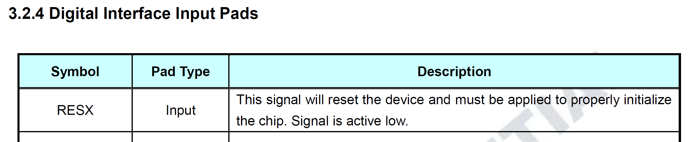 

* LEDK / LEDA - is backlight for LCD. Connected to Devterm OCP8178

Let's take a closer look to each point:

1. LEDK / LEDA

LEDK / LEDA I'm not very know what is mean but in Devterm Mainboard is connected to OCP8178 chip.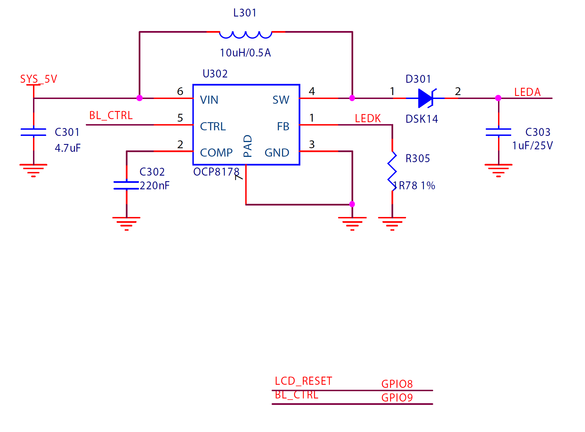.Found dtasheet for OCP8178 in internet  [OCP8178DatasheetV1.9.pdf](ClockworkPi_DevTerm/OCP8178DatasheetV1.9.pdf)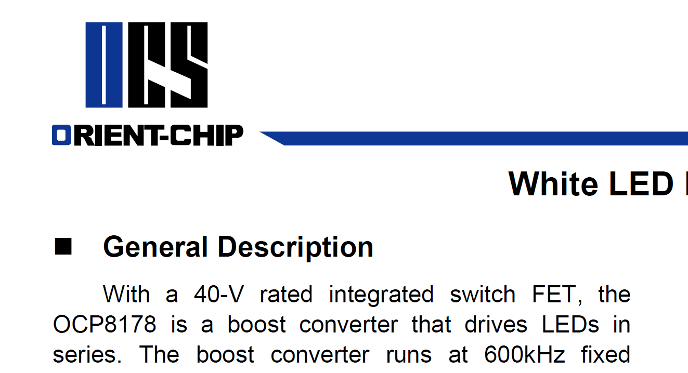 OCP8178 is a boost converter that drives LEDs, and looks like is responcable for backlight for Display.<br> Also in datasheet says about CTRL input: 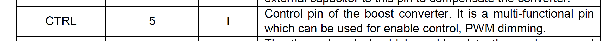 "It is a multi-functional pin which can be used for enable control, PWM dimming." 

Right now Im not want handle backlight level by PWM signal, need just On/Off backlight. So I asume I can just provide logical 1 or 0 to this pin to On/Off backlight.<br>
According schematic BL_CNTRL connected to GPIO9 in main connetor then to PD20 pin in D1H. Need configure pin as Pull up.

2. LCD_RESET 

RSTB Connected to DISP_1V8 throught pin LCD_RESET. LCD_RESET connected to GPIO8 in main connetor then to PD19 pin in D1H.<br>
Also asume I can just provide logical 1 or 0 to this pin for reset.<br> But as is provide DISP_1V8 and signal is active low need configure pin as Pull down.<br>R01 Core schematic show BL_CNTRL / LCD_RESET connected to PD19 / PD20:   

So lets define this pins in C array of structures:
* PD19 will be pull down
* PD20 will be pull up

<details><summary>icn9707_mipi_config.c:</summary>

```c
    {
        .name = "lcd_gpio_0",
        .type = PROPERTY_GPIO,
        .v.gpio_list = {
            .gpio = GPIOD(19), //LCD_RESET
            .mul_sel = GPIO_DIRECTION_OUTPUT,
            .pull = 2,
            .drv_level = 3,
            .data = 1,
        },
    },
        {
        .name = "lcd_gpio_1",
        .type = PROPERTY_GPIO,
        .v.gpio_list = {
            .gpio = GPIOD(20), //BL_CNTRL
            .mul_sel = GPIO_DIRECTION_OUTPUT,
            .pull = 1,
            .drv_level = 3,
            .data = 1,
        },
    },
```
</details>
<br>
3. IOVCC / VCI

IOVCC provided from DISP_1V8<br>
VCI provided from DISP_3V3<br>

If we trace in Mainboard schematic file [clockwork_Mainboard_V3.14_V5_Schematic.pdf](ClockworkPi_DevTerm/clockwork_Mainboard_V3.14_V5_Schematic.pdf).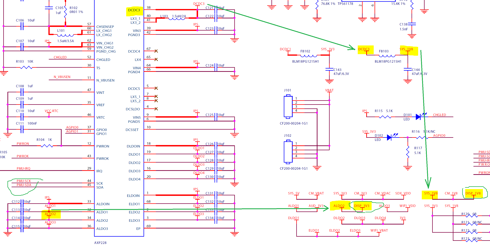   

DISP_1V8 conected to SYS_1V8 then DCDC3 from AXP228 chip.<br>
DISP_3V3 conected to ALDO2 from AXP228 chip.<br>
AXP228 is Power Managment chip. How work with it will figure out later.

Noticed in [ICNL9707_Datasheet.pdf](ClockworkPi_DevTerm\ICNL9707_Datasheet.pdf) that in Dispaly startup siguence - first off all VCI and IOVCC voltage UP then after T2 = 10ms reseted RESET pin.<br>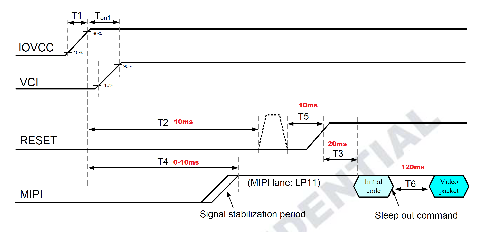   

But between powered up board, bootloaders up, RTT loaded and the moment when the driver calls RESET pin obviously more time passes rather than on diagram. Also Im not sure DISP_1V8 is powered from beggining.    
Hypotise that it looks like we need to force reset VCI and IOVCC in RTT just before RESET pin.<br> 
So need to understand how operate with AXP228. 

### AXP228
Found dtasheet for AXP228 in internet  [AXP228_V1.1_20130106..pdf](ClockworkPi_DevTerm/AXP228_V1.1_20130106..pdf)

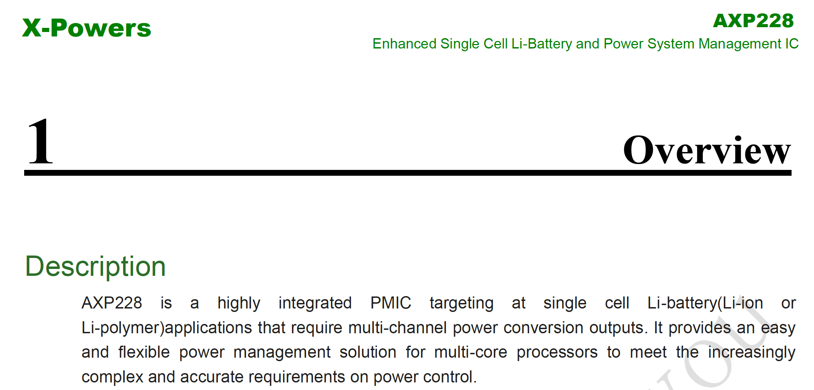 

PMIC is Power Management Integrated Circuits.Found that we can control this device by TWI interface:

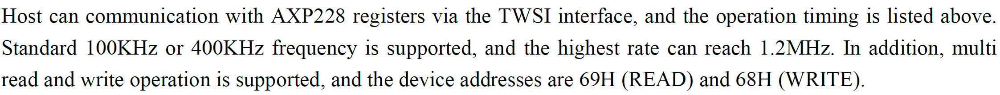

https://en.wikipedia.org/wiki/I%C2%B2C say:<br>

"TWI (Two-Wire Interface) or TWSI (Two-Wire Serial Interface) is essentially the same bus implemented on various system-on-chip processors from Atmel and other vendors.[38] Vendors use the name TWI, even though I2C is not a registered trademark as of 2014-11-07.[39] Trademark protection only exists for the respective logo (see upper right corner), and patents on I2C have now lapsed.[citation needed] According to Microchip Technology, TWI and I2C have a few differences."

Device address is 69H/68H. Also we have list of registers with descriptions:

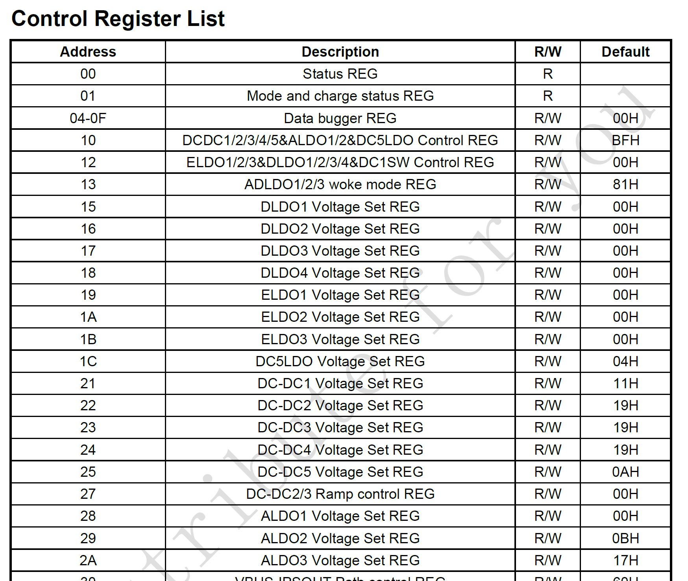 

in Devterm R01 AXP228 TWI interface connected to D1H PB10/11 pins:

| AXP228         | D1H   | Function |
|:---            |:---   |:---      |
| PMU-SCK        | PB-10 | TWI0-SCK |
| PMU-SDA        | PB-11 | TWI0-SDA |

Also notice in Linux DTS that AXP228 exacly use to cintrol display:
* iovcc-supply = <&reg_dcdc3>;
* vci-supply = <&reg_aldo2>;

<details><summary>https://github.com/smaeul/linux/blob/d1/all/arch/riscv/boot/dts/allwinner/sun20i-d1-devterm-v3.14.dts:</summary>

```json
&dsi {
	pinctrl-0 = <&dsi_4lane_pins>;
	pinctrl-names = "default";
	status = "okay";

	panel@0 {
		compatible = "clockwork,cwd686";
		reg = <0>;
		backlight = <&backlight>;
		reset-gpios = <&pio 3 19 GPIO_ACTIVE_LOW>; /* PD19/GPIO8 */
		rotation = <90>;
		iovcc-supply = <&reg_dcdc3>;
		vci-supply = <&reg_aldo2>;
	};
}
```
</details>
<br>
<details><summary>https://github.com/smaeul/linux/blob/d1/all/arch/riscv/boot/dts/allwinner/sun20i-d1-clockworkpi-v3.14.dts:</summary>

```json
&i2c0 {
	pinctrl-0 = <&i2c0_pb10_pins>;
	pinctrl-names = "default";
	status = "okay";

	axp221: pmic@34 {
		compatible = "x-powers,axp228", "x-powers,axp221";
		reg = <0x34>;
...

			reg_dcdc3: dcdc3 {
				regulator-name = "sys-1v8";
				regulator-always-on;
				regulator-min-microvolt = <1800000>;
				regulator-max-microvolt = <1800000>;
			};

			reg_aldo2: aldo2 {
				regulator-name = "disp-3v3";
				regulator-always-on;
				regulator-min-microvolt = <3300000>;
				regulator-max-microvolt = <3300000>;
			};
```
</details>
<br>

According AXP 228 documentation [AXP228_V1.1_20130106..pdf](ClockworkPi_DevTerm/AXP228_V1.1_20130106..pdf) chip culd be ontrolled by TWI interface (I2C) and have control register:

DCDC3 and ALDO2 we can control by Reg 10H "DCDC1/2/3/4/5&ALDO1/2&DC5LDO Enable Set"

| Bit  | Description 	   | Value 		  | R/W  | Default |
| :--- | :---		 	   | :---  		  | :--- |:---     |
| 7    | ALDO2 Enable Set  | 0: Off 1: On | RW   | X 	   |
| 6    | ALDO1 Enable Set  | 			  | RW   | X 	   |
| 5    | DCDC5 Enable Set  | 			  | RW   | X 	   |
| 4    | DCDC4 Enable Set  | 			  | RW   | X 	   |
| 3    | DCDC3 Enable Set  | 			  | RW   | X 	   |
| 2    | DCDC2 Enable Set  | 			  | RW   | X 	   |
| 1    | DCDC1 Enable Set  | 			  | RW   | X 	   |
| 0    | DC5LDO Enable Set | 			  | RW   | X 	   |


### Enable I2C and configure TWI pins

<details><summary>enable I2C in config:</summary>

```patch
diff --git a/rt-thread/bsp/allwinner/d1s_d1h/.config b/rt-thread/bsp/allwinner/d1s_d1h/.config
index 25fa3db03..adb50af2f 100644
--- a/rt-thread/bsp/allwinner/d1s_d1h/.config
+++ b/rt-thread/bsp/allwinner/d1s_d1h/.config
@@ -189,7 +189,9 @@ CONFIG_RT_USING_TTY=y
+CONFIG_RT_USING_I2C=y
+CONFIG_BSP_USING_I2C=y
+CONFIG_BSP_USING_I2C0=y
```
</details>
<br>
<details><summary>add PB10/11 pins to I2C driver:</summary>

```patch
diff --git a/rt-thread/bsp/allwinner/libraries/drivers/drv_i2c.c b/rt-thread/bsp/allwinner/libraries/drivers/drv_i2c.c
index ad4515d8f..edcca13c4 100644
--- a/rt-thread/bsp/allwinner/libraries/drivers/drv_i2c.c
+++ b/rt-thread/bsp/allwinner/libraries/drivers/drv_i2c.c
@@ -111,7 +111,31 @@ static struct hal_i2c_bus _i2c_bus_3 = {
 
 #define CFG_GPIO_PORT(p) ((p) - 'A' + 1)
 
+
+
 static const user_gpio_set_t _i2c_gpio_cfg[][2] = {
+#ifdef BSP_USING_CWP_DT_R01
+    {// twi0
+        {
+            .gpio_name = "twi0.sck",
+            .port = CFG_GPIO_PORT('B'),
+            .port_num = 10, // PB10
+            .mul_sel = 4,
+            .pull = 1, // pull up
+            .drv_level = 3,
+            .data = 1,
+        },
+        {
+            .gpio_name = "twi0.sda",
+            .port = CFG_GPIO_PORT('B'),
+            .port_num = 11, // PB11
+            .mul_sel = 4,
+            .pull = 1, // pull up
+            .drv_level = 3,
+            .data = 1,
+        }
+    },
+#else
     {// twi0
         {
             .gpio_name = "twi0.sck",
@@ -132,6 +156,7 @@ static const user_gpio_set_t _i2c_gpio_cfg[][2] = {
             .data = 1,
         }
     },
+#endif
```
</details>
<br>

### AXP228 driver

Lets implement a simple driver for control AXP228 (ALDO2 and DCDC30) by TWI interface.

<details><summary>axp228 simple driver:</summary>

```patch
git diff 36594b5...b0ca16e rt-thread/ > diff.patch
                   
diff --git a/rt-thread/bsp/allwinner/libraries/drivers/SConscript b/rt-thread/bsp/allwinner/libraries/drivers/SConscript
index 5dcf08dd7..ffafee242 100644
--- a/rt-thread/bsp/allwinner/libraries/drivers/SConscript
+++ b/rt-thread/bsp/allwinner/libraries/drivers/SConscript
@@ -15,6 +15,7 @@ if GetDepend('BSP_USING_RTC'):
 
 if GetDepend('BSP_USING_I2C'):
     src += ['drv_i2c.c']
+    src += ['drv_axp228_simpl.c']
 
diff --git a/rt-thread/bsp/allwinner/libraries/drivers/drv_axp228_simpl.c b/rt-thread/bsp/allwinner/libraries/drivers/drv_axp228_simpl.c
new file mode 100644
index 000000000..f8339d8cc
--- /dev/null
+++ b/rt-thread/bsp/allwinner/libraries/drivers/drv_axp228_simpl.c
@@ -0,0 +1,272 @@
+/*
+ * Copyright (c) ylyamin
+ */
+#include <rthw.h>
+#include <rtdevice.h>
+
+#include "sunxi_hal_twi.h"
+
+#define DBG_LVL DBG_WARNING
+#define DBG_TAG "drv/axp"
+#include <rtdbg.h>
+
+#define AXP228_ADDR (0x69 >> 1)
+
+#define DCDC_CNTRL_REG 0x10
+#define ELDO_CNTRL_REG 0x12
+#define ALDO_CNTRL_REG 0x13
+
+#define DLDO1_Voltage_REG 0x15
+#define DLDO2_Voltage_REG 0x16
+#define DLDO3_Voltage_REG 0x17
+#define DLDO4_Voltage_REG 0x18
+#define ELDO1_Voltage_REG 0x19
+#define ELDO2_Voltage_REG 0x1A
+#define ELDO3_Voltage_REG 0x1B
+#define DC5LD_Voltage_REG 0x1C
+#define DCDC1_Voltage_REG 0x21
+#define DCDC2_Voltage_REG 0x22
+#define DCDC3_Voltage_REG 0x23
+#define DCDC4_Voltage_REG 0x24
+#define DCDC5_Voltage_REG 0x25
+#define ALDO1_Voltage_REG 0x28
+#define ALDO2_Voltage_REG 0x29
+#define ALDO3_Voltage_REG 0x2A
+
+//DCDC_CNTRL_REG
+#define ALDO2_Enable_mask BIT(7)
+#define ALDO1_Enable_mask BIT(6)
+#define DCDC5_Enable_mask BIT(5)
+#define DCDC4_Enable_mask BIT(4)
+#define DCDC3_Enable_mask BIT(3)
+#define DCDC2_Enable_mask BIT(2)
+#define DCDC1_Enable_mask BIT(1)
+#define DC5LD_Enable_mask BIT(0)
+
+//ELDO_CNTRL_REG
+#define DC1SW_Enable_mask BIT(7)
+#define DLDO4_Enable_mask BIT(6)
+#define DLDO3_Enable_mask BIT(5)
+#define DLDO2_Enable_mask BIT(4)
+#define DLDO1_Enable_mask BIT(3)
+#define ELDO3_Enable_mask BIT(2)
+#define ELDO2_Enable_mask BIT(1)
+#define ELDO1_Enable_mask BIT(0)
+
+//ALDO_CNTRL_REG
+#define ALDO3_Enable_mask BIT(7)
+struct dcdc_reg
+{
+    char name[40];
+    uint8_t addr;
+    uint8_t value;
+};
+
+#define ENABLE_REGISTERS {\
+            {"DCDC1-5 ALDO1-2 DC5LDO Control",DCDC_CNTRL_REG,0},\
+            {"ELDO1-3 DLDO1-4 DC1SW Control ",ELDO_CNTRL_REG,0},\
+            {"ADLDO3 Control                ",ALDO_CNTRL_REG,0},\
+                         }  
+
+#define VOLTAGE_REGISTERS {\
+            {"DLDO1  Voltage Set",DLDO1_Voltage_REG,0},\
+            {"DLDO2  Voltage Set",DLDO2_Voltage_REG,0},\
+            {"DLDO3  Voltage Set",DLDO3_Voltage_REG,0},\
+            {"DLDO4  Voltage Set",DLDO4_Voltage_REG,0},\
+            {"ELDO1  Voltage Set",ELDO1_Voltage_REG,0},\
+            {"ELDO2  Voltage Set",ELDO2_Voltage_REG,0},\
+            {"ELDO3  Voltage Set",ELDO3_Voltage_REG,0},\
+            {"DC5LDO Voltage Set",DC5LD_Voltage_REG,0},\
+            {"DCDC1  Voltage Set",DCDC1_Voltage_REG,0},\
+            {"DCDC2  Voltage Set",DCDC2_Voltage_REG,0},\
+            {"DCDC3  Voltage Set",DCDC3_Voltage_REG,0},\
+            {"DCDC4  Voltage Set",DCDC4_Voltage_REG,0},\
+            {"DCDC5  Voltage Set",DCDC5_Voltage_REG,0},\
+            {"ALDO1  Voltage Set",ALDO1_Voltage_REG,0},\
+            {"ALDO2  Voltage Set",ALDO2_Voltage_REG,0},\
+            {"ALDO3  Voltage Set",ALDO3_Voltage_REG,0},\
+    };  
+
+void _axp_set_reg(struct rt_i2c_bus_device *i2c_bus, uint8_t reg_addr, uint8_t reg_value)
+{
+    struct rt_i2c_msg msg[1];
+    uint8_t buf[2] = {reg_addr,reg_value};
+
+    msg[0].addr = AXP228_ADDR;
+    msg[0].flags = RT_I2C_WR;
+    msg[0].buf = buf;
+    msg[0].len = sizeof(buf);
+    rt_i2c_transfer(i2c_bus, &msg[0], 1);
+}
+
+void _axp_get_reg(struct rt_i2c_bus_device *i2c_bus, uint8_t reg_addr, uint8_t *reg_value)
+{
+    struct rt_i2c_msg msg[2];
+    uint8_t buf[1] = {reg_addr};
+
+    msg[0].addr = AXP228_ADDR;
+    msg[0].flags = RT_I2C_WR;
+    msg[0].buf = buf;
+    msg[0].len = sizeof(buf);
+
+    msg[1].addr = AXP228_ADDR;
+    msg[1].flags = RT_I2C_RD;
+    msg[1].buf = buf;
+    msg[1].len = sizeof(buf);
+
+    rt_i2c_transfer(i2c_bus, &msg[0], 2);
+    *reg_value = msg[1].buf[0];
+}
+
+void _axp_update_reg(struct rt_i2c_bus_device *i2c_bus, uint8_t reg_addr, uint8_t val, uint8_t mask)
+{
+    uint8_t reg_val = 0;
+    _axp_get_reg(i2c_bus, reg_addr, &reg_val);
+
+    if ((reg_val & mask) != val) {
+        reg_val = (reg_val & ~mask) | (val & mask);
+        _axp_set_reg(i2c_bus, reg_addr, reg_val);
+    }
+}
+
+static void _axp_get_regsisters(struct dcdc_reg *dcdc_regs, uint8_t dcdc_regs_len)
+{
+    uint8_t reg_value = 0;
+    struct rt_i2c_bus_device *i2c_bus;
+    i2c_bus = (struct rt_i2c_bus_device*)rt_device_find("i2c0");
+
+    if (!i2c_bus)
+    {
+        rt_kprintf("i2c0 not found\n");
+        return;
+    }
+
+    for (int i =0;i < dcdc_regs_len;i++)
+    {
+        _axp_get_reg(i2c_bus, dcdc_regs[i].addr, &reg_value);
+        dcdc_regs[i].value = reg_value;
+        //rt_hw_us_delay(100);
+    }
+}
+
+void _axp_LCD_control(int on)
+{
+    uint8_t value = 0;
+    struct rt_i2c_bus_device *i2c_bus;
+    i2c_bus = (struct rt_i2c_bus_device*)rt_device_find("i2c0");
+
+    if (!i2c_bus)
+    {
+        rt_kprintf("i2c0 not found\n");
+        return;
+    }
+
+    if (on) value = DCDC3_Enable_mask | ALDO2_Enable_mask;
+    _axp_update_reg(i2c_bus, DCDC_CNTRL_REG, value, DCDC3_Enable_mask | ALDO2_Enable_mask);
+}
+
+static void _axp_LCD_control_cmd(int argc, char *args[])
+{
+    if (argc < 2) return;
+    int on = atoi(args[1]);
+    _axp_LCD_control(on);
+}
+MSH_CMD_EXPORT_ALIAS(_axp_LCD_control_cmd, axp_LCD_control_cmd, axp_LCD_control_cmd);
+
+static void _axp_get_voltage(void)
+{
+    struct dcdc_reg dcdc_regs[] = VOLTAGE_REGISTERS;
+    uint8_t dcdc_regs_len = sizeof(dcdc_regs) / sizeof(struct dcdc_reg);
+
+    _axp_get_regsisters(dcdc_regs, dcdc_regs_len);
+
+    for (int i =0;i < dcdc_regs_len;i++)
+    {
+        rt_kprintf("Reg name:'%s' addr: %x value: %d\n",
+        dcdc_regs[i].name, 
+        dcdc_regs[i].addr, 
+        dcdc_regs[i].value);
+    }
+}
+MSH_CMD_EXPORT_ALIAS(_axp_get_voltage, axp_get_voltage, axp_get_voltage);
+
+static void _axp_get_enable(void)
+{
+    struct dcdc_reg dcdc_regs[] = ENABLE_REGISTERS;
+    uint8_t dcdc_regs_len = sizeof(dcdc_regs) / sizeof(struct dcdc_reg);
+
+    _axp_get_regsisters(dcdc_regs, dcdc_regs_len);
+
+    for (int i =0;i < dcdc_regs_len;i++)
+    {
+        rt_kprintf("Reg name:'%s' addr: %x value: %x\n",
+        dcdc_regs[i].name, 
+        dcdc_regs[i].addr, 
+        dcdc_regs[i].value);
+
+        if (dcdc_regs[i].addr == DCDC_CNTRL_REG)
+        {
+            rt_kprintf("    ALDO2_Enable %d\n",(bool)(dcdc_regs[i].value & ALDO2_Enable_mask));
+            rt_kprintf("    ALDO1_Enable %d\n",(bool)(dcdc_regs[i].value & ALDO1_Enable_mask));
+            rt_kprintf("    DCDC5_Enable %d\n",(bool)(dcdc_regs[i].value & DCDC5_Enable_mask));
+            rt_kprintf("    DCDC4_Enable %d\n",(bool)(dcdc_regs[i].value & DCDC4_Enable_mask));
+            rt_kprintf("    DCDC3_Enable %d\n",(bool)(dcdc_regs[i].value & DCDC3_Enable_mask));
+            rt_kprintf("    DCDC2_Enable %d\n",(bool)(dcdc_regs[i].value & DCDC2_Enable_mask));
+            rt_kprintf("    DCDC1_Enable %d\n",(bool)(dcdc_regs[i].value & DCDC1_Enable_mask));
+            rt_kprintf("    DC5LD_Enable %d\n",(bool)(dcdc_regs[i].value & DC5LD_Enable_mask));
+        }
+        //
+        if (dcdc_regs[i].addr == ELDO_CNTRL_REG)
+        {
+            rt_kprintf("    DC1SW_Enable %d\n",(bool)(dcdc_regs[i].value & DC1SW_Enable_mask));
+            rt_kprintf("    DLDO4_Enable %d\n",(bool)(dcdc_regs[i].value & DLDO4_Enable_mask));
+            rt_kprintf("    DLDO3_Enable %d\n",(bool)(dcdc_regs[i].value & DLDO3_Enable_mask));
+            rt_kprintf("    DLDO2_Enable %d\n",(bool)(dcdc_regs[i].value & DLDO2_Enable_mask));
+            rt_kprintf("    DLDO1_Enable %d\n",(bool)(dcdc_regs[i].value & DLDO1_Enable_mask));
+            rt_kprintf("    ELDO3_Enable %d\n",(bool)(dcdc_regs[i].value & ELDO3_Enable_mask));
+            rt_kprintf("    ELDO2_Enable %d\n",(bool)(dcdc_regs[i].value & ELDO2_Enable_mask));
+            rt_kprintf("    ELDO1_Enable %d\n",(bool)(dcdc_regs[i].value & ELDO1_Enable_mask));
+        }
+        if (dcdc_regs[i].addr == ALDO_CNTRL_REG)
+        {
+            rt_kprintf("    ALDO3_Enable %d\n",(bool)(dcdc_regs[i].value & ALDO3_Enable_mask));
+        }
+    }
+}
+MSH_CMD_EXPORT_ALIAS(_axp_get_enable, axp_get_enable, axp_get_enable);
```
</details>
<br>

### Modify LCD display driver

Found in Linux power siguence defined in DRM driver:

<details><summary>https://github.com/smaeul/linux/blob/d1/all/drivers/gpu/drm/panel/panel-clockwork-cwd686.c:</summary>

```c
static int cwd686_prepare(struct drm_panel *panel)
{
...
	err = regulator_enable(ctx->vci);
	if (err < 0) {
		dev_err(ctx->dev, "failed to enable vci supply: %d\n", err);
		return err;
	}
	err = regulator_enable(ctx->iovcc);
	if (err < 0) {
		dev_err(ctx->dev, "failed to enable iovcc supply: %d\n", err);
		goto disable_vci;
	}

	gpiod_set_value_cansleep(ctx->reset_gpio, 0);
	/* T2 */
	msleep(10);

	gpiod_set_value_cansleep(ctx->reset_gpio, 1);
	/* T3 */
	msleep(20);

	/* Exit sleep mode and power on */

	err = cwd686_init_sequence(ctx);
	if (err) {
		dev_err(ctx->dev, "failed to initialize display (%d)\n", err);
		goto disable_iovcc;
	}

	err = mipi_dsi_dcs_exit_sleep_mode(dsi);
	if (err) {
		dev_err(ctx->dev, "failed to exit sleep mode (%d)\n", err);
		goto disable_iovcc;
	}
	/* T6 */
	msleep(120);

	err = mipi_dsi_dcs_set_display_on(dsi);
	if (err) {
		dev_err(ctx->dev, "failed to turn display on (%d)\n", err);
		goto disable_iovcc;
	}
	msleep(20);
...
```
</details>
<br>

So lets modify power siguense accordenly and also use axp228. 

<details><summary>icn9707_480x1280.c:</summary>

```patch
diff --git a/rt-thread/bsp/allwinner/libraries/sunxi-hal/hal/source/disp2/disp/lcd/icn9707_480x1280.c b/rt-thread/bsp/allwinner/libraries/sunxi-hal/hal/source/disp2/disp/lcd/icn9707_480x1280.c
index f0ea916dd..835a8c888 100644
--- a/rt-thread/bsp/allwinner/libraries/sunxi-hal/hal/source/disp2/disp/lcd/icn9707_480x1280.c
+++ b/rt-thread/bsp/allwinner/libraries/sunxi-hal/hal/source/disp2/disp/lcd/icn9707_480x1280.c
static s32 LCD_open_flow(u32 sel)
 {
     printk("raoyiming +++ LCD_open_flow\n");
-    LCD_OPEN_FUNC(sel, LCD_power_on, 100);   //open lcd power, and delay 50ms
-    LCD_OPEN_FUNC(sel, LCD_panel_init, 200);   //open lcd power, than delay 200ms
+   // LCD_OPEN_FUNC(sel, LCD_power_on, 100);   //open lcd power, and delay 50ms
+    LCD_OPEN_FUNC(sel, LCD_panel_init, 0);   //open lcd power, than delay 200ms
     LCD_OPEN_FUNC(sel, sunxi_lcd_tcon_enable, 200);     //open lcd controller, and delay 100ms
     LCD_OPEN_FUNC(sel, LCD_bl_open, 0);     //open lcd backlight, and delay 0ms
-
+    printk("raoyiming +++ LCD_open_flow finish\n");
     return 0;
 }
 
@@ -203,20 +207,32 @@ static struct lcd_setting_table lcd_init_setting[] = {
 
 };
 
+extern void _axp_LCD_control(bool on);
+
 static void LCD_panel_init(u32 sel)
 {
 	
     u32 i;
     printk("<0>raoyiming +++ LCD_panel_init\n");
-	
-    /**/
+	 sunxi_lcd_power_enable(sel, 0);
+    sunxi_lcd_pin_cfg(sel, 1);
+
+    /*all off*/
+    _axp_LCD_control(0);
+    sunxi_lcd_delay_ms(100);
+
+    /*start*/
     panel_rst(1);
+    _axp_LCD_control(1);
+
+    /*T2*/
     sunxi_lcd_delay_ms(10);
     panel_rst(0);
-    sunxi_lcd_delay_ms(50);
-    panel_rst(1);
-    sunxi_lcd_delay_ms(200);
 
+    /*T3*/
+    sunxi_lcd_delay_ms(20);
+
+    /*init sequence*/
     for (i = 0; ; i++) {
         if(lcd_init_setting[i].cmd == REGFLAG_END_OF_TABLE) {
             break;
@@ -227,8 +243,10 @@ static void LCD_panel_init(u32 sel)
         }
     }
 
-   sunxi_lcd_dsi_clk_enable(sel);
-
+    sunxi_lcd_dsi_clk_enable(sel);
+	/* T6 */
+	sunxi_lcd_delay_ms(120);
+    printk("<0>raoyiming +++ LCD_panel_init finish\n");
     return;
 }
```
</details>
<br> 

### MIPI DSI LCD Display work

After all modification in code DevTerm R01 - LCD MIPI DSI Display successfully started, can be tested by command:
```sh
lcd_draw_point 100 100
```
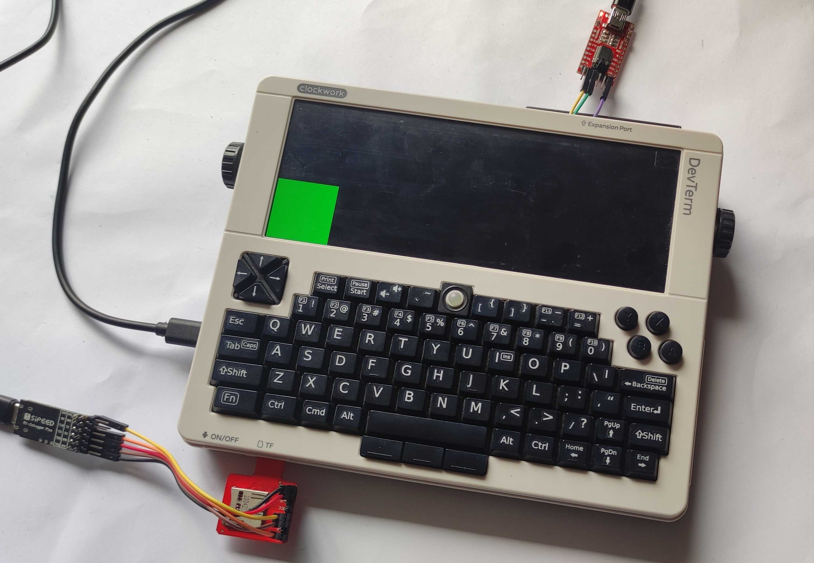

## uConsole dispaly

uConsole display initialisation process looks like very similar as DevTerm LCD Dispaly.<br>
I skip most of explanation as is the same as was before for Devterm MIPI DSI variant.<br>
Please refer to paragraph above for additional information about each step.

After the first attempt display didn't show anything.<br>
Thanks for Clockworkpi forum user @jusentari selected experimental parameters with display [finally worked](https://forum.clockworkpi.com/t/r-01-risc-v-baremetal-with-rt-thread-lcd-work-usb-in-progress/14683/8).

**Used experimental display parameters, please use with caution.**

From ClockworkPi path to uConsole R01 https://github.com/clockworkpi/uConsole/blob/master/Code/patch/r01/20230614/r01_v1.01_230614.patch<br>
I extracted driver for cwu50 display, lets put it to **lcd** folder:
- rt-thread/bsp/allwinner/libraries/sunxi-hal/hal/source/disp2/disp/lcd/cwu50.c
- rt-thread/bsp/allwinner/libraries/sunxi-hal/hal/source/disp2/disp/lcd/cwu50.h

Looking to ClockworkPi repository looks like they have datasheet for uConsole display IC [JD9365DA-H3_DS_V0.01_20200819.pdf](ClockworkPi_uConsole/JD9365DA-H3_DS_V0.01_20200819.pdf). Is JADART JD9365DA-H3 Single chip solution for a WXGA a-Si type LCD display.

At "9.5.2. Power on sequence for differential power mode" paragraph defined Power on sequence diagram:

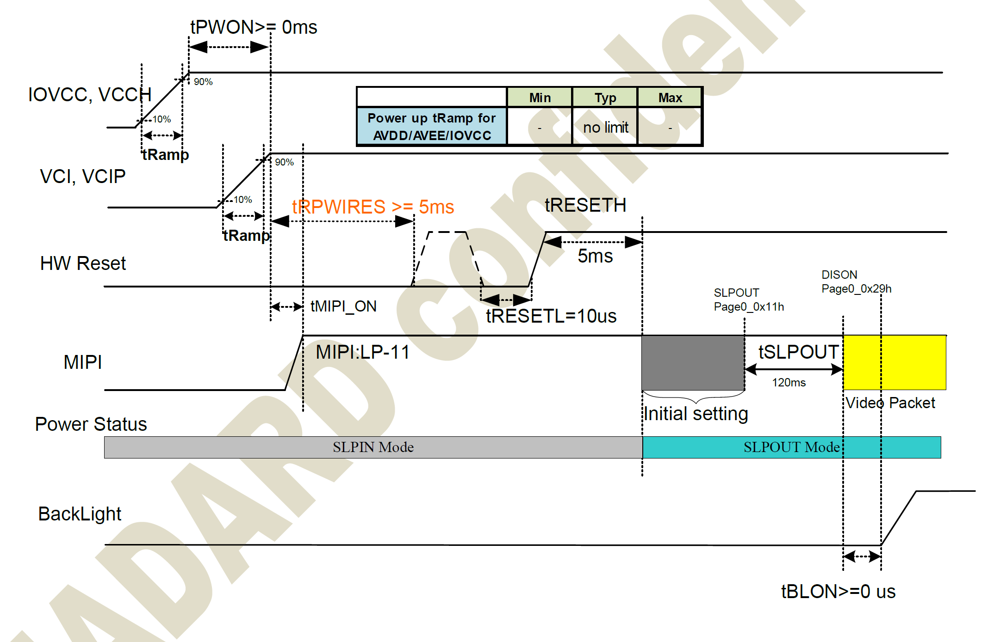

Clockworkpi forum user @jusentari found by experiment this siquence is wrok:

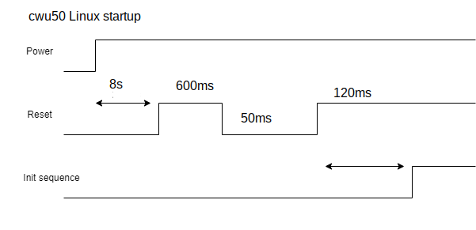

Lets modify LCD_power_on function in cwu50.c to use axp228 power manager:

```patch
diff --git a/rt-thread/bsp/allwinner/libraries/sunxi-hal/hal/source/disp2/disp/lcd/cwu50.c b/rt-thread/bsp/allwinner/libraries/sunxi-hal/hal/source/disp2/disp/lcd/cwu50.c

+extern void _axp_LCD_control(bool on);

static void LCD_power_on(u32 sel)
{
+	_axp_LCD_control(0);    //power off
+	sunxi_lcd_delay_us(200);
+	_axp_LCD_control(1);    //power on
    sunxi_lcd_power_enable(sel, 0);//config lcd_power pin to open lcd power0
```

<details><summary>Add this driver file to RTT build:</summary>

```patch
diff --git a/rt-thread/bsp/allwinner/libraries/sunxi-hal/hal/SConscript b/rt-thread/bsp/allwinner/libraries/sunxi-hal/hal/SConscript
+if GetDepend('LCD_SUPPORT_CWU50'):
+    disp2_src += ['./source/disp2/disp/lcd/cwu50.c']
```
</details>
<br>
<details><summary>And define config values:</summary>

```patch
diff --git a/rt-thread/bsp/allwinner/libraries/sunxi-hal/hal/source/disp2/disp/lcd/Kconfig b/rt-thread/bsp/allwinner/libraries/sunxi-hal/hal/source/disp2/disp/lcd/Kconfig
+config LCD_SUPPORT_CWU50
+    bool "LCD support CWU50 panel"
+    default n
+    ---help---
+        If you want to support CWU50 panel for display driver, select it.
```
</details>
<br>
<details><summary>RTT cuts off CONFIG_ prefix so redefine this:</summary>

```patch
diff --git a/rt-thread/bsp/allwinner/libraries/sunxi-hal/hal/kconfig.h b/rt-thread/bsp/allwinner/libraries/sunxi-hal/hal/kconfig.h
+#if defined(LCD_SUPPORT_CWU50)
+#define CONFIG_LCD_SUPPORT_CWU50 1
+#endif
```
</details>
<br>
<details><summary>Need add structure to panels.c/.h files to possibility to use by disp driver</summary>

```patch
diff --git a/rt-thread/bsp/allwinner/libraries/sunxi-hal/hal/source/disp2/disp/lcd/panels.c b/rt-thread/bsp/allwinner/libraries/sunxi-hal/hal/source/disp2/disp/lcd/panels.c

+#ifdef CONFIG_LCD_SUPPORT_CWU50
+    &cwu50_panel,
+#endif
 
diff --git a/rt-thread/bsp/allwinner/libraries/sunxi-hal/hal/source/disp2/disp/lcd/panels.h b/rt-thread/bsp/allwinner/libraries/sunxi-hal/hal/source/disp2/disp/lcd/panels.h

+#ifdef CONFIG_LCD_SUPPORT_CWU50
+extern struct __lcd_panel cwu50_panel;
+#endif
```
</details>
<br>

### Add configuration for this board:   

From ClockworkPi path to uConsole R01 https://github.com/clockworkpi/uConsole/blob/master/Code/patch/r01/20230614/r01_v1.01_230614.patch<br>
I extracted Device tree file uc_board.dts with LCD difinition.

<details><summary>uc_board.dts:</summary>

```yaml
	lcd_driver_name     = "cwu50";
	lcd_backlight       = <50>;
	lcd_if              = <4>;

	lcd_x               = <720>;
	lcd_y               = <1280>;
	lcd_width           = <90>;
	lcd_height          = <160>;
	lcd_dclk_freq       = <62>;

	lcd_pwm_used        = <1>;
	lcd_pwm_ch          = <2>;
	lcd_pwm_freq        = <1000>;
	lcd_pwm_pol         = <0>;
	lcd_pwm_max_limit   = <255>;

	lcd_hbp             = <40>;
	lcd_ht              = <790>;
	lcd_hspw            = <20>;
	lcd_vbp             = <18>;
	lcd_vt              = <1306>;
	lcd_vspw            = <2>;

	lcd_dsi_if          = <0>;
	lcd_dsi_lane        = <4>;
	lcd_lvds_if         = <0>;
	lcd_lvds_colordepth = <0>;
	lcd_lvds_mode       = <0>;
	lcd_frm             = <0>;
	lcd_hv_clk_phase    = <0>;
	lcd_hv_sync_polarity= <0>;
	lcd_io_phase        = <0x0000>;
	lcd_gamma_en        = <0>;
	lcd_bright_curve_en = <0>;
	lcd_cmap_en         = <0>;
	lcd_fsync_en        = <0>;
	lcd_fsync_act_time  = <1000>;
	lcd_fsync_dis_time  = <1000>;
	lcd_fsync_pol       = <0>;

	deu_mode            = <0>;
	lcdgamma4iep        = <22>;
	smart_color         = <90>;

	lcd_gpio_0 =  <&pio PD 19 GPIO_ACTIVE_HIGH>;
	pinctrl-0 = <&dsi4lane_pins_a>;
	pinctrl-1 = <&dsi4lane_pins_b>;
```
</details>
<br>
Convert this information to C array of structures and save in file rt-thread/bsp/allwinner/libraries/sunxi-hal/hal/source/disp2/soc/cwu50_config.c

<details><summary>cwu50_config.c:</summary>

```c
struct property_t g_lcd0_config_soc[] = {
    {
        .name = "lcd_used",
        .type = PROPERTY_INTGER,
        .v.value = 1,
    },
    {
        .name = "lcd_driver_name",
        .type = PROPERTY_STRING,
        .v.str = "cwu50",
    },
    {
        .name = "lcd_backlight",
        .type = PROPERTY_INTGER,
        .v.value = 50,
    },
    {
        .name = "lcd_if",
        .type = PROPERTY_INTGER,
        .v.value = 4,
    },
    {
        .name = "lcd_x",
        .type = PROPERTY_INTGER,
        .v.value = 720,
    },
    {
        .name = "lcd_y",
        .type = PROPERTY_INTGER,
        .v.value = 1280,
.
.
.        
```
</details>
<br>

Clockworkpi forum user @jusentari found with lcd_dclk_freq = 62 screen slowly flickers, according datasheet 62Mhz is propper frequency for this resolution:

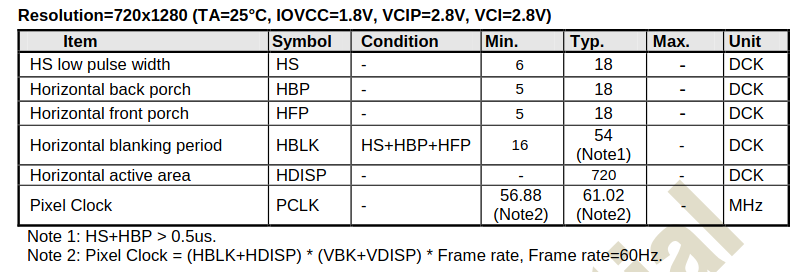

@jusentari: "I fixed it by upping the lcd_dclk_freq in the cwu50_config.c file from 62 to 67. There was some trial and error (the flickering gets worse as the number goes up until about 67) but now the screen displays the drawn pixels correctly. Pushed it further to see if I could increase the bandwidth. That worked! I don’t know if it affects battery life or the life of the screen, but at least there’s something on the screen now."

**Used experimental display parameters, please use with caution.**

```patch
    {
        .name = "lcd_dclk_freq",
        .type = PROPERTY_INTGER,
-        .v.value = 62,
+        .v.value = 67,
    },
```

<details><summary>Need add this config file to RTT build:</summary>

```patch
diff --git a/rt-thread/bsp/allwinner/libraries/sunxi-hal/hal/SConscript b/rt-thread/bsp/allwinner/libraries/sunxi-hal/hal/SConscript

+if GetDepend('MIPI_DSI_LCD_CWU50'):
+    disp2_src += ['./source/disp2/soc/cwu50_config.c']
```
</details>
<br>
<details><summary>And define config values:</summary>

```patch
diff --git a/rt-thread/bsp/allwinner/libraries/sunxi-hal/hal/source/disp2/soc/Kconfig b/rt-thread/bsp/allwinner/libraries/sunxi-hal/hal/source/disp2/soc/Kconfig
+config MIPI_DSI_LCD_CWU50
+      bool "Clockworkpi uConsole R01 board with MIPI DSI display CWU50"
+      default n
+      ---help---
+        Clockworkpi uConsole R01 board with MIPI DSI display CWU50
```
</details>
<br>
<details><summary>RTT cuts off CONFIG_ prefix so redefine this:</summary>

```patch
diff --git a/rt-thread/bsp/allwinner/libraries/sunxi-hal/hal/kconfig.h b/rt-thread/bsp/allwinner/libraries/sunxi-hal/hal/kconfig.h
+#if defined(MIPI_DSI_LCD_CWU50)
+#define CONFIG_MIPI_DSI_LCD_CWU50 1
+#endif
```
</details>
<br>

### Config for uConsole R01 board
Create common config for board that include driver and config structure:

<details><summary>Kconfig:</summary>

```patch
diff --git a/rt-thread/bsp/allwinner/libraries/drivers/Kconfig b/rt-thread/bsp/allwinner/libraries/drivers/Kconfig
 choice
     prompt "Choose Board"
+    config BSP_USING_CWP_UC_R01
+        bool "ClockworkPi uConsole R01 board"
+        select LCD_SUPPORT_CWU50
+        select MIPI_DSI_LCD_CWU50
+        select ARCH_SUN20IW1
```
</details>
<br>

In menuconfig need to choose: 
- "General Drivers Configuration" -> "Choose Board" and then choose "ClockworkPi uConsole R01 board"

Also need to choose only one LCD panel and only one Board:
- "HAL library from sunxi" -> "Video support for sunxi" -> "LCD panels select" -> "LCD support CWU50 panel"
- "HAL library from sunxi" -> "Video support for sunxi" -> "Soc and board select" -> "Board Select" -> "Clockworkpi uConsole R01 board with MIPI DSI display CWU50"

<details><summary>.config:</summary>

```patch
diff --git a/rt-thread/bsp/allwinner/d1s_d1h/.config b/rt-thread/bsp/allwinner/d1s_d1h/.config
+CONFIG_BSP_USING_CWP_UC_R01=y
+CONFIG_LCD_SUPPORT_CWU50=y
+CONFIG_MIPI_DSI_LCD_CWU50=y
```
</details>
<br>

### MIPI DSI LCD Display work

After all modification in code uConsole R01 - LCD MIPI DSI Display successfully started, can be tested by command:
```sh
lcd_draw_point 100 100
```

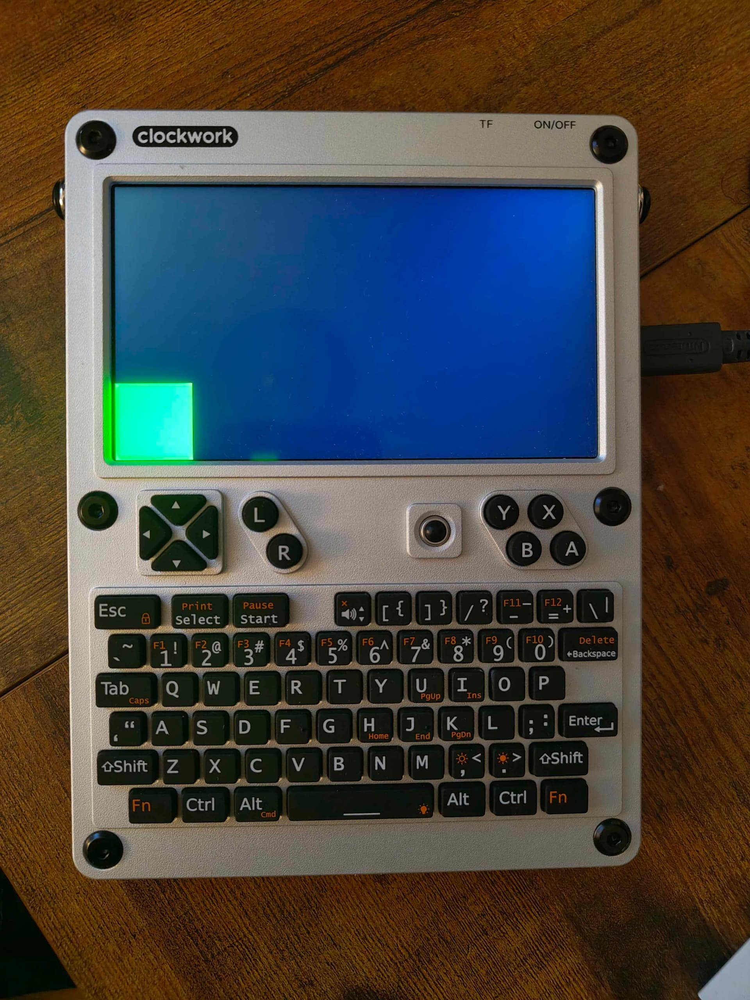


## LCD Display driver for RGB Display

I also have Sipeed Lichee RV + Dock is smoll D1H board.<br>
And Dock extension LCD adapter board + 4.3 RGB LCD Display (043026-N6(ML)) with IC ST7001s (SPI)

So lets implement driver for this RGB display. I skip most of explanation as is the same as was before for Devterm MIPI DSI variant.

### Add LCD Display driver 

Found ST7001s SPI driver from https://github.com/Tina-Linux/LCD_Panel_Driver/tree/master/LCD/BH040I-01_ST7701s_RGB_480x480 <br>

So just copy from Linux to RTT:
```patch
+++ b/rt-thread/bsp/allwinner/libraries/sunxi-hal/hal/source/disp2/disp/lcd/st7701s_rgb.c
+++ b/rt-thread/bsp/allwinner/libraries/sunxi-hal/hal/source/disp2/disp/lcd/st7701s_rgb.h
```

<details><summary>Need add this driver file to RTT build:</summary>

```patch
diff --git a/rt-thread/bsp/allwinner/libraries/sunxi-hal/hal/SConscript b/rt-thread/bsp/allwinner/libraries/sunxi-hal/hal/SConscript
+if GetDepend('LCD_SUPPORT_ST7701S_RGB'):
+    disp2_src += ['./source/disp2/disp/lcd/st7701s_rgb.c']
```
</details>
<br>
<details><summary>And define config values:</summary>

```patch
diff --git a/rt-thread/bsp/allwinner/libraries/sunxi-hal/hal/source/disp2/disp/lcd/Kconfig b/rt-thread/bsp/allwinner/libraries/sunxi-hal/hal/source/disp2/disp/lcd/Kconfig
+config LCD_SUPPORT_ST7701S_RGB
+    bool "LCD support ST7701S RGB panel"
+    default n
+    ---help---
+        If you want to support ST7701S RGB panel for display driver, select it.
```
</details>
<br>
<details><summary>RTT cuts off CONFIG_ prefix so redefine this:</summary>

```patch
diff --git a/rt-thread/bsp/allwinner/libraries/sunxi-hal/hal/kconfig.h b/rt-thread/bsp/allwinner/libraries/sunxi-hal/hal/kconfig.h
+#if defined(LCD_SUPPORT_ST7701S_RGB)
+#define CONFIG_LCD_SUPPORT_ST7701S_RGB 1
+#endif
```
</details>
<br>
<details><summary>Need add structure to panels.c/.h files to possibility to use by disp driver</summary>

```patch
diff --git a/rt-thread/bsp/allwinner/libraries/sunxi-hal/hal/source/disp2/disp/lcd/panels.c b/rt-thread/bsp/allwinner/libraries/sunxi-hal/hal/source/disp2/disp/lcd/panels.c

+#ifdef CONFIG_LCD_SUPPORT_ST7701S_RGB
+    &st7701s_rgb_panel,
+#endif
 
diff --git a/rt-thread/bsp/allwinner/libraries/sunxi-hal/hal/source/disp2/disp/lcd/panels.h b/rt-thread/bsp/allwinner/libraries/sunxi-hal/hal/source/disp2/disp/lcd/panels.h

+#ifdef CONFIG_LCD_SUPPORT_ST7701S_RGB
+extern struct __lcd_panel st7701s_rgb_panel;
+#endif
```
</details>
<br>

### Add configuration for this board:   

Also I found that Sipeed Lichee RV work perfectly with https://github.com/xboot/xboot and RGB display show picture.<br>
This is xboot display driver implementation https://github.com/xboot/xboot/blob/master/src/arch/riscv64/mach-lichee86p/driver/fb-d1-rgb.c<br>

According to https://github.com/xboot/xboot/blob/master/src/arch/riscv64/mach-lichee86p/romdisk/boot/lichee86p.json

<details><summary>I can reuse LCD config values</summary>

```json
	"fb-d1-rgb@0x05000000": {
		"clock-name-de": "link-de",
		"clock-name-tconlcd": "link-tconlcd",
		"reset-de": 16,
		"reset-tconlcd": 912,
		"width": 480,
		"height": 480,
		"physical-width": 70,
		"physical-height": 72,
		"bits-per-pixel": 16,
		"clock-frequency": 12000000,
		"hfront-porch": 22,
		"hback-porch": 8,
		"hsync-len": 2,
		"vfront-porch": 2,
		"vback-porch": 11,
		"vsync-len": 2,
		"hsync-active": true,
		"vsync-active": true,
		"den-active": true,
		"clk-active": true,
		"backlight": "led-gpio.1"
	},
```
</details>
<br>
Also I find in internet some schematic looks like very similar with dispaly 4.3 RGB LCD Display (043026-N6(ML))

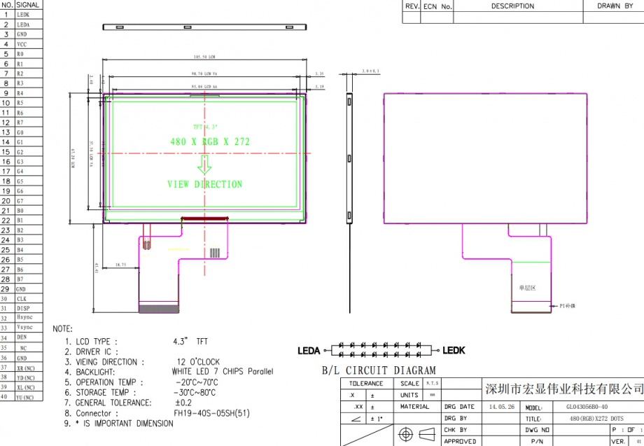

Connection table:

| LCD         |   RV_Dock_EXT_3517   |  GPIO Function  |
|:---         |:---                  |:---             |
| 1   LEDK    |   pd22_bl (5v)       |                 |
| 2   LEDA    |   pd22_bl (5v)       |                 |
| 3   GND     |                      |                 |
| 4   VCC     |   out 3.3V           |                 |
| 5   R0      |       (gnd)          |                 |
| 6   R1      |       (gnd)          |                 |
| 7   R2      |   pd12               |   LCD0-D18      |
| 8   R3      |   .                  |   .             |
| 9   R4      |   .                  |   .             |
| 10  R5      |   .                  |   .             |
| 11  R6      |   .                  |   .             |
| 12  R7      |   pd17               |   LCD0-D23      |
| 13  G0      |       (gnd)          |                 |
| 14  G1      |       (gnd)          |                 |
| 15  G2      |   pd6                |   LCD0-D10      |
| 16  G3      |   .                  |   .             |
| 17  G4      |   .                  |   .             |
| 18  G5      |   .                  |   .             |
| 19  G6      |   .                  |   .             |
| 20  G7      |   pd11               |   LCD0-D15      |
| 21  B0      |       (gnd)          |                 |
| 22  B1      |       (gnd)          |                 |
| 23  B2      |   pd0                |   LCD0-D2       |
| 24  B3      |   .                  |   .             |
| 25  B4      |   .                  |   .             |
| 26  B5      |   .                  |   .             |
| 27  B6      |   .                  |   .             |
| 28  B7      |   pd5                |   LCD0-D7       |
| 29  GND     |                      |                 |
| 30  CLK     |   pd18               |   LCD0-CLK      |
| 31  DISP    |   (NC)               |                 |
| 32  Hsync   |   pd20               |   LCD0-HSYNK    |
| 33  Vsync   |   pd21               |   LCD0-VSYNK    |
| 34  DEN     |   pd19               |   LCD0-DE       |
| 35  NC      |   (NC)               |                 |
| 36  GND     |                      |                 |
| 37  XR      |   pg13               |   Reset         |
| 38  YD      |   pe12               |   SDI           |
| 39  XL      |   pe15               |   SCL           |
| 40  YU      |   pe16               |   CS ?          |


According information above create config file with C array of structures:

```patch
+++ b/rt-thread/bsp/allwinner/libraries/sunxi-hal/hal/source/disp2/soc/RGB_LCD_ST7001s.c
```
<details><summary>Need add this config file to RTT build:</summary>

```patch
diff --git a/rt-thread/bsp/allwinner/libraries/sunxi-hal/hal/SConscript b/rt-thread/bsp/allwinner/libraries/sunxi-hal/hal/SConscript

+if GetDepend('RGB_LCD_ST7001S'):
+    disp2_src += ['./source/disp2/soc/RGB_LCD_ST7001s.c']
```
</details>
<br>
<details><summary>And define config values:</summary>

```patch
diff --git a/rt-thread/bsp/allwinner/libraries/sunxi-hal/hal/source/disp2/soc/Kconfig b/rt-thread/bsp/allwinner/libraries/sunxi-hal/hal/source/disp2/soc/Kconfig
+config RGB_LCD_ST7001S
+    bool "4.3 inch RGB LCD display 043026-N6(ML) with ST7001s (SPI)"
+    default n
+    ---help---
+      4.3 inch RGB LCD display 043026-N6(ML) with ST7001s (SPI)
```
</details>
<br>
<details><summary>RTT cuts off CONFIG_ prefix so redefine this:</summary>

```patch
diff --git a/rt-thread/bsp/allwinner/libraries/sunxi-hal/hal/kconfig.h b/rt-thread/bsp/allwinner/libraries/sunxi-hal/hal/kconfig.h
+
+#if defined(RGB_LCD_ST7001S)
+#define CONFIG_RGB_LCD_ST7001S 1
+#endif
```
</details>
<br>

### Config for Sipeed board

Create common config for board that include driver and config structure:

<details><summary>Kconfig:</summary>

```patch
diff --git a/rt-thread/bsp/allwinner/libraries/drivers/Kconfig b/rt-thread/bsp/allwinner/libraries/drivers/Kconfig
 choice
     prompt "Choose Board"
+    config BSP_USING_SIPEED_LICHEE_RV
+        bool "Sipeed Lichee RV board"
+        select LCD_SUPPORT_ST7701S_RGB
+        select RGB_LCD_ST7001S
+        select ARCH_SUN20IW1
```
</details>
<br>

In menuconfig need to choose: 
- "General Drivers Configuration" -> "Choose Board" and then choose "Sipeed Lichee RV board"

Also need to choose only one LCD panel and only one Board:
- "HAL library from sunxi" -> "Video support for sunxi" -> "LCD panels select" -> "LCD support ST7701S RGB panel"
- "HAL library from sunxi" -> "Video support for sunxi" -> "Soc and board select" -> "Board Select" -> "4.3 inch RGB LCD display 043026-N6(ML) with ST7001s (SPI)"
<details><summary>.config:</summary>

```patch
diff --git a/rt-thread/bsp/allwinner/d1s_d1h/.config b/rt-thread/bsp/allwinner/d1s_d1h/.config
+CONFIG_BSP_USING_SIPEED_LICHEE_RV=y
+CONFIG_LCD_SUPPORT_ST7701S_RGB=y
+CONFIG_RGB_LCD_ST7001S=y
```
</details>
<br>

### RGB LCD Display work

After all modification Sipeed Lichee RV - RGB LCD Display successfully started, tested by command:
```sh
lcd_draw_point 100 100
```
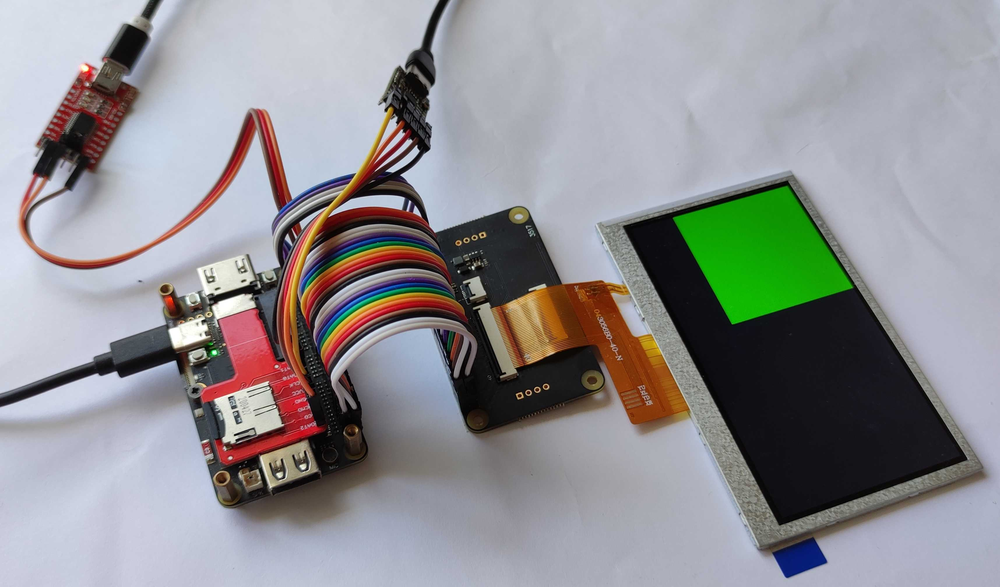

[Prev chapter](D1_4_make_and_hw.md) | [Index](D1_0_index.md) | [Next chapter](D1_6_usb_keyboard.md)