# D1-6. Devterm Keyboard
[Prev chapter](D1_5_lcd_driver.md) | [Index](D1_0_index.md)

So we have working display as output from the board now need to have way to input information - use keyboard.

## Keyboard connection
First of all lets look how keyboard connected to D1H. Keyboard in Devterm is actually standalone USB HID device with STM32F103Rx chip connected to main board by USB interface:

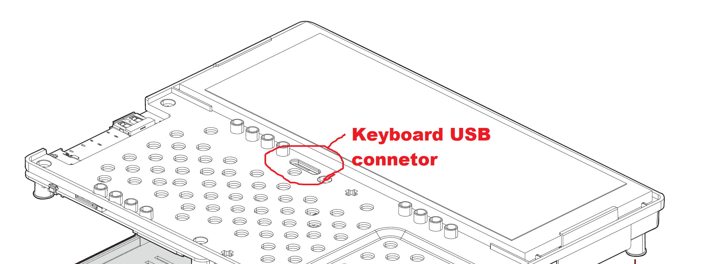

From Devterm Mainboard PCB outline file [pcb_3.14_botton.pdf](ClockworkPi_DevTerm/pcb_3.14_botton.pdf) we can see is connected to J502 connector:

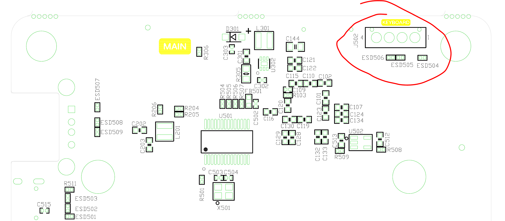

Then as you can see from the Mainboard schematic file [clockwork_Mainboard_V3.14_V5_Schematic.pdf](ClockworkPi_DevTerm/clockwork_Mainboard_V3.14_V5_Schematic.pdf) from J502 connector (DM1/DP1 pins) is go to => GL850G chip (is USB hub) then from DM0/DP0 pins go to => USB_DP/USB_DM connected to R01 Core board.

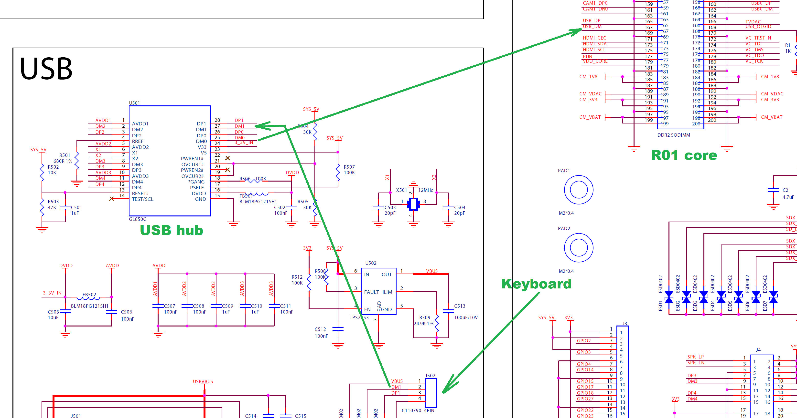

In R01 Core schematic file [clockwork_DevTerm_R01_Core_for_Mainboard_V3.14_Schematic.pdf](ClockworkPi_DevTerm/clockwork_DevTerm_R01_Core_for_Mainboard_V3.14_Schematic.pdf) is connected to D1H USB1-DP/USB1-DM (A8/B8 pins)

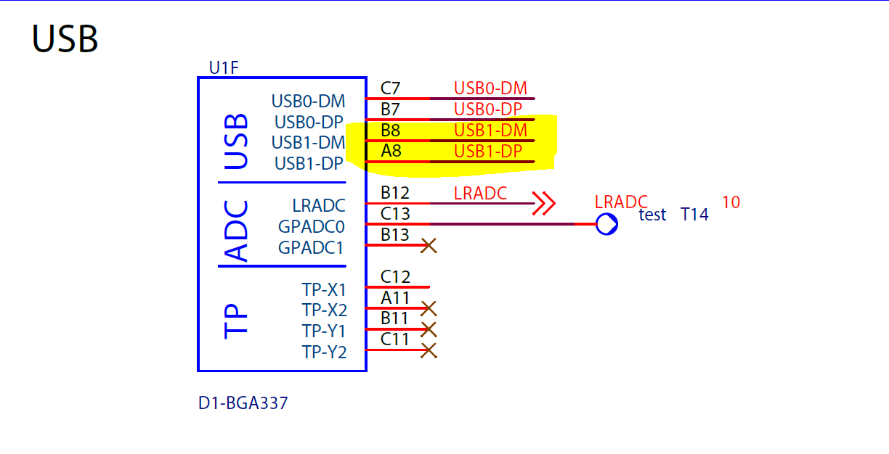

From D1H datasheet [D1_Datasheet_V0.1_Draft_Version.pdf](Allwinner_D1H/D1_Datasheet_V0.1_Draft_Version.pdf) we can found A8/B8 pins connected to USB2.0 HOST number 1.

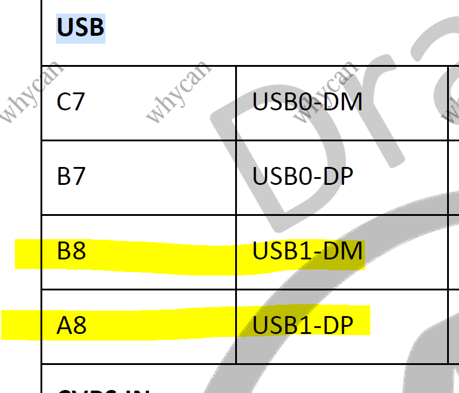
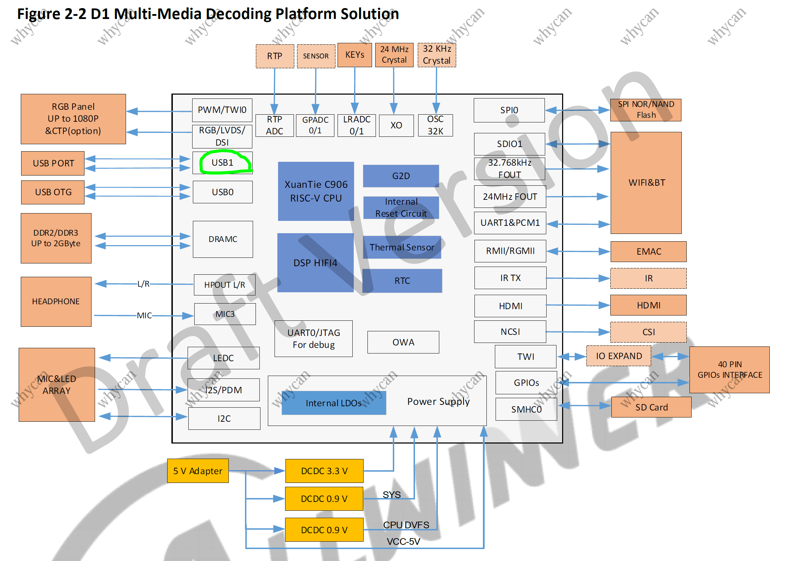

The D1H user manual [D1_User_Manual_V0.1_Draft_Version.pdf](Allwinner_D1H/D1_User_Manual_V0.1_Draft_Version.pdf) document does not contain much information about USB interface. 

Defined that:
* USB0 is USB2.0 Dual role device (Device/Host controller) - we not interesting of this.
* USB1 is USB2.0 Host - where we have our keyboard

But before deep dive to this controller and communication lets look how this USB device powered.

## Keyboard power

So J502 1st power pin connected to VBAT line that provided from TPS2553 Power switch chip. This chip have main power SYS_5V and looks like signal for Enabling from 3V3 line. USB hub chip powered from SYS_5V line.


This 3V3 line provided from DLDO2 from AXP228 power management chip that we already know from Display powering part above. SYS_5V provided from DCDC1 AXP228.
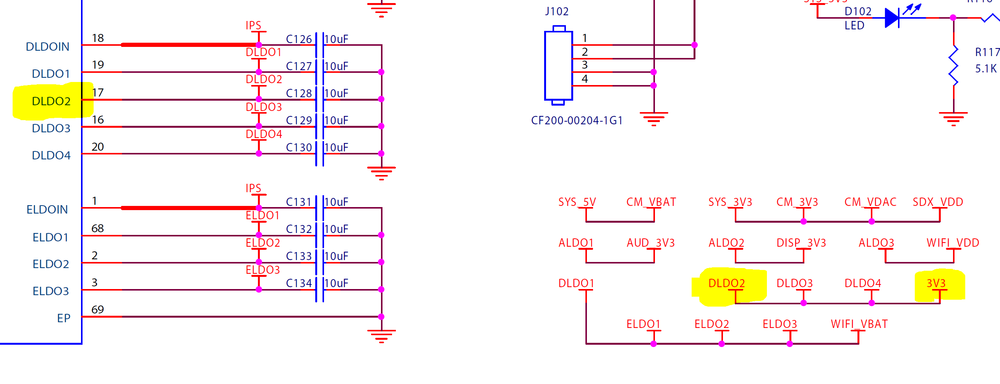

For powering USB need to enable  
* DCDC1 for SYS_3V -> SYS_5V
* DLDO2 for 3V3 -> VBUS

Lets modify AXP228 driver to add power control for VBUS. 
<details><summary>Implement _axp_USB_control() function</summary>

```patch
diff --git a/rt-thread/bsp/allwinner/libraries/drivers/drv_axp228_simpl.c b/rt-thread/bsp/allwinner/libraries/drivers/drv_axp228_simpl.c
new file mode 100644
index 000000000..9bff5c7f4
--- /dev/null
+++ b/rt-thread/bsp/allwinner/libraries/drivers/drv_axp228_simpl.c

+void _axp_USB_control(int on)
+{
+    uint8_t value_1 = 0;
+    uint8_t value_2 = 0;
+    uint8_t value_3 = 0;
+
+    struct rt_i2c_bus_device *i2c_bus;
+    i2c_bus = (struct rt_i2c_bus_device*)rt_device_find("i2c0");
+
+    if (!i2c_bus)
+    {
+        rt_kprintf("i2c0 not found\n");
+        return;
+    }
+
+    if (on) {
+        value_1 = DCDC1_Enable_mask;
+        value_2 = DLDO2_Enable_mask;
+        value_3 = 0xff;
+    }
+    _axp_update_reg(i2c_bus, DCDC_CNTRL_REG, value_1, DCDC1_Enable_mask);
+    _axp_update_reg(i2c_bus, DLDO2_Voltage_REG, value_3, 0xff);
+    _axp_update_reg(i2c_bus, ELDO_CNTRL_REG, value_2, DLDO2_Enable_mask);
+}
+
+static void _axp_USB_control_cmd(int argc, char *args[])
+{
+    if (argc < 2) return;
+    int on = atoi(args[1]);
+    _axp_USB_control(on);
+}
+MSH_CMD_EXPORT_ALIAS(_axp_USB_control_cmd, axp_USB_control_cmd, axp_USB_control_cmd);
```

</details>
<br>
Now USB device can be powered from board. 

## USB HAL
Lets look to software side.  
In RTT sunxi-hal we have folder **usb** [rt-thread/bsp/allwinner/libraries/sunxi-hal/hal/source/usb](rt-thread/bsp/allwinner/libraries/sunxi-hal/hal/source/usb).  
File sunxi-hal/hal/SConscript defined build rules about HAL for RTT.  
Now for usb folder defined only one source file - usb/platform/sun20iw1/usb_sun20iw1.c.  
So lets define all host related stuff.  
Lets look to sunxi-hal/hal/source/usb/Makefile and child Makefile's in folders to understand what should be included, add then to SConscript
<details><summary>Change build to support USB HAL</summary>

```patch
diff --git a/rt-thread/bsp/allwinner/libraries/sunxi-hal/hal/SConscript b/rt-thread/bsp/allwinner/libraries/sunxi-hal/hal/SConscript
index 165cce4ac..beb29117f 100644
--- a/rt-thread/bsp/allwinner/libraries/sunxi-hal/hal/SConscript
+++ b/rt-thread/bsp/allwinner/libraries/sunxi-hal/hal/SConscript
@@ -237,11 +237,82 @@ if GetDepend('DRIVERS_TWI'):
     twi_src += ['source/twi/hal_twi.c']
     twi_path += [cwd + '/source/twi']
 
+# USB udc
 udc_src = Split('''
 source/usb/platform/sun20iw1/usb_sun20iw1.c
+source/usb/udc/hal_udc.c
 ''')
-# source/usb/udc/hal_udc.c
-udc_path = [cwd + '/source/usb/udc', cwd + '/source/usb/include']
+udc_path = [cwd + '/source/usb/udc']
+udc_path += [cwd + '/source/usb/include']
+
+udc_test_src = Split('''
+test/usb/udc/usb_msg.c
+test/usb/udc/main.c
+test/usb/udc/ed_test.c
+''')
+
+# USB host
+host_src = Split('''
+source/usb/include/usb_os_platform.c
+source/usb/include/list_head_ext.c
+source/usb/include/usb_gen_dev_mod.c
+source/usb/include/usb_drv_dev_macth.c
+source/usb/include/usb_utils_find_zero_bit.c
+source/usb/platform/sun20iw1/usb_sun20iw1.c
+source/usb/core/usb_virt_bus.c
+source/usb/core/usb_msg_base.c
+source/usb/core/usb_msg.c
+source/usb/core/usb_gen_hub_base.c
+source/usb/core/usb_gen_hub.c
+source/usb/core/usb_gen_hcd_rh.c
+source/usb/core/usb_gen_hcd.c
+source/usb/core/usb_core_interface.c
+source/usb/core/usb_core_init.c
+source/usb/core/usb_core_config.c
+source/usb/core/usb_core_base.c	
+source/usb/core/usb_driver_init.c
+source/usb/core/urb.c
+source/usb/host/sunxi-hci.c
+source/usb/host/hal_hci.c
+source/usb/host/ehci-hcd.c
+source/usb/host/ehci-sunxi.c
+source/usb/host/ohci-hub.c
+source/usb/host/ohci-hcd.c
+source/usb/host/ohci_sunxi.c
+source/usb/hid/Client/KeyBoard/KeyBoard.c
+source/usb/hid/Client/misc_lib.c
+source/usb/hid/Class/Hid.c
+source/usb/hid/Class/HidProtocol.c
+source/usb/hid/Class/HidTransport.c
+source/usb/manager/usb_manager.c
+source/usb/manager/usb_msg_center.c
+source/usb/manager/usb_hw_scan.c
+source/usb/hid/Client/Mouse/UsbMouse.c
+source/usb/hid/Client/Mouse/UsbMouse_DriftControl.c
+''')
+
+host_test_src = Split('''
+test/usb/host/test_hci.c
+test/usb/host/hci_ed_test.c
+''')
+
+host_path =  [cwd + '/source/usb/include']
+host_path += [cwd + '/source/usb/core']
+host_path += [cwd + '/source/usb/storage/include']
+host_path += [cwd + '/source/usb/hid/Include']
+host_path += [cwd + '/source/usb/host']
 
 ce_src = Split('''
 source/ce/ce_common.c
@@ -312,8 +383,11 @@ if GetDepend('DRIVERS_G2D'):
 
 if GetDepend('DRIVERS_USB'):
     if GetDepend('USB_DEVICE'):
-        src += udc_src
+        src += udc_src + udc_test_src
         CPPPATH += udc_path
+    if GetDepend('USB_HOST'):
+        src += host_src + host_test_src
+        CPPPATH += host_path
 
 if GetDepend('DRIVERS_CE'):
     src += ce_src
diff --git a/rt-thread/bsp/allwinner/libraries/sunxi-hal/hal/kconfig.h b/rt-thread/bsp/allwinner/libraries/sunxi-hal/hal/kconfig.h
index 971fa38b0..40ba78a6d 100644
--- a/rt-thread/bsp/allwinner/libraries/sunxi-hal/hal/kconfig.h
+++ b/rt-thread/bsp/allwinner/libraries/sunxi-hal/hal/kconfig.h
@@ -61,7 +61,7 @@
-#define CONFIG_USB_STORAGE 1
+//#define CONFIG_USB_STORAGE 1
+#define CONFIG_USB_HID 1

diff --git a/rt-thread/bsp/allwinner/d1s_d1h/.config b/rt-thread/bsp/allwinner/d1s_d1h/.config
index 25fa3db03..0619d4d8d 100644
--- a/rt-thread/bsp/allwinner/d1s_d1h/.config
+++ b/rt-thread/bsp/allwinner/d1s_d1h/.config

+CONFIG_RT_USING_USB=y
+CONFIG_RT_USING_USB_HOST=y
+CONFIG_RT_USBH_HID=y
+CONFIG_RT_USBH_HID_MOUSE=y
+CONFIG_RT_USBH_HID_KEYBOARD=y
+CONFIG_BSP_USING_USB=y
+CONFIG_DRIVERS_USB=y
+#
+# USB HOST
+#
+CONFIG_USB_HOST=y
+CONFIG_HAL_TEST_HCI=y
+# CONFIG_USB_STORAGE is not set
+# CONFIG_USB_CAMERA is not set
+CONFIG_USB_HID=y
+#
+# USB DEVICE
+#
+CONFIG_USB_DEVICE=y
+CONFIG_HAL_TEST_UDC=y
+CONFIG_USB_MANAGER=y
```
</details>
<br>
From test program for USB HAL rt-thread\bsp\allwinner\libraries\sunxi-hal\hal\test\usb\host\test_hci.c is understandable how USB stack should be initiated.
Is done by functions:
* hal_usb_core_init()
* hal_usb_hcd_init()

So lets create driver with this functions for RTT to init HAL:

<details><summary>Add USB driver</summary>

```patch
diff --git a/rt-thread/bsp/allwinner/libraries/drivers/Kconfig b/rt-thread/bsp/allwinner/libraries/drivers/Kconfig
index f489985a9..def4a0100 100644
--- a/rt-thread/bsp/allwinner/libraries/drivers/Kconfig
+++ b/rt-thread/bsp/allwinner/libraries/drivers/Kconfig

+menuconfig BSP_USING_USB
+    bool "Enable USB"
+    default n
+

diff --git a/rt-thread/bsp/allwinner/libraries/drivers/SConscript b/rt-thread/bsp/allwinner/libraries/drivers/SConscript
index 5dcf08dd7..19b2a5862 100644
--- a/rt-thread/bsp/allwinner/libraries/drivers/SConscript
+++ b/rt-thread/bsp/allwinner/libraries/drivers/SConscript
@@ -15,6 +15,7 @@ if GetDepend('BSP_USING_RTC'):
 
 if GetDepend('BSP_USING_I2C'):
     src += ['drv_i2c.c']
 
 if GetDepend('BSP_USING_SPI'):
     src += ['drv_spi.c']
@@ -26,6 +27,9 @@ if GetDepend('BSP_USING_LCD'):
     src += ['drv_lcd.c']
     src += ['lcd_cfg.c']
 
+if GetDepend('BSP_USING_USB'):
+    src += ['drv_usbh.c']
+
 group = DefineGroup('Drivers', src, depend = [''], CPPPATH = CPPPATH)
 
 objs = [group]

diff --git a/rt-thread/bsp/allwinner/libraries/drivers/drv_usbh.c b/rt-thread/bsp/allwinner/libraries/drivers/drv_usbh.c
new file mode 100644
index 000000000..8b71888a1
--- /dev/null
+++ b/rt-thread/bsp/allwinner/libraries/drivers/drv_usbh.c
@@ -0,0 +1,38 @@
+#include <stdio.h>
+#include <kconfig.h>
+#include <platform_usb.h>
+#include <hal_log.h>
+#include <hal_cmd.h>
+#include <usb/hal_hci.h>
+
+#include <rtthread.h>
+#include <rtdevice.h>
+
+extern void _axp_USB_control(int on);
+
+int drv_usb(void)
+{
+    _axp_USB_control(1);
+
+    hal_usb_core_init();
+
+    for (int hci_num = 0; hci_num < USB_MAX_CONTROLLER_COUNT; hci_num++)
+    {
+        hal_usb_hcd_init(hci_num);
+    }
+
+    //hal_usb_manager_init();    
+    //rt_usb_host_init("hwsc");
+ }
+ MSH_CMD_EXPORT_ALIAS(drv_usb, usb, usb);
+//INIT_DEVICE_EXPORT(drv_usb);
```
</details>
<br>

Change debug level in file rt-thread\bsp\allwinner\libraries\libos\include\log.h
```patch
-#define DBG_LVL DBG_ERROR
+#define DBG_LVL DBG_INFO
```

But after running RTT nothing happen.
<br>
<details><summary>Is RTT console output:</summary>

```shell
[I/DBG] --usb_gen_hub_init---1----
[I/DBG] --usb_gen_hub_init---2----
[I/DBG] [usb bus]: driver "hub drv" detect usb bus.
[I/DBG] --usb_virt_bus_drv_reg---1-2--
[I/DBG] --usb_virt_bus_drv_reg---1-3--
[I/DBG] --usb_gen_hub_init---4----
[I/DBG] --usb_gen_hub_init---5----
[I/DBG] [sunxi-ehci11]: probe, sunxi_ehci: 0x0x00000000405816c0, 0x:0x0000000004200000, irq_no:49
plic_irq_toggle irq:49,enable:1
[I/DBG] --open_clock 0x810 = 0x0
[I/DBG] reg_value = 0x701
[I/DBG] ---usb_passby 0x800 = 0x701
[I/DBG] [usbh core]: add gen_dev SW USB2.0 'Enhanced' Host Controller (EHCI) Driver
[ehci_qtd_alloc:57] qtd virt = 0x405999c0, phys = 0x405999c0
[I/DBG] ----2--usb_add_hc_gen_dev
[I/DBG] ----3--usb_add_hc_gen_dev
[I/DBG] --ehci_run: cmd = 0x10005
[I/DBG] --ehci_run: hc_capbase = 0x100
[I/DBG] USB 0.0 started, EHCI 1.00(NULL)
[ehci_irq_handler:718]
ehci_irq: highspeed device connect
[I/DBG] ----4--usb_add_hc_gen_dev
[I/DBG] hcd->remote_wakeup=0
[I/DBG] ----5--usb_add_hc_gen_dev
[I/DBG] ---usb_get_device_descriptor---1--
[I/DBG] ---usb_get_device_descriptor---2--
[I/DBG] ---usb_get_device_descriptor---3--
[usbh core]: adding sub dev  (config #1, interface 0)[I/DBG] --usb_virt_bus_dev_add---0
[I/DBG] --usb_virt_bus_dev_add---1
[I/DBG] ----func_drv->func_drv_name = hub drv
[I/DBG] ---usb_core_func_drv_probe----1---
[I/DBG] usb match id suceessfull
[I/DBG] ---usb_core_func_drv_probe----2---
[I/DBG] [hub]: usb hub probe
[I/DBG] hub_probe--1--
[I/DBG] hub_probe--2--
[I/DBG] hub_probe--3--
[I/DBG] hub_probe--3-4--
[I/DBG] hub_probe--4--
[I/DBG] _hub_config--1--
[I/DBG] _hub_config--2--
[I/DBG] _hub_config--3--
[I/DBG] [hub]: 1 port detected
[usbh hub]: stand alone hub[I/DBG] _hub_config--4--
[usbh hub]: individual port power switching[I/DBG] _hub_config--4--
[usbh hub]: global over-current protection[I/DBG] _hub_config--5--
[I/DBG] _hub_config--6--
[usbh hub]: TT requires at most 8 FS bit times[I/DBG] _hub_config--7--
[I/DBG] _hub_config--8--
[I/DBG] _hub_config--9--
[I/DBG] _hub_config--10--
[I/DBG] [usbh hub]: local power source is good
[I/DBG] [usbh hub]: no over-current condition exists
[I/DBG] _hub_config--11--
[I/DBG] _hub_config--12--
[I/DBG] _hub_config--13--
[I/DBG] _hub_config--14--
[I/DBG] _hub_config--15--
[I/DBG] _hub_config--16--
[I/DBG] ---usb_core_func_drv_probe----3---
[I/DBG] portstatus = 0x501, portchange = 0x1
[I/DBG] port debounce 0...
[I/DBG] port debounce 0...
[I/DBG] port debounce 25...
[I/DBG] port debounce 50...
[I/DBG] port debounce 75...
[I/DBG] hub_port_init: udev address = 0
[ehci_irq_handler:718] 
ehci_irq: highspeed device disconnect
[E/DBG] port_wait_reset: err = -107
[E/DBG] ERR: hub_port_reset failed!
[E/DBG] ERR: hub_port_init failed, retry....
ERR: parameter is NULL, can't freeERR: parameter is NULL, can't freeERR: parameter is NULL, can't freeERR: parameter is NULL, can't free[I/DBG] hub_events--6-10--
[I/DBG] hub_events--7--
[I/DBG] hub_events--8--
[I/DBG] hub_events--9--
[I/DBG] portstatus = 0x100, portchange = 0x1
[I/DBG] port debounce 0...
[I/DBG] port debounce 0...
[I/DBG] port debounce 25...
[I/DBG] port debounce 50...
[I/DBG] port debounce 75...
[I/DBG] hub_events--6-10--
[I/DBG] hub_events--7--
[I/DBG] hub_events--8--
[I/DBG] hub_events--9--
[I/DBG] ----6--usb_add_hc_gen_dev
```
</details>
<br>
Seems is detect USB device connection, I expect some process of enumeration USB devices, but looks like is not rich this point.

Trying to use RTT function rt_usb_host_init() from rt-thread\components\drivers\usb\usbhost\core\usbhost.c also not show anything.<br>

### USB D1s Melis HAL variant
Thinking maybe whole USB host HAL outdated or broken, lets look to other variants.<br>
I found different HAL in https://github.com/Tina-Linux/d1s-melis/tree/master/ekernel/drivers.<br>

Moved this usb HAL folder to RTT: rt-thread/bsp/allwinner/libraries/sunxi-hal/hal/source/usb_melis <br>
Original RTT USB HAL folder moved to: rt-thread/bsp/allwinner/libraries/sunxi-hal/hal/source/usb_old <br>
Change rt-thread/bsp/allwinner/libraries/sunxi-hal/hal/SConscript <br>
<details><summary>Is RTT console output:</summary>

```shell
[I/DBG] [usb bus]: driver "hub drv" detect usb bus.
[ehci-usb1] insmod host driver!
[I/DBG] --open_clock 0x810 = 0x0
phy_vbase : 0x4200800, usbc_no : 1, efuse : 0x1e9200f
[sunxi-ehci1]: sunxi_set_vbus cnt.
[I/DBG] ehci insmod status = 2
[I/DBG] [usbh core]: add gen_dev SW USB2.0 'Enhanced' Host Controller (EHCI) Driver
[I/DBG] USB 0.0 started, EHCI 1.00
ehci_irq_handler hcd: 405a26d8
ehci_irq_handler regs: 4200010
ehci_irq_handler status: 4200014
ehci_irq: highspeed device connect
[usb_control_msg:70]                    req:GET_DESCRIPTOR(6), req_type:0x80
[usb_hcd_link_urb_to_ep:1310]           urb_enqueue(0x00000000405e7420) ctrl-0-in
[urb_unlink:127]                        urb_dequeue(0x00000000405e7420)
[usb_control_msg:70]                    req:GET_DESCRIPTOR(6), req_type:0x80
[usb_hcd_link_urb_to_ep:1310]           urb_enqueue(0x00000000405e7588) ctrl-0-in
[urb_unlink:127]                        urb_dequeue(0x00000000405e7588)
[usb_control_msg:70]                    req:GET_DESCRIPTOR(6), req_type:0x80
[usb_hcd_link_urb_to_ep:1310]           urb_enqueue(0x00000000405e7650) ctrl-0-in
[urb_unlink:127]                        urb_dequeue(0x00000000405e7650)
[usb_control_msg:70]                    req:GET_DESCRIPTOR(6), req_type:0x80
[usb_hcd_link_urb_to_ep:1310]           urb_enqueue(0x00000000405e7920) ctrl-0-in
[urb_unlink:127]                        urb_dequeue(0x00000000405e7920)
[usb_control_msg:70]                    req:GET_DESCRIPTOR(6), req_type:0x80
[usb_hcd_link_urb_to_ep:1310]           urb_enqueue(0x00000000405e7920) ctrl-0-in
[urb_unlink:127]                        urb_dequeue(0x00000000405e7920)
[usb_control_msg:70]                    req:GET_DESCRIPTOR(6), req_type:0x80
[usb_hcd_link_urb_to_ep:1310]           urb_enqueue(0x00000000405e7a48) ctrl-0-in
[urb_unlink:127]                        urb_dequeue(0x00000000405e7a48)
[usb_control_msg:70]                    req:GET_DESCRIPTOR(6), req_type:0x80
[usb_hcd_link_urb_to_ep:1310]           urb_enqueue(0x00000000405e7b70) ctrl-0-in
[urb_unlink:127]                        urb_dequeue(0x00000000405e7b70)
[usb_control_msg:70]                    req:SET_CONFIGURATION(9), req_type:0x0
[usb_hcd_link_urb_to_ep:1310]           urb_enqueue(0x00000000405e7a78) ctrl-0-out
[urb_unlink:127]                        urb_dequeue(0x00000000405e7a78)
[usbh core]: adding sub dev  (config #1, interface 0)[I/DBG] usb match id suceessfull
[ohci-usb1] insmod host driver!
[I/DBG] --open_clock 0x810 = 0x3880
phy_vbase : 0x4200800, usbc_no : 1, efuse : 0x1e9200f
[sunxi-ohci1]: sunxi_set_vbus cnt.
[I/DBG] [usbh core]: add gen_dev SW USB2.0 'Open' Host Controller (OHCI) Driver
[usb_control_msg:70]                    req:GET_DESCRIPTOR(6), req_type:0x80
[usb_hcd_link_urb_to_ep:1310]           urb_enqueue(0x00000000405e97f0) ctrl-0-in
[urb_unlink:127]                        urb_dequeue(0x00000000405e97f0)
[usb_control_msg:70]                    req:GET_DESCRIPTOR(6), req_type:0x80
[usb_hcd_link_urb_to_ep:1310]           urb_enqueue(0x00000000405e9a38) ctrl-0-in
[urb_unlink:127]                        urb_dequeue(0x00000000405e9a38)
[usb_control_msg:70]                    req:GET_DESCRIPTOR(6), req_type:0x80
[usb_hcd_link_urb_to_ep:1310]           urb_enqueue(0x00000000405e9b00) ctrl-0-in
[urb_unlink:127]                        urb_dequeue(0x00000000405e9b00)
[usb_control_msg:70]                    req:GET_DESCRIPTOR(6), req_type:0x80
[usb_hcd_link_urb_to_ep:1310]           urb_enqueue(0x00000000405e9e10) ctrl-0-in
[urb_unlink:127]                        urb_dequeue(0x00000000405e9e10)
[usb_control_msg:70]                    req:GET_DESCRIPTOR(6), req_type:0x80
[usb_hcd_link_urb_to_ep:1310]           urb_enqueue(0x00000000405e9e10) ctrl-0-in
[urb_unlink:127]                        urb_dequeue(0x00000000405e9e10)
[usb_control_msg:70]                    req:GET_DESCRIPTOR(6), req_type:0x80
[usb_hcd_link_urb_to_ep:1310]           urb_enqueue(0x00000000405e9f38) ctrl-0-in
[urb_unlink:127]                        urb_dequeue(0x00000000405e9f38)
[usb_control_msg:70]                    req:GET_DESCRIPTOR(6), req_type:0x80
[usb_hcd_link_urb_to_ep:1310]           urb_enqueue(0x00000000405ea060) ctrl-0-in
[urb_unlink:127]                        urb_dequeue(0x00000000405ea060)
[usb_control_msg:70]                    req:SET_CONFIGURATION(9), req_type:0x0
[usb_hcd_link_urb_to_ep:1310]           urb_enqueue(0x00000000405e9f68) ctrl-0-out
[urb_unlink:127]                        urb_dequeue(0x00000000405e9f68)
[usbh core]: adding sub dev  (config #1, interface 0)[I/DBG] usb match id suceessfull
```
</details>
<br>
Looks like exchange descriptors but I believe is an exchange with a virtual device not real.<br>
Seems is detect USB device connection but communication and enumeration did not happen.

## D1H Documentation

Looking to the D1H User manual [D1_User_Manual_V0.1_Draft_Version.pdf](Allwinner_D1H/D1_User_Manual_V0.1_Draft_Version.pdf)<br>
What we have about USB ? Not too much: 
* Short Overview 
* Controller and Physical layer connection diagram
* Registers list

Is not clear how to control it.

## Physical layer

Lets first start with Physical layer. This is Controller and Physical layer connection diagram from In the [D1H User manual](Allwinner_D1H/D1_User_Manual_V0.1_Draft_Version.pdf):

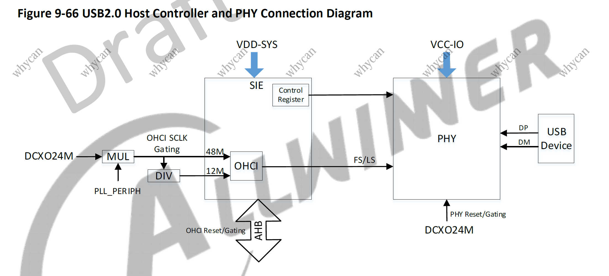

Does PHY initialized correctly and provide correct data to controller ? As is no explanation how is should be initialized in documentation need to look to code. But I'm can't be sure that RTT sunxi-hal code is correct as is not found USB devices. Need working example - in Devterm Linux work perfectly.

### Let see how is implemented in Linux.

I use article https://andreas.welcomes-you.com/boot-sw-debian-risc-v-lichee-rv and https://github.com/smaeul/linux to compile Linux kernel.

Created some scripts to atomized process:
* build/linux_image_create.sh
* build/linux_image_update_kernel.sh

Burn image to SD card and run. In Linux USB is up successfully and device enumerated.

<details><summary>linux console output:</summary>

```shell
Starting kernel ...
[    0.000000] Linux version 5.17.0-rc2-379425-g06b026a8b714-dirty (yury@yury) (riscv64-unknown-linux-gnu-gcc (C-SKY RISCV Tools V1.8.4 B20200702) 8.1.0, GNU ld (GNU Binutils) 2.32) #20 PREEMPT Mon Sep 9 07:05:32 UTC 2024

[    0.247663] usbcore: registered new interface driver usbfs
[    0.253218] usbcore: registered new interface driver hub
[    0.258568] usbcore: registered new device driver usb

[    0.441543] ehci_hcd: USB 2.0 'Enhanced' Host Controller (EHCI) Driver
[    0.448051] ehci-platform: EHCI generic platform driver
[    0.453655] ohci_hcd: USB 1.1 'Open' Host Controller (OHCI) Driver
[    0.459875] ohci-platform: OHCI generic platform driver

[    0.630352] usbcore: registered new interface driver snd-usb-audio

[    0.978834] phy phy-4100400.phy.0: Changing dr_mode to 1
[    1.842129] phy phy-4100400.phy.0: External vbus detected, not enabling our own vbus

[    1.850045] ehci-platform 4101000.usb: EHCI Host Controller
[    1.855779] ehci-platform 4101000.usb: new USB bus registered, assigned bus number 1
[    1.863877] ehci-platform 4101000.usb: irq 37, io mem 0x04101000
[    1.887139] ehci-platform 4101000.usb: USB 2.0 started, EHCI 1.00

[    1.900455] usb usb1: New USB device found, idVendor=1d6b, idProduct=0002, bcdDevice= 5.17
[    1.915139] usb usb1: New USB device strings: Mfr=3, Product=2, SerialNumber=1
[    1.922644] usb usb1: Product: EHCI Host Controller
[    1.927786] usb usb1: Manufacturer: Linux 5.17.0-rc2-379425-g06b026a8b714-dirty ehci_hcd
[    1.936129] usb usb1: SerialNumber: 4101000.usb
[    1.942243] hub 1-0:1.0: USB hub found
[    1.946548] hub 1-0:1.0: 1 port detected

[    1.970649] ehci-platform 4200000.usb: EHCI Host Controller
[    1.977091] ehci-platform 4200000.usb: new USB bus registered, assigned bus number 2
[    1.985107] ehci-platform 4200000.usb: irq 39, io mem 0x04200000
[    2.003583] ehci-platform 4200000.usb: USB 2.0 started, EHCI 1.00
[    2.010053] usb usb2: New USB device found, idVendor=1d6b, idProduct=0002, bcdDevice= 5.17
[    2.018383] usb usb2: New USB device strings: Mfr=3, Product=2, SerialNumber=1
[    2.025714] usb usb2: Product: EHCI Host Controller
[    2.030650] usb usb2: Manufacturer: Linux 5.17.0-rc2-379425-g06b026a8b714-dirty ehci_hcd
[    2.038778] usb usb2: SerialNumber: 4200000.usb
[    2.044319] hub 2-0:1.0: USB hub found
[    2.048243] hub 2-0:1.0: 1 port detected

[    2.053653] ohci-platform 4101400.usb: Generic Platform OHCI controller
[    2.060407] ohci-platform 4101400.usb: new USB bus registered, assigned bus number 3
[    2.068376] ohci-platform 4101400.usb: irq 38, io mem 0x04101400
[    2.135880] usb usb3: New USB device found, idVendor=1d6b, idProduct=0001, bcdDevice= 5.17
[    2.144213] usb usb3: New USB device strings: Mfr=3, Product=2, SerialNumber=1
[    2.151477] usb usb3: Product: Generic Platform OHCI controller
[    2.157449] usb usb3: Manufacturer: Linux 5.17.0-rc2-379425-g06b026a8b714-dirty ohci_hcd
[    2.165581] usb usb3: SerialNumber: 4101400.usb
[    2.171081] hub 3-0:1.0: USB hub found
[    2.175000] hub 3-0:1.0: 1 port detected

[    2.180667] ohci-platform 4200400.usb: Generic Platform OHCI controller
[    2.187649] ohci-platform 4200400.usb: new USB bus registered, assigned bus number 4
[    2.195661] ohci-platform 4200400.usb: irq 40, io mem 0x04200400
[    2.263855] usb usb4: New USB device found, idVendor=1d6b, idProduct=0001, bcdDevice= 5.17
[    2.272185] usb usb4: New USB device strings: Mfr=3, Product=2, SerialNumber=1
[    2.279452] usb usb4: Product: Generic Platform OHCI controller
[    2.285413] usb usb4: Manufacturer: Linux 5.17.0-rc2-379425-g06b026a8b714-dirty ohci_hcd
[    2.293539] usb usb4: SerialNumber: 4200400.usb
[    2.299038] hub 4-0:1.0: USB hub found
[    2.302957] hub 4-0:1.0: 1 port detected

[    2.608573] usb 4-1: new full-speed USB device number 2 using ohci-platform
[    2.850655] usb 4-1: New USB device found, idVendor=0483, idProduct=3748, bcdDevice= 1.00
[    2.859043] usb 4-1: New USB device strings: Mfr=1, Product=2, SerialNumber=3
[    2.866636] usb 4-1: Product: STM32 STLink
[    2.871152] usb 4-1: Manufacturer: STMicroelectronics
[    2.877704] usb 4-1: SerialNumber: 'Ä000002
```
</details>
<br>
Lets compare HAL and Linux drivers step by step to understand where can be mistake.

### Configuration

Lets look how Linux kernel configured to support D1H USB host and then compare with RTT configuration.

<details><summary>linux config:</summary>
I use configuration for Linux from https://andreas.welcomes-you.com/media/files/licheerv_linux_defconfig is define several USB related values:

```conf
CONFIG_PHY_SUN4I_USB=y
CONFIG_USB=y
CONFIG_USB_EHCI_HCD=y
CONFIG_USB_EHCI_HCD_PLATFORM=y
CONFIG_USB_OHCI_HCD=y
CONFIG_USB_OHCI_HCD_PLATFORM=y
```

This config also affect what files will be compiled according linux/drivers/usb/Makefile

```makefile
obj-$(CONFIG_USB)			+= core/
obj-$(CONFIG_USB_EHCI_HCD)	+= host/
```
</details>
<details><summary>On the other side in RTT config</summary>
In rt-thread\bsp\allwinner\libraries\sunxi-hal\hal\kconfig.h file

```c
#define CONFIG_USB_HOST 1
#define CONFIG_USB_EHCI 1
#define CONFIG_USB_EHCI_0 1
#define CONFIG_USB_EHCI_1 1
#define CONFIG_USB_OHCI 1
#define CONFIG_USB_OHCI_0 1
#define CONFIG_USB_OHCI_1 1
```
</details>
<br>
Comparing Linux and RTT is nothing extra difference in config and build. 

lets looks to Linux Device Tree Source files that describes the system's hardware layout:
<details><summary>Linux DTS:</summary>
From file https://github.com/smaeul/linux/blob/d1/all/arch/riscv/boot/dts/allwinner/sun20i-d1.dtsi

```json
		usbphy: phy@4100400 {
			compatible = "allwinner,sun20i-d1-usb-phy";
			reg = <0x4100400 0x100>,
			      <0x4101800 0x100>,
			      <0x4200800 0x100>;
			reg-names = "phy_ctrl",
				    "pmu0",
				    "pmu1";
			clocks = <&osc24M>,
				 <&osc24M>;
			clock-names = "usb0_phy",
				      "usb1_phy";
			resets = <&ccu RST_USB_PHY0>,
				 <&ccu RST_USB_PHY1>;
			reset-names = "usb0_reset",
				      "usb1_reset";
			#phy-cells = <1>;
			status = "disabled";
		};

		ehci1: usb@4200000 {
			compatible = "allwinner,sun20i-d1-ehci",
				     "generic-ehci";
			reg = <0x4200000 0x100>;
			clocks = <&ccu CLK_BUS_OHCI1>,
				 <&ccu CLK_BUS_EHCI1>,
				 <&ccu CLK_USB_OHCI1>;
			resets = <&ccu RST_BUS_OHCI1>,
				 <&ccu RST_BUS_EHCI1>;
			interrupts = <49 IRQ_TYPE_LEVEL_HIGH>;
			phys = <&usbphy 1>;
			phy-names = "usb";
			status = "disabled";
		};

		ohci1: usb@4200400 {
			compatible = "allwinner,sun20i-d1-ohci",
				     "generic-ohci";
			reg = <0x4200400 0x100>;
			clocks = <&ccu CLK_BUS_OHCI1>,
				 <&ccu CLK_USB_OHCI1>;
			resets = <&ccu RST_BUS_OHCI1>;
			interrupts = <50 IRQ_TYPE_LEVEL_HIGH>;
			phys = <&usbphy 1>;
			phy-names = "usb";
			status = "disabled";
		};
```

According this memory layout for USB is:
```c
OTG_PBASE		0x04100000
phy otg        	0x04100400

EHCI0     		0x04101000
OHCI0          	0x04101400
phy hci0       	0x04101800

EHCI1     		0x04200000
OHCI1          	0x04200400
phy hci1       	0x04200800
```
</details>
<details><summary>RTT analog:</summary>
File rt-thread\bsp\allwinner\libraries\sunxi-hal\hal\source\usb_melis\platform\sun20iw1\usb_sun20iw1.h

```c
#define SUNXI_USB_OTG_PBASE			0x04100000
#define SUNXI_USB_HCI0_PBASE		0x04101000
#define SUNXI_USB_HCI1_PBASE		0x04200000
```
</details>

Base registers seems the same.

### Look to clocks. 

<details><summary>Clock in Linux:</summary>
sun20i-d1.dtsi included:

```c
#include <dt-bindings/clock/sun20i-d1-ccu.h>
#include <dt-bindings/reset/sun20i-d1-ccu.h>
```
That can be found in linux/include/dt-bindings/clock/sun20i-d1-ccu.h
```c
#define CLK_USB_OHCI0		97
#define CLK_USB_OHCI1		98
#define CLK_BUS_OHCI0		99
#define CLK_BUS_OHCI1		100
#define CLK_BUS_EHCI0		101
#define CLK_BUS_EHCI1		102
#define CLK_BUS_OTG			103
```
And linux/include/dt-bindings/reset/sun20i-d1-ccu.h
```c
#define RST_USB_PHY0		40
#define RST_USB_PHY1		41
#define RST_BUS_OHCI0		42
#define RST_BUS_OHCI1		43
#define RST_BUS_EHCI0		44
#define RST_BUS_EHCI1		45
#define RST_BUS_OTG		    46
```
</details>
<details><summary>Clock in RTT:</summary>
In RTT file rt-thread\bsp\allwinner\libraries\sunxi-hal\hal\source\ccmu\sunxi-ng\ccu-sun8iw20.h

```c
#define CLK_USB_OHCI0       100
#define CLK_USB_OHCI1       101
#define CLK_BUS_OHCI0       102
#define CLK_BUS_OHCI1       103
#define CLK_BUS_EHCI0       104
#define CLK_BUS_EHCI1       105
#define CLK_BUS_OTG         106
```

And rt-thread\bsp\allwinner\libraries\sunxi-hal\hal\source\ccmu\sunxi-ng\rst-sun8iw20.h
```c
#define RST_USB_PHY0        42
#define RST_USB_PHY1        43
#define RST_BUS_OHCI0       44
#define RST_BUS_OHCI1       45
#define RST_BUS_EHCI0       46
#define RST_BUS_EHCI1       47
#define RST_BUS_OTG         48
```
</details>

Strange it shifted to 3 for clock and 2 for reset. 
Display and UART clock inited seccusefull with this shifts so assume is shifts is ok, just specific of clock driver implementation.

### Lets look how clock initialization implemented

<details><summary>Linux driver:</summary>

In Linux drivers/phy/allwinner/phy-sun4i-usb.c file sun4i_usb_phy_init() function:
```c
clk_prepare_enable(phy->clk);           // is osc24M
clk_prepare_enable(phy->clk2);          // is 0
reset_control_deassert(phy->reset);     // is RST_USB_PHY1 = 41

of_clk_get(dev->dev.of_node, clk);      //is CLK_BUS_EHCI1 = 102
reset_control_deassert(priv->rsts);     //is RST_BUS_EHCI1 = 45
```
</details>
<details><summary>RTT driver:</summary>

In RTT rt-thread\bsp\allwinner\libraries\sunxi-hal\hal\source\usb_melis\platform\sun20iw1\usb_sun20iw1.c

```c
	ehci-1
		.usb_clk = CLK_BUS_EHCI1 // 105
		.usb_rst = RST_BUS_EHCI1 // 47
		.phy_clk = 0,
		.phy_rst = RST_USB_PHY1  // 43

	ohci-1
		.ohci_clk = CLK_USB_OHCI1,
		.usb_clk  = CLK_BUS_OHCI1,
		.usb_rst  = RST_BUS_OHCI1,
		.phy_clk  = 0,
		.phy_rst  = RST_USB_PHY1
```

File rt-thread\bsp\allwinner\libraries\sunxi-hal\hal\source\usb_melis\host\sunxi-hci.c 

function hci_clock_init()

```c
	bus_clk_id    = usb_clk  // CLK_BUS_EHCI1 = 105
	reset_bus_clk = usb_rst  // RST_BUS_EHCI1 = 47
	phy_clk_id    = phy_clk  // 0
	reset_phy_clk = phy_rst  // RST_USB_PHY1  = 43
	ohci_clk_id   = ohci_clk // CLK_USB_OHCI1 = 101
```

function open_clock()

```c
reset_control_get(reset_phy_clk)   //RST_USB_PHY1  = 43
reset_control_deassert(reset_phy)
reset_control_put(reset_phy)

reset_control_get(reset_bus_clk)   //RST_BUS_EHCI1 = 47
reset_control_deassert(reset_hci)
reset_control_put(reset_hci)

clock_get(phy_clk_id)    //0
clock_enable(phy_clk)

clock_get(bus_clk_id)    //CLK_BUS_EHCI1 = 105
clock_enable(bus_clk)

clock_get(ohci_clk_id)   //CLK_USB_OHCI1 = 101
clock_enable(ohci_clk)   

```
</details>

Overall seems Linux and RTT implementation quite similar.

### Lets look how PHY initialization implemented

I add to drivers/phy/allwinner/phy-sun4i-usb.c help wrapper to understand what writed to registers

<details><summary>writel wrapper</summary>

```c
void writel_(u32 v, void __iomem *c)
{
	writel(v,c);
	printk(KERN_WARNING "phy writel %x<-%x\n",c,v);
}
```
But in Linux registers is ioremap so add some debug to sun4i_usb_phy_probe()
```c
	printk(KERN_WARNING "phy->pmu %s virt_addr: %x\n",name,phy->pmu);
	printk(KERN_WARNING "phy->pmu %s phy__addr: %x\n",name,platform_get_resource_byname(pdev,IORESOURCE_MEM,name)->start);

```
</details>

This result we have:

<details><summary>linux console output:</summary>

```shell
[    0.247663] usbcore: registered new interface driver usbfs
[    0.253218] usbcore: registered new interface driver hub
[    0.258568] usbcore: registered new device driver usb
[    0.441543] ehci_hcd: USB 2.0 'Enhanced' Host Controller (EHCI) Driver
[    0.448051] ehci-platform: EHCI generic platform driver
[    0.453655] ohci_hcd: USB 1.1 'Open' Host Controller (OHCI) Driver
[    0.459875] ohci-platform: OHCI generic platform driver
[    0.630352] usbcore: registered new interface driver snd-usb-audio
[    0.868509] sun4i_usb_phy_probe
[    0.871856] data->base phy_ctrl virt_addr: 4125400
[    0.876701] data->base phy_ctrl phy__addr: 4100400
[    0.882447] phy->clk name: usb0_phy
[    0.904067] phy->reset name: usb0_reset
[    0.908125] phy->pmu pmu0 virt_addr: 412d800
[    0.912816] phy->pmu pmu0 phy__addr: 4101800
[    0.917532] phy->clk name: usb1_phy
[    0.921247] phy->reset name: usb1_reset
[    0.925289] phy->pmu pmu1 virt_addr: 4141800
[    0.929669] phy->pmu pmu1 phy__addr: 4200800
[    0.943058] sun4i_usb_phy_init
[    0.946225] phy writel 412d810<-0
[    0.949651] phy writel 4125410<-20
[    0.953172] sun4i_usb_phy_passby
[    0.956571] phy writel 412d800<-701
[    0.960166] phy->index == 0
[    0.963023] sun4i_usb_phy0_update_iscr
[    0.966922] phy writel 4125400<-40010000
[    0.970945] sun4i_usb_phy0_update_iscr
[    0.974798] phy writel 4125400<-40030000
[    0.978834] phy phy-4100400.phy.0: Changing dr_mode to 1
[    1.842129] phy phy-4100400.phy.0: External vbus detected, not enabling our own vbus
[    1.850045] ehci-platform 4101000.usb: EHCI Host Controller
[    1.855779] ehci-platform 4101000.usb: new USB bus registered, assigned bus number 1
[    1.863877] ehci-platform 4101000.usb: irq 37, io mem 0x04101000
[    1.887139] ehci-platform 4101000.usb: USB 2.0 started, EHCI 1.00
[    1.900455] usb usb1: New USB device found, idVendor=1d6b, idProduct=0002, bcdDevice= 5.17
[    1.915139] usb usb1: New USB device strings: Mfr=3, Product=2, SerialNumber=1
[    1.922644] usb usb1: Product: EHCI Host Controller
[    1.927786] usb usb1: Manufacturer: Linux 5.17.0-rc2-379425-g06b026a8b714-dirty ehci_hcd
[    1.936129] usb usb1: SerialNumber: 4101000.usb
[    1.942243] hub 1-0:1.0: USB hub found
[    1.946548] hub 1-0:1.0: 1 port detected
[    1.956111] sun4i_usb_phy_init
[    1.959186] phy writel 4141810<-0
[    1.963807] sun4i_usb_phy_passby
[    1.967053] phy writel 4141800<-701
[    1.970649] ehci-platform 4200000.usb: EHCI Host Controller
[    1.977091] ehci-platform 4200000.usb: new USB bus registered, assigned bus number 2
[    1.985107] ehci-platform 4200000.usb: irq 39, io mem 0x04200000
[    2.003583] ehci-platform 4200000.usb: USB 2.0 started, EHCI 1.00
[    2.010053] usb usb2: New USB device found, idVendor=1d6b, idProduct=0002, bcdDevice= 5.17
[    2.018383] usb usb2: New USB device strings: Mfr=3, Product=2, SerialNumber=1
[    2.025714] usb usb2: Product: EHCI Host Controller
[    2.030650] usb usb2: Manufacturer: Linux 5.17.0-rc2-379425-g06b026a8b714-dirty ehci_hcd
[    2.038778] usb usb2: SerialNumber: 4200000.usb
[    2.044319] hub 2-0:1.0: USB hub found
[    2.048243] hub 2-0:1.0: 1 port detected
[    2.053653] ohci-platform 4101400.usb: Generic Platform OHCI controller
[    2.060407] ohci-platform 4101400.usb: new USB bus registered, assigned bus number 3
[    2.068376] ohci-platform 4101400.usb: irq 38, io mem 0x04101400
[    2.135880] usb usb3: New USB device found, idVendor=1d6b, idProduct=0001, bcdDevice= 5.17
[    2.144213] usb usb3: New USB device strings: Mfr=3, Product=2, SerialNumber=1
[    2.151477] usb usb3: Product: Generic Platform OHCI controller
[    2.157449] usb usb3: Manufacturer: Linux 5.17.0-rc2-379425-g06b026a8b714-dirty ohci_hcd
[    2.165581] usb usb3: SerialNumber: 4101400.usb
[    2.171081] hub 3-0:1.0: USB hub found
[    2.175000] hub 3-0:1.0: 1 port detected
[    2.180667] ohci-platform 4200400.usb: Generic Platform OHCI controller
[    2.187649] ohci-platform 4200400.usb: new USB bus registered, assigned bus number 4
[    2.195661] ohci-platform 4200400.usb: irq 40, io mem 0x04200400
[    2.263855] usb usb4: New USB device found, idVendor=1d6b, idProduct=0001, bcdDevice= 5.17
[    2.272185] usb usb4: New USB device strings: Mfr=3, Product=2, SerialNumber=1
[    2.279452] usb usb4: Product: Generic Platform OHCI controller
[    2.285413] usb usb4: Manufacturer: Linux 5.17.0-rc2-379425-g06b026a8b714-dirty ohci_hcd
[    2.293539] usb usb4: SerialNumber: 4200400.usb
[    2.299038] hub 4-0:1.0: USB hub found
[    2.302957] hub 4-0:1.0: 1 port detected
[    2.608573] usb 4-1: new full-speed USB device number 2 using ohci-platform
[    2.850655] usb 4-1: New USB device found, idVendor=0483, idProduct=3748, bcdDevice= 1.00
[    2.859043] usb 4-1: New USB device strings: Mfr=1, Product=2, SerialNumber=3
[    2.866636] usb 4-1: Product: STM32 STLink
[    2.871152] usb 4-1: Manufacturer: STMicroelectronics
[    2.877704] usb 4-1: SerialNumber: 'Ä000002
```
</details>

<details><summary>let's highlight in output the most important parts and change register value to real:
</summary>

```sh
sun4i_usb_phy_probe
data->base phy_ctrl virt_addr: 4125 400
data->base phy_ctrl phy__addr: 4100 400		//phy otg

phy->pmu pmu0 virt_addr: 412d 800
phy->pmu pmu0 phy__addr: 4101 800			//phy hci0
							  
phy->pmu pmu1 virt_addr: 4141 800
phy->pmu pmu1 phy__addr: 4200 800			//phy hci1 

sun4i_usb_phy_init			phy writel 4101 810<-0			// cntrl clear
						phy writel 4100 410<-20				// | 5 & 3	SIDDQ
sun4i_usb_phy_passby		phy writel 4101 800<-701		// | 10 9 8 0
phy->index == 0                             
sun4i_usb_phy0_update_iscr	phy writel 4100 400<-40010000	// & 0 | 16 
sun4i_usb_phy0_update_iscr	phy writel 4100 400<-40030000	// & 0 | 17
										    
										    
sun4i_usb_phy_init			phy writel 4200 810<-0			// cntrl clear
sun4i_usb_phy_passby		phy writel 4200 800<-701		// | 10 9 8 0
```
</details>

<details><summary>RTT add in functions print's like this:</summary>

```c
	rt_kprintf("phy write: %x<-%x\n\r",(sunxi_hci->usb_vbase + SUNXI_HCI_PHY_CTRL),reg_value);
```
</details>

<details><summary>RTT Console output:</summary>

```shell
[ehci-usb1] insmod host driver!
USBC_Clean_SIDDP
phy write: 4200810<-0
usb_passby
phy write: 4200800<-701
```
</details>
<br>
Overall seems Linux and RTT implementation quite similar.
Lets asume clock and phy init is ok. So maybe problem in EHCI/OHCI

## EHCI/OHCI

[D1H User manual](Allwinner_D1H/D1_User_Manual_V0.1_Draft_Version.pdf) contain usb related registers:

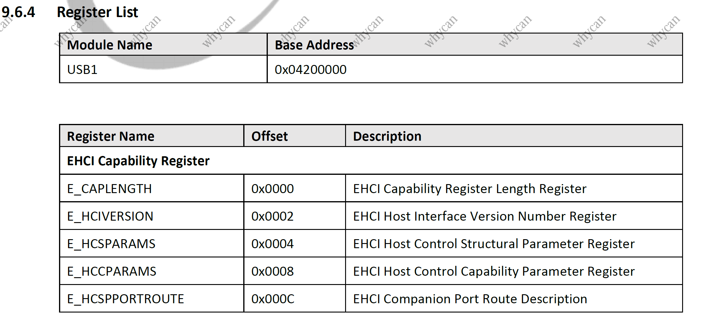

From registers we can understand that is used EHCI/OHCI. What is EHCI and OHCI ? 

According [https://wiki.osdev.org/Enhanced_Host_Controller_Interface](https://wiki.osdev.org/Enhanced_Host_Controller_Interface) <br>
"The Enhanced Host Controller Interface (EHCI) is the single method of interfacing with USB 2.0"<br>
"On a PC you will normally find the EHCI USB controller on the PCI bus - in fact it is the only access method specified in the specification. USB 2.0 supports interfacing with USB 1.0 devices. However, EHCI is NOT expected to support them. Instead, you will find an UHCI or OHCI companion controller. "

looking to EHCI Intel specification [ehci-specification-for-usb.pdf](USB/ehci-specification-for-usb.pdf)

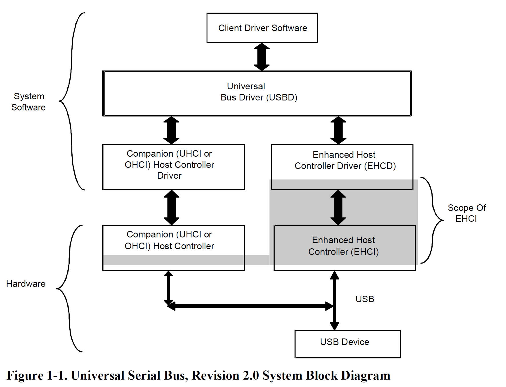

EHCI and OHCI is low level controllers for High and Full speed USB devices accordantly. Device can be routed to EHCI or OHCI depend what speed of device is.

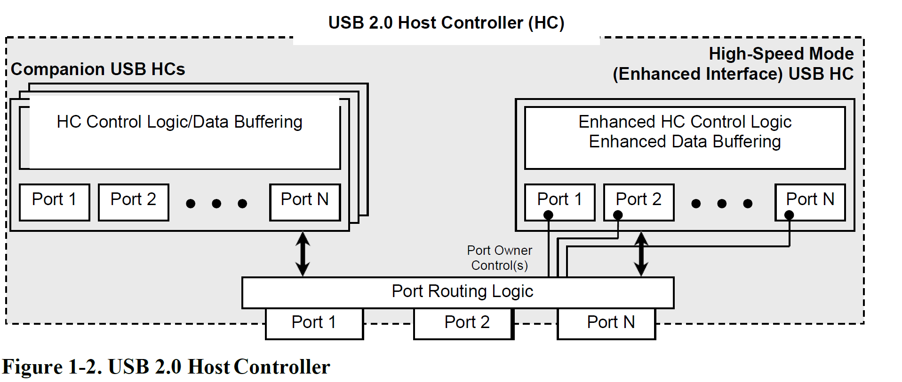

Code for work with EHCI in sunxi hal for me is quite complicated, and is not reach enumeration. So I tryed to find simple opensource implementation. 

RTT support use of external packages https://packages.rt-thread.org/en/index.html for USB stack offers CherryUSB and TinyUSB packages.<br>

This packages downloads from differen repositories to folder rt-thread/bsp/allwinner/d1s_d1h/packages. 
I created forks of this packages:
* https://github.com/ylyamin/CherryUSB_fork
* https://github.com/ylyamin/tinyusb_fork

Created driver with commands for all USB stack varians:

<details><summary>rt-thread\bsp\allwinner\libraries\drivers\drv_usbh.c</summary>

```c
int drv_usb_hal(void)
{
  hal_usb_core_init();
	hal_usb_hcd_init(1);
}
MSH_CMD_EXPORT_ALIAS(drv_usb_hal, usb_hal, usb);

int drv_usb_cherry(void)
{
    usbh_initialize(1, 0x04200000);
}
MSH_CMD_EXPORT_ALIAS(drv_usb_cherry, usb_cherry, usb);

extern int init_tinyusb(void);

int drv_usb_tiny(void)
{
    init_tinyusb();
}
MSH_CMD_EXPORT_ALIAS(drv_usb_tiny, usb_tiny, usb);
```
</details>

### CherryUSB
Lets start with CherryUSB.<br>
I do some changes in CherryUSB to support D1H but will not describe it here becouse CherryUSB didn't suit me in the end.<br>
But CherryUSB implementation have important moment.<br>
<details><summary>Lets run CherryUSB variant and look to console output:</summary>

```shell
msh />usb_cherry
[ehci-usb1] insmod host driver!
[sunxi-ehci1]: sunxi_set_vbus cnt.
[usbh core]: adding sub dev  (config #1, interface 0)
[ohci-usb1] insmod host driver!
[sunxi-ohci1]: sunxi_set_vbus cnt.
[usbh core]: adding sub dev  (config #1, interface 0)[I/USB] EHCI HCIVERSION:0x0100
[I/USB] EHCI HCSPARAMS:0x001101
[I/USB] EHCI HCCPARAMS:0xa026
[I/USB] EHCI caplength:0x0010
[I/USB] EHCI ppc:0, n_ports:1, n_cc:1, n_pcc:1
[I/USB] EHCI_HCOR addr:4200010
OHCI_IRQHandler usbsts 40
[I/USB] EHCI uses companion controller for ls/fs device
[I/USB] OHCI hcrevision:0x10
OHCI_IRQHandler usbsts 40
OHCI_IRQHandler usbsts 40
OHCI_IRQHandler usbsts 40
[D/usbh_hub] Port change:0x02
[D/usbh_hub] Port 1 change
[D/usbh_hub] port 1, status:0x100, change:0x01
OHCI_IRQHandler usbsts 40
[D/usbh_hub] Port 1, status:0x100, change:0x00
[D/usbh_hub] Port 1, status:0x100, change:0x00
[D/usbh_hub] Port 1, status:0x100, change:0x00
[D/usbh_hub] Port 1, status:0x100, change:0x00
[I/usbh_hub] Device on Bus 1, Hub 1, Port 1 disconnected
[D/usbh_hub] Port change:0x00
OHCI_IRQHandler usbsts 40
[D/usbh_hub] Port change:0x02
[D/usbh_hub] Port 1 change
[D/usbh_hub] port 1, status:0x101, change:0x01
OHCI_IRQHandler usbsts 40
[D/usbh_hub] Port 1, status:0x101, change:0x00
[D/usbh_hub] Port 1, status:0x101, change:0x00
[D/usbh_hub] Port 1, status:0x101, change:0x00
[D/usbh_hub] Port 1, status:0x101, change:0x00
[D/usbh_hub] Port 1, status:0x101, change:0x00
OHCI_IRQHandler usbsts 40
OHCI_IRQHandler usbsts 40
OHCI_IRQHandler usbsts 40
[I/usbh_hub] New full-speed device on Bus 1, Hub 1, Port 1 connected
[E/usbh_core] Failed to get device descriptor,errorcode:-5
[E/usbh_hub] Port 1 enumerate fail
[D/usbh_hub] Port change:0x00
```
</details>
<br>
Looks like EHCI detect connection of full speed device and then use companion controller OHCI to this device

According to [EHCI Intel specification](USB/ehci-specification-for-usb.pdf)

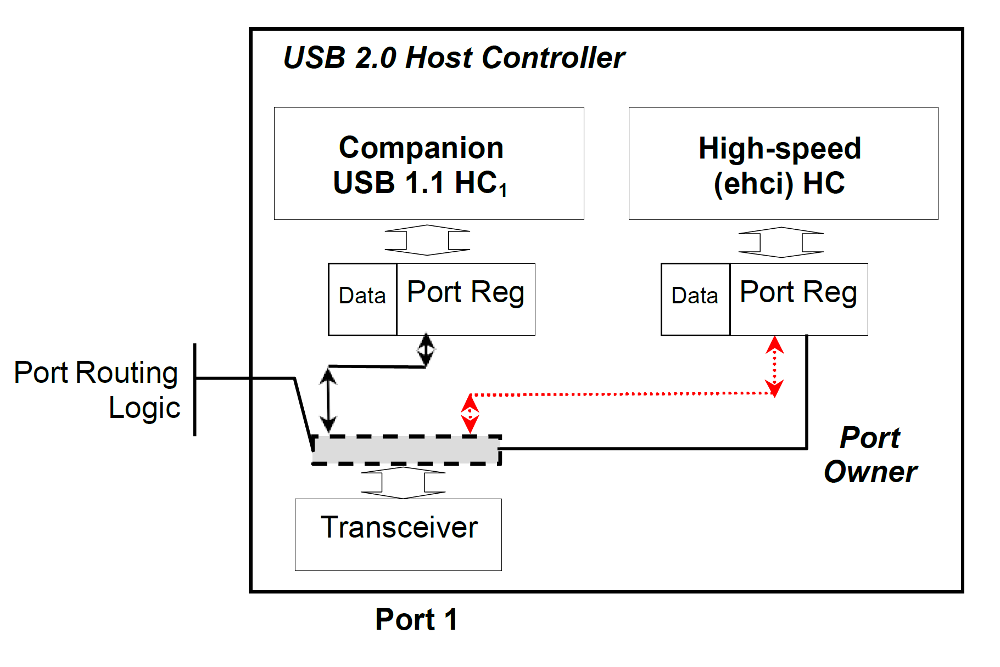

Cherry USB do switching from EHCI to OHCI companion controller but in Cherry USB - OHCI transfer functions is not implemented.
<details><summary>rt-thread\bsp\allwinner\d1s_d1h\packages\CherryUSB\port\ohci\usb_hc_ohci.c</summary>

```c
int ohci_submit_urb(struct usbh_urb *urb)
{
    return -USB_ERR_NOTSUPP;
}

int ohci_kill_urb(struct usbh_urb *urb)
{
    return -USB_ERR_NOTSUPP;
}
```
</details>

### TinyUSB
In TinyUSB transfer functions is implemented for EHCI and OHCI

/src/portable/ehci/ehci.c<br>
/src/portable/ohci/ohci.c<br>

But not implemented switching to OHCI companion controller. Lets try to do it.

### First need to change TinyUSB build
<details><summary>Change build and config files to support host stack:</summary>

```patch
diff --git a/rt-thread/SConscript b/rt-thread/SConscript
index 628f6aabe..386e08f2a 100644
--- a/rt-thread/SConscript
+++ b/rt-thread/SConscript
@@ -5,11 +5,19 @@ cwd     = GetCurrentDir()
 src     = Split("""
 ../src/tusb.c
 ../src/common/tusb_fifo.c
-../src/device/usbd.c
-../src/device/usbd_control.c
+../src/host/hub.c
+../src/host/usbh.c
+../src/class/hid/hid_host.c
+../src/portable/ehci/ehci.c
+../src/portable/ohci/ohci.c
 ./tinyusb_port.c
-./usb_descriptor.c
 """)
+
+
+#../src/device/usbd.c
+#../src/device/usbd_control.c
+#./usb_descriptor.c
+
 path = [cwd, cwd + "/../src"]
 
 # BSP
@@ -31,6 +39,11 @@ if GetDepend(["SOC_RP2040"]):
             "../src/portable/raspberrypi/rp2040/rp2040_usb.c",
             "../src/portable/raspberrypi/rp2040/dcd_rp2040.c"]
 
+if GetDepend(["ARCH_SUN20IW1"]):
+    src += ["bsp/sunxi_D1/drv_tinyusb.c"]
+    src += ["../examples/host/bare_api/src/main.c"]
+    src += ["../examples/host/hid_controller/src/hid_app.c"]
+

diff --git a/rt-thread/tusb_config.h b/rt-thread/tusb_config.h
index 710a54e07..9c5894b16 100644
--- a/rt-thread/tusb_config.h
+++ b/rt-thread/tusb_config.h
@@ -48,34 +48,39 @@ extern "C" {
 #define CFG_TUSB_MCU    OPT_MCU_HPM
 #elif defined(SOC_RP2040)
 #define CFG_TUSB_MCU    OPT_MCU_RP2040
+#elif defined(ARCH_SUN20IW1)
+#define CFG_TUSB_MCU    OPT_MCU_SUN20IW1
 #else
 #error "Not support for current MCU"
 #endif
 
 #define CFG_TUSB_OS OPT_OS_RTTHREAD
 
+
 //--------------------------------------------------------------------
 // DEBUG CONFIGURATION
 //--------------------------------------------------------------------
+#define CFG_TUSB_DEBUG 3
+
 #ifdef CFG_TUSB_DEBUG
 #define CFG_TUSB_DEBUG_PRINTF rt_kprintf
 #endif /* CFG_TUSB_DEBUG */
 
-#ifndef BOARD_DEVICE_RHPORT_NUM
-#define BOARD_DEVICE_RHPORT_NUM     PKG_TINYUSB_RHPORT_NUM
-#endif
+//#ifndef BOARD_DEVICE_RHPORT_NUM
+//#define BOARD_DEVICE_RHPORT_NUM     PKG_TINYUSB_RHPORT_NUM
+//#endif
 
-#ifndef BOARD_DEVICE_RHPORT_SPEED
-#define BOARD_DEVICE_RHPORT_SPEED   PKG_TINYUSB_DEVICE_PORT_SPEED
-#endif
+//#ifndef BOARD_DEVICE_RHPORT_SPEED
+//#define BOARD_DEVICE_RHPORT_SPEED   PKG_TINYUSB_DEVICE_PORT_SPEED
+//#endif
 
-#if   BOARD_DEVICE_RHPORT_NUM == 0
-#define CFG_TUSB_RHPORT0_MODE     (OPT_MODE_DEVICE | BOARD_DEVICE_RHPORT_SPEED)
-#elif BOARD_DEVICE_RHPORT_NUM == 1
-#define CFG_TUSB_RHPORT1_MODE     (OPT_MODE_DEVICE | BOARD_DEVICE_RHPORT_SPEED)
-#else
-  #error "Incorrect RHPort configuration"
-#endif
+//#if   BOARD_DEVICE_RHPORT_NUM == 0
+//#define CFG_TUSB_RHPORT0_MODE     (OPT_MODE_HOST | BOARD_DEVICE_RHPORT_SPEED)
+//#elif BOARD_DEVICE_RHPORT_NUM == 1
+//#define CFG_TUSB_RHPORT1_MODE     (OPT_MODE_HOST | BOARD_DEVICE_RHPORT_SPEED)
+//#else
+//  #error "Incorrect RHPort configuration"
+//#endif
 
 /* USB DMA on some MCUs can only access a specific SRAM region with restriction on alignment.
  * Tinyusb use follows macros to declare transferring memory so that they can be put
@@ -99,35 +104,44 @@ extern "C" {
 #define CFG_TUSB_MEM_ALIGN          ALIGN(PKG_TINYUSB_MEM_ALIGN)
 #endif
 #endif
-
 //--------------------------------------------------------------------
-// DEVICE CONFIGURATION
+// HOST CONFIGURATION
 //--------------------------------------------------------------------
+#define TUP_USBIP_EHCI
+//#define TUP_USBIP_OHCI
+#define LPC_USB_BASE  0x4200000 + 0x400
 
-#ifndef CFG_TUD_ENDPOINT0_SIZE
-#define CFG_TUD_ENDPOINT0_SIZE        PKG_TINYUSB_EDPT0_SIZE
-#endif
+#define CFG_TUH_ENABLED       1
+#define CFG_TUSB_RHPORT0_MODE OPT_MODE_HOST
+#define CFG_TUH_MAX_SPEED     OPT_MODE_HIGH_SPEED
+// Size of buffer to hold descriptors and other data used for enumeration
+#define CFG_TUH_ENUMERATION_BUFSIZE 2560
 
-// CDC FIFO size of TX and RX
-#define CFG_TUD_CDC_RX_BUFSIZE        PKG_TINYUSB_DEVICE_CDC_RX_BUFSIZE
-#define CFG_TUD_CDC_TX_BUFSIZE        PKG_TINYUSB_DEVICE_CDC_TX_BUFSIZE
+// only hub class is enabled
+#define CFG_TUH_HUB                 1
+#define CFG_TUH_HID                 4 // typical keyboard + mouse device can have 3-4 HID interfaces
+#define CFG_TUH_HID_EP_BUFSIZE      640
 
-#define CFG_TUD_MSC_EP_BUFSIZE        PKG_TINYUSB_DEVICE_MSC_EP_BUFSIZE
 
-#define CFG_TUD_HID_EP_BUFSIZE        PKG_TINYUSB_DEVICE_HID_EP_BUFSIZE
+// max device support (excluding hub device)
+// 1 hub typically has 4 ports
+#define CFG_TUH_DEVICE_MAX          (CFG_TUH_HUB ? 4 : 1)
 
-#ifndef PKG_TINYUSB_DEVICE_CDC_STRING
-#define PKG_TINYUSB_DEVICE_CDC_STRING ""
-#endif
+// Max endpoint per device
+#define CFG_TUH_ENDPOINT_MAX        8
 
-#ifndef PKG_TINYUSB_DEVICE_MSC_STRING
-#define PKG_TINYUSB_DEVICE_MSC_STRING ""
-#endif
+// Enable tuh_edpt_xfer() API
+#define CFG_TUH_API_EDPT_XFER       1
 
-#ifndef PKG_TINYUSB_DEVICE_HID_STRING
-#define PKG_TINYUSB_DEVICE_HID_STRING ""
+// RHPort number used for host can be defined by board.mk, default to port 0
+#ifndef BOARD_TUH_RHPORT
+#define BOARD_TUH_RHPORT      0
 #endif
 
+//--------------------------------------------------------------------
+// DEVICE CONFIGURATION
+//--------------------------------------------------------------------
+#define CFG_TUD_ENABLED 0
 
 #ifdef __cplusplus
 }

diff --git a/src/tusb_option.h b/src/tusb_option.h
index f4ce843d5..0d59062cd 100644
--- a/src/tusb_option.h
+++ b/src/tusb_option.h
@@ -159,6 +159,7 @@ typedef int make_iso_compilers_happy;
 
 // Allwinner
 #define OPT_MCU_F1C100S          2100 ///< Allwinner F1C100s family
+#define OPT_MCU_SUN20IW1         2101 ///< Allwinner SUN20IW1 family

diff --git a/src/common/tusb_compiler.h b/src/common/tusb_compiler.h
index 2c30daf6f..8d1c083e6 100644
--- a/src/common/tusb_compiler.h
+++ b/src/common/tusb_compiler.h
@@ -49,6 +49,8 @@
 #else
   #define _TU_COUNTER_ __LINE__
 #endif
+#define __CCRX__ 1

diff --git a/src/osal/osal_rtthread.h b/src/osal/osal_rtthread.h
index 18eb9c693..e4d7b6af1 100644
--- a/src/osal/osal_rtthread.h
+++ b/src/osal/osal_rtthread.h
@@ -38,7 +38,8 @@ extern "C" {
 // TASK API
 //--------------------------------------------------------------------+
 TU_ATTR_ALWAYS_INLINE static inline void osal_task_delay(uint32_t msec) {
-  rt_thread_mdelay(msec);
+  //rt_thread_mdelay(msec);
+  rt_hw_us_delay(msec*1000);
 }

diff --git a/rt-thread/tinyusb_port.c b/rt-thread/tinyusb_port.c
index 8ae20b04e..7a6e37c22 100644
--- a/rt-thread/tinyusb_port.c
+++ b/rt-thread/tinyusb_port.c
@@ -27,11 +27,11 @@ static void tusb_thread_entry(void *parameter)
     (void) parameter;
     while (1)
     {
-        tud_task();
+        tuh_task();
     }
 }
 
-static int init_tinyusb(void)
+int init_tinyusb(void)
 {
     rt_thread_t tid;
 
@@ -60,4 +60,4 @@ static int init_tinyusb(void)
 
     return 0;
 }
-INIT_COMPONENT_EXPORT(init_tinyusb);
+//INIT_COMPONENT_EXPORT(init_tinyusb);
```
</details>

### Rename OHCI functions
In EHCI and OHCI several functions have the same name becouse of that linking filed. 
<details><summary>Need to rename OHCI functions.</summary>

```patch
diff --git a/src/portable/ohci/ohci.c b/src/portable/ohci/ohci.c
index 228da6ae0..b7719548f 100644
--- a/src/portable/ohci/ohci.c
+++ b/src/portable/ohci/ohci.c

-uint32_t hcd_frame_number(uint8_t rhport)
+uint32_t ohci_hcd_frame_number(uint8_t rhport)
 {
   (void) rhport;
   return (ohci_data.frame_number_hi << 16) | OHCI_REG->frame_number;
@@ -210,24 +226,24 @@ uint32_t hcd_frame_number(uint8_t rhport)
 //--------------------------------------------------------------------+
 // PORT API
 //--------------------------------------------------------------------+
-void hcd_port_reset(uint8_t hostid)
+void ohci_hcd_port_reset(uint8_t hostid)
 {
   (void) hostid;
   OHCI_REG->rhport_status[0] = RHPORT_PORT_RESET_STATUS_MASK;
 }
 
-void hcd_port_reset_end(uint8_t rhport)
+void ohci_hcd_port_reset_end(uint8_t rhport)
 {
   (void) rhport;
 }
 
-bool hcd_port_connect_status(uint8_t hostid)
+bool ohci_hcd_port_connect_status(uint8_t hostid)
 {
   (void) hostid;
   return OHCI_REG->rhport_status_bit[0].current_connect_status;
 }
 
-tusb_speed_t hcd_port_speed_get(uint8_t hostid)
+tusb_speed_t ohci_hcd_port_speed_get(uint8_t hostid)
 {
   (void) hostid;
   return OHCI_REG->rhport_status_bit[0].low_speed_device_attached ? TUSB_SPEED_LOW : TUSB_SPEED_FULL;
@@ -235,7 +251,7 @@ tusb_speed_t hcd_port_speed_get(uint8_t hostid)
 
 // endpoints are tied to an address, which only reclaim after a long delay when enumerating
 // thus there is no need to make sure ED is not in HC's cahed as it will not for sure
-void hcd_device_close(uint8_t rhport, uint8_t dev_addr)
+void ohci_hcd_device_close(uint8_t rhport, uint8_t dev_addr)
 {
   // TODO OHCI
   (void) rhport;
@@ -398,7 +414,7 @@ static void td_insert_to_ed(ohci_ed_t* p_ed, ohci_gtd_t * p_gtd)
 // Endpoint API
 //--------------------------------------------------------------------+
 
-bool hcd_edpt_open(uint8_t rhport, uint8_t dev_addr, tusb_desc_endpoint_t const * ep_desc)
+bool ohci_hcd_edpt_open(uint8_t rhport, uint8_t dev_addr, tusb_desc_endpoint_t const * ep_desc)
 {
   (void) rhport;
 
@@ -432,7 +448,7 @@ bool hcd_edpt_open(uint8_t rhport, uint8_t dev_addr, tusb_desc_endpoint_t const
   return true;
 }
 
-bool hcd_setup_send(uint8_t rhport, uint8_t dev_addr, uint8_t const setup_packet[8])
+bool ohci_hcd_setup_send(uint8_t rhport, uint8_t dev_addr, uint8_t const setup_packet[8])
 {
   (void) rhport;
 
@@ -453,7 +469,7 @@ bool hcd_setup_send(uint8_t rhport, uint8_t dev_addr, uint8_t const setup_packet
   return true;
 }
 
-bool hcd_edpt_xfer(uint8_t rhport, uint8_t dev_addr, uint8_t ep_addr, uint8_t * buffer, uint16_t buflen)
+bool ohci_hcd_edpt_xfer(uint8_t rhport, uint8_t dev_addr, uint8_t ep_addr, uint8_t * buffer, uint16_t buflen)
 {
   (void) rhport;
 
@@ -495,7 +511,7 @@ bool hcd_edpt_xfer(uint8_t rhport, uint8_t dev_addr, uint8_t ep_addr, uint8_t *
   return true;
 }
 
-bool hcd_edpt_clear_stall(uint8_t dev_addr, uint8_t ep_addr)
+bool ohci_hcd_edpt_clear_stall(uint8_t dev_addr, uint8_t ep_addr)
 {
   ohci_ed_t * const p_ed = ed_from_addr(dev_addr, ep_addr);
 
@@ -604,13 +620,17 @@ static void done_queue_isr(uint8_t hostid)
   }
 }
 
-void hcd_int_handler(uint8_t hostid)
+void ohci_hcd_int_handler(uint8_t hostid)
 {
+  hostid = 0;
```
</details>

### Implement TinyUSB driver for D1H
<details><summary>Copy sunxi-hal usb initilization to tiny init, redefine inerrupt handlers for ehci/ohci:</summary>

```patch
diff --git a/rt-thread/bsp/sunxi_D1/drv_tinyusb.c b/rt-thread/bsp/sunxi_D1/drv_tinyusb.c
new file mode 100644
index 000000000..59d64a85f
--- /dev/null
+++ b/rt-thread/bsp/sunxi_D1/drv_tinyusb.c
@@ -0,0 +1,97 @@
+/*
+ */
+#include <rtthread.h>
+#include "host/usbh.h"
+#include <sunxi-hci.h>
+#include <interrupt.h>
+#include <usb_os_platform.h>
+#include <portable/ehci/ehci_api.h>
+
+void ehci_handler(void)
+{
+   rt_interrupt_enter();
+   ehci_hcd_int_handler(0);
+   rt_interrupt_leave();
+}
+
+void ohci_handler(void)
+{
+   rt_interrupt_enter();
+   ohci_hcd_int_handler(0);
+   rt_interrupt_leave();
+}
+
+bool hcd_init(uint8_t rhport)
+{
+    ehci_init(rhport, (uint32_t) 0x4200000, (uint32_t) 0x4200010);
+    #ifdef TUP_USBIP_OHCI
+    ohci_hcd_init_(rhport);
+    #endif
+    return 1;
+}
+
+void ehci_int_enable(void)
+{
+   int irq_no = 49;
+   disable_irq(irq_no);
+   request_irq(irq_no, ehci_handler, 0, "ehci", NULL);
+   enable_irq(irq_no);
+}
+
+void ohci_int_enable(void)
+{
+   int irq_no = 50;
+   disable_irq(irq_no);
+   request_irq(irq_no, ohci_handler, 0, "ohci", NULL);
+   enable_irq(irq_no);
+}
+
+void hcd_int_enable(uint8_t rhport)
+{
+    ehci_int_enable();
+    #ifdef TUP_USBIP_OHCI
+    ohci_int_enable();
+    #endif
+}
+
+
+int tusb_board_init(void)
+{
+    hal_usb_core_init();
+	   hal_usb_hcd_init(1);
+    return 1;
+}
```
</details>

### Disable interrupts in sunxi-hal

<details><summary>Change files:</summary>

rt-thread/bsp/allwinner/libraries/sunxi-hal/hal/source/usb_melis/host/ehci-sunxi.c

```patch
+	/* 	
	if (hal_request_irq(sunxi_ehci->irq_no, ehci_irq_handler, "ehci", hcd) < 0) {
		hal_log_err("request irq error\n");
		return -1;
	}
	hal_enable_irq(sunxi_ehci->irq_no); 
+	*/
```

rt-thread/bsp/allwinner/libraries/sunxi-hal/hal/source/usb_melis/host/ohci-sunxi.c

```patch
+/*
  	if (hal_request_irq(sunxi_ohci->irq_no, ohci_irq_handler, "ohci", hcd) < 0) {
		hal_log_err("request irq error\n");
		return -1;
	}

	hal_enable_irq(sunxi_ohci->irq_no); 
+*/
```

</details>


### Add switching to companion support
<details><summary>If ehci detect full speed device put port owner to 1</summary>

```patch
diff --git a/src/portable/ehci/ehci.c b/src/portable/ehci/ehci.c
index 7140897a1..eec62ce46 100644
--- a/src/portable/ehci/ehci.c
+++ b/src/portable/ehci/ehci.c

+void hcd_switch_to_companion(uint8_t rhport)
+{
+  (void) rhport;
+  rt_kprintf("hcd_switch_to_companion\n\r");
+  ehci_data.regs->config_flag = 0;
+  ehci_data.regs->portsc_bm.port_owner = 1;
+  uint32_t temp = ehci_data.regs->command;
+}

diff --git a/src/host/usbh.c b/src/host/usbh.c
index 5ac9e9cca..4fdf9c099 100644
--- a/src/host/usbh.c
+++ b/src/host/usbh.c
 
+bool is_companion = 0;
 
@@ -550,7 +557,16 @@ bool tuh_control_xfer (tuh_xfer_t* xfer)
 
   if (xfer->complete_cb)
   {
-    TU_ASSERT( hcd_setup_send(rhport, daddr, (uint8_t const*) &_ctrl_xfer.request) );
+    #ifdef TUP_USBIP_OHCI
+    if(is_companion)
+    {
+      TU_ASSERT( ohci_hcd_setup_send(rhport, daddr, (uint8_t const*) &_ctrl_xfer.request) );
+    }
+    else
+    #endif
+    {
+      TU_ASSERT( hcd_setup_send(rhport, daddr, (uint8_t const*) &_ctrl_xfer.request) );
+    }
   }else
   {
     // blocking if complete callback is not provided
@@ -561,7 +577,16 @@ bool tuh_control_xfer (tuh_xfer_t* xfer)
     _ctrl_xfer.user_data   = (uintptr_t) &result;
     _ctrl_xfer.complete_cb = _control_blocking_complete_cb;
 
-    TU_ASSERT( hcd_setup_send(rhport, daddr, (uint8_t*) &_ctrl_xfer.request) );
+    #ifdef TUP_USBIP_OHCI
+    if(is_companion)
+    {
+      TU_ASSERT( ohci_hcd_setup_send(rhport, daddr, (uint8_t*) &_ctrl_xfer.request) );
+    }
+    else
+    #endif
+    {
+      TU_ASSERT( hcd_setup_send(rhport, daddr, (uint8_t*) &_ctrl_xfer.request) );
+    }
 
     while (result == XFER_RESULT_INVALID)
     {
@@ -640,7 +665,18 @@ static bool usbh_control_xfer_cb (uint8_t dev_addr, uint8_t ep_addr, xfer_result
         {
           // DATA stage: initial data toggle is always 1
           _set_control_xfer_stage(CONTROL_STAGE_DATA);
-          TU_ASSERT( hcd_edpt_xfer(rhport, dev_addr, tu_edpt_addr(0, request->bmRequestType_bit.direction), _ctrl_xfer.buffer, request->wLength) );
+          
+          #ifdef TUP_USBIP_OHCI
+
+          if(is_companion)
+          {
+            TU_ASSERT( ohci_hcd_edpt_xfer(rhport, dev_addr, tu_edpt_addr(0, request->bmRequestType_bit.direction), _ctrl_xfer.buffer, request->wLength) );
+          }
+          else
+          #endif
+          {
+            TU_ASSERT( hcd_edpt_xfer(rhport, dev_addr, tu_edpt_addr(0, request->bmRequestType_bit.direction), _ctrl_xfer.buffer, request->wLength) );
+          }
           return true;
         }
         TU_ATTR_FALLTHROUGH;
@@ -656,7 +692,17 @@ static bool usbh_control_xfer_cb (uint8_t dev_addr, uint8_t ep_addr, xfer_result
 
         // ACK stage: toggle is always 1
         _set_control_xfer_stage(CONTROL_STAGE_ACK);
-        TU_ASSERT( hcd_edpt_xfer(rhport, dev_addr, tu_edpt_addr(0, 1-request->bmRequestType_bit.direction), NULL, 0) );
+        #ifdef TUP_USBIP_OHCI
+        if(is_companion)
+        {
+          TU_ASSERT( ohci_hcd_edpt_xfer(rhport, dev_addr, tu_edpt_addr(0, 1-request->bmRequestType_bit.direction), NULL, 0) );
+        }
+        else
+        #endif
+        {
+          TU_ASSERT( hcd_edpt_xfer(rhport, dev_addr, tu_edpt_addr(0, 1-request->bmRequestType_bit.direction), NULL, 0) );
+        }
+
       break;
 
       case CONTROL_STAGE_ACK:
@@ -779,7 +825,19 @@ bool usbh_edpt_xfer_with_callback(uint8_t dev_addr, uint8_t ep_addr, uint8_t * b
   dev->ep_callback[epnum][dir].user_data   = user_data;
 #endif
 
-  if ( hcd_edpt_xfer(dev->rhport, dev_addr, ep_addr, buffer, total_bytes) )
+  bool result;
+  #ifdef TUP_USBIP_OHCI
+  if(is_companion)
+  {
+    result = ohci_hcd_edpt_xfer(dev->rhport, dev_addr, ep_addr, buffer, total_bytes);
+  }
+  else
+  #endif
+  {
+    result = hcd_edpt_xfer(dev->rhport, dev_addr, ep_addr, buffer, total_bytes);
+  }
+
+  if ( result )
   {
     TU_LOG_USBH("OK\r\n");
     return true;
@@ -807,15 +865,31 @@ static bool usbh_edpt_control_open(uint8_t dev_addr, uint8_t max_packet_size)
     .wMaxPacketSize   = max_packet_size,
     .bInterval        = 0
   };
-
-  return hcd_edpt_open(usbh_get_rhport(dev_addr), dev_addr, &ep0_desc);
+  #ifdef TUP_USBIP_OHCI
+  if(is_companion)
+  {
+    return ohci_hcd_edpt_open(usbh_get_rhport(dev_addr), dev_addr, &ep0_desc);
+  }
+  else
+  #endif
+  {
+    return hcd_edpt_open(usbh_get_rhport(dev_addr), dev_addr, &ep0_desc);
+  }
 }
 
 bool tuh_edpt_open(uint8_t dev_addr, tusb_desc_endpoint_t const * desc_ep)
 {
   TU_ASSERT( tu_edpt_validate(desc_ep, tuh_speed_get(dev_addr)) );
-
-  return hcd_edpt_open(usbh_get_rhport(dev_addr), dev_addr, desc_ep);
+  #ifdef TUP_USBIP_OHCI
+  if(is_companion)
+  {
+    return ohci_hcd_edpt_open(usbh_get_rhport(dev_addr), dev_addr, desc_ep);
+  }
+  else
+  #endif
+  {
+    return hcd_edpt_open(usbh_get_rhport(dev_addr), dev_addr, desc_ep);
+  }
 }
 
@@ -1387,13 +1462,26 @@ static bool enum_new_device(hcd_event_t* event)

+    #ifdef TUP_USBIP_OHCI
+    // go to companion
+    if(((tusb_speed_t)_dev0.speed) != TUSB_SPEED_HIGH)
+    {
+      if (!is_companion) hcd_switch_to_companion(_dev0.rhport);
+      is_companion = 1;
+      return true;
+    }
+    else
+    {
+      is_companion = 0;
+    }
+    #endif
```
</details>


## Test
Lets put any USB device in board USB socket and run TinyUSB variant:
```sh
msh />usb_tiny
```

RTT Console output:
```sh
[ehci-usb1] insmod host driver!
phy write: 4200810<-0
phy write: 4200800<-701
[sunxi-ehci1]: sunxi_set_vbus cnt.
plic_irq_toggle irq:76,enable:1
[usbh core]: adding sub dev  (config #1, interface 0)
[ohci-usb1] insmod host driver!
phy write: 4200810<-0
phy write: 4200800<-701
[sunxi-ohci1]: sunxi_set_vbus cnt.
[usbh core]: adding sub dev  (config #1, interface 0)USBH init on controller 0
sizeof(usbh_device_t) = 312
sizeof(hcd_event_t) = 24
sizeof(_ctrl_xfer) = 40
sizeof(tuh_xfer_t) = 48
sizeof(tu_fifo_t) = 32
sizeof(tu_edpt_stream_t) = 144
osal: rt_mq_init result: 0
HID init
HUB init
tiny ehci_init
EHCI HCIVERSION:0x0100
EHCI HCSPARAMS:0x001101
EHCI HCCPARAMS:0xa026
EHCI HCI_interface:     1793
EHCI HCI_Control_3:     0
EHCI PHY_Control (810): 0
EHCI PHY_Status  (824): 0
EHCI HCI_SIE_Port:      3
tiny ohcd_init
plic_irq_toggle irq:49,enable:0
plic_irq_toggle irq:49,enable:1
plic_irq_toggle irq:50,enable:0
plic_irq_toggle irq:50,enable:1
tuh_task_ext: tusb_inited
```
No reaction to USB device attach / de-attach.<br>
In function tusb_board_init() lets not use common sunxi-hal initialisation instead put only specific HAL function open_clock() usb_passby():
```patch
diff --git a/rt-thread/bsp/sunxi_D1/drv_tinyusb.c b/rt-thread/bsp/sunxi_D1/drv_tinyusb.c

int tusb_board_init(void)
{
+    //assertion failed at function:_map_one_page
+    int hci_num = 1;
+    //ehci
+    struct sunxi_hci_hcd *sunxi_ehci;
+    struct platform_usb_config *ehci_table = platform_get_ehci_table();
+    struct platform_usb_config *otg_table = platform_get_otg_table();
+    sunxi_ehci->usbc_no     = hci_num;
+    sunxi_ehci->usb_vbase   = ehci_table[hci_num].pbase;
+    sunxi_ehci->irq_no      = ehci_table[hci_num].irq;
+    sunxi_ehci->otg_vbase   = otg_table->pbase;
+	   sprintf(sunxi_ehci->hci_name, "%s", ehci_table[hci_num].name);
+
+    hci_clock_init(sunxi_ehci,ehci_table);
+    open_clock(sunxi_ehci);
+    usb_passby(sunxi_ehci, 1);
+
+    //ohci
+    struct sunxi_hci_hcd *sunxi_ohci;
+    struct platform_usb_config *ohci_table = platform_get_ohci_table();
+    sunxi_ohci->usbc_no = hci_num;
+    sunxi_ohci->usb_vbase = ohci_table[hci_num].pbase;
+    sunxi_ohci->irq_no = ohci_table[hci_num].irq;
+    sunxi_ohci->otg_vbase = otg_table->pbase;
+    sprintf(sunxi_ohci->hci_name, "%s", ohci_table[hci_num].name);
+
+    hci_clock_init(sunxi_ohci, ohci_table);
+    open_clock(sunxi_ohci);
+    usb_passby(sunxi_ohci, 1);  
    return 1;
}
```

RTT Console output:
```shell
msh />usb_tiny
phy write: 4200810<-0
phy write: 4200800<-701
phy write: 4200810<-0
phy write: 4200800<-701
USBH init on controller 0
sizeof(usbh_device_t) = 312
sizeof(hcd_event_t) = 24
sizeof(_ctrl_xfer) = 40
sizeof(tuh_xfer_t) = 48
sizeof(tu_fifo_t) = 32
sizeof(tu_edpt_stream_t) = 144
osal: rt_mq_init result: 0
HID init
HUB init
tiny ehci_init
EHCI HCIVERSION:0x0100
EHCI HCSPARAMS:0x001101
EHCI HCCPARAMS:0xa026
EHCI HCI_interface:     1793
EHCI HCI_Control_3:     0
EHCI PHY_Control (810): 0
EHCI PHY_Status  (824): 0
EHCI HCI_SIE_Port:      3
plic_irq_toggle irq:49,enable:0
plic_irq_toggle irq:49,enable:1
ehci hcd_int_handler: 4
regs->portsc = 1803
  Current Connect Status: 1
  Connect Status Change : 1
  Port Enabled          : 0
  Port Enabled Change   : 0
  Port Reset            : 0
  Port Power            : 1
  Port Owner            : 0
  Over current active   : 0
  Over current change   : 0
  Port suspend          : 0
  Port line_status      : 2
  Wake on connect enable: 0
hcd_event_device_attach
osal: rt_mq_send result: 0
tuh_task_ext: tusb_inited
osal: rt_mq_recv result: 24
tuh_task_ext: event.event_id 0
tuh_task_ext: USBH DEVICE ATTACH
[0:] USBH DEVICE ATTACH
ehci hcd_int_handler: 3
``` 
So is detected USB device attach by interapt hendler "ehci hcd_int_handler: 4"<br> 
But then interapt hendler return error "ehci hcd_int_handler: 3"<br>

Lets build OHCI:
```patch
diff --git a/rt-thread/tusb_config.h b/rt-thread/tusb_config.h

+#define TUP_USBIP_OHCI
```

RTT Console output:
```sh
msh />usb_tiny
phy write: 4200810<-0
phy write: 4200800<-701
phy write: 4200810<-0
phy write: 4200800<-701
USBH init on controller 0
sizeof(usbh_device_t) = 312
sizeof(hcd_event_t) = 24
sizeof(_ctrl_xfer) = 40
sizeof(tuh_xfer_t) = 48
sizeof(tu_fifo_t) = 32
sizeof(tu_edpt_stream_t) = 144
osal: rt_mq_init result: 0
HID init
HUB init
tiny ehci_init
EHCI HCIVERSION:0x0100
EHCI HCSPARAMS:0x001101
EHCI HCCPARAMS:0xa026
EHCI HCI_interface:     1793
EHCI HCI_Control_3:     0
EHCI PHY_Control (810): 0
EHCI PHY_Status  (824): 0
EHCI HCI_SIE_Port:      3
tiny ohcd_init
plic_irq_toggle irq:49,enable:0
plic_irq_toggle irq:49,enable:1
Unhandled Exception 12:Instruction Page Fault
scause:0x0x000000000000000c,stval:0x0x0000000004200000,sepc:0x0x0000000004200000
--------------Dump Registers-----------------
Function Registers:
        ra(x1) = 0x0x000000004041d11e   user_sp = 0x0x000000004053ced8  
        gp(x3) = 0x0x000000004052c020   tp(x4) = 0x0x00000000deadbeef   
Temporary Registers:
        t0(x5) = 0x0x8000000000000009   t1(x6) = 0x0x0000000000000008   
        t2(x7) = 0x0x000000000000003a
        t3(x28) = 0x0x0000000000000069  t4(x29) = 0x0x000000000000001f  
        t5(x30) = 0x0x000000000000000b  t6(x31) = 0x0x000000000000000b  
Saved Registers:
        s0/fp(x8) = 0x0x000000004053cf38        s1(x9) = 0x0x00000000deadbeef
        s2(x18) = 0x0x00000000deadbeef  s3(x19) = 0x0x00000000deadbeef  
        s4(x20) = 0x0x00000000deadbeef  s5(x21) = 0x0x00000000deadbeef  
        s6(x22) = 0x0x00000000deadbeef  s7(x23) = 0x0x00000000deadbeef  
        s8(x24) = 0x0x00000000deadbeef  s9(x25) = 0x0x00000000deadbeef  
        s10(x26) = 0x0x00000000deadbeef s11(x27) = 0x0x00000000deadbeef 
Function Arguments Registers:
        a0(x10) = 0x0x0000000040558560  a1(x11) = 0x0x0000000000000001  
        a2(x12) = 0x0x0000003000000030  a3(x13) = 0x0x0000000000000001  
        a4(x14) = 0x0x0410000004200000  a5(x15) = 0x0x0000000040558560
        a6(x16) = 0x0xffffffffffffffff  a7(x17) = 0x0x0000000000000002  
sstatus = 0x0x0000000200040100
        Supervisor Interrupt Disabled
        Last Time Supervisor Interrupt Disabled
        Last Privilege is Supervisor Mode
        Permit to Access User Page
        Not Permit to Read Executable-only Page
satp = 0x0x800000000004056e
        Current Page Table(Physical) = 0x0x000000004056e000
        Current ASID = 0x0x0000000000000000
        Mode = Page-based 39-bit Virtual Addressing Mode
-----------------Dump OK---------------------
--------------Thread list--------------
current thread: tshell
--------------Backtrace--------------
$TOOLCHAIN_INSTALL_DIR/riscv64-linux-musleabi_for_x86_64-pc-linux-gnu/bin/riscv64-unknown-linux-musl-addr2line -e rt-thread/bsp/allwinner/d1s_d1h/rtthread.elf -a -f 0x00000000041ffffc
```

Page Fault happen. Don't know why. Maybe OHCI driver code somewhere use memory out of page.

## OHCI only

Thanks for Clockworkpi forum user @zoenggit who [found](https://forum.clockworkpi.com/t/r-01-risc-v-baremetal-with-rt-thread-lcd-work-usb-in-progress/14683/20) discussion  in TinyUSB repo looks like about similar [issue](https://github.com/hathach/tinyusb/discussions/1599)<br>

According this discussion topic user @robots created repo https://github.com/robots/allwinner_t113 for Allwinner T113 chip. Is ARM core but peripherals looks absolutely the same as D1H RISC-V.<br>
Is repo is bare metal experiments with T113 and FreeRTOS also contains Doom.<br> 
So author decide to deactivate EHCI and use only OHCI. Also for USB descriptors used memory section with direct mapping.<br>

I try to do the same:

1. Deactivate EHCI:

rt-thread/bsp/allwinner/d1s_d1h/packages/TinyUSB/rt-thread/bsp/sunxi_D1/drv_tinyusb.c
```c
	volatile uint32_t *portsc  = (uint32_t * ) (EHCI1_BASE + 0x054);  //E_PORTSC
	*portsc |= BV(13);
```

2. Add few places to clear/invalidate caches. 

in rt-thread/bsp/allwinner/d1s_d1h/packages/TinyUSB/src/portable/ohci/ohci.c:
```c
static void gtd_init(ohci_gtd_t* p_td, uint8_t* data_ptr, uint16_t total_bytes)
{
...
  rt_hw_cpu_dcache_clean_and_invalidate_local(data_ptr, total_bytes);
}
```

in rt-thread/bsp/allwinner/d1s_d1h/packages/TinyUSB/src/class/hid/hid_host.c
```c
bool hidh_xfer_cb(uint8_t dev_addr, uint8_t ep_addr, xfer_result_t result, uint32_t xferred_bytes)
{
  ...
  if ( dir == TUSB_DIR_IN )
  {
    rt_hw_cpu_dcache_invalidate(hid_itf->epin_buf, xferred_bytes);
    tuh_hid_report_received_cb(dev_addr, instance, hid_itf->epin_buf, (uint16_t) xferred_bytes);
  }else
  {
    rt_hw_cpu_dcache_invalidate(hid_itf->epin_buf, xferred_bytes);
    if (tuh_hid_report_sent_cb) tuh_hid_report_sent_cb(dev_addr, instance, hid_itf->epout_buf, (uint16_t) xferred_bytes);
  }
```

3. Define DMA memory section:

rt-thread/bsp/allwinner/d1s_d1h/link.lds
```conf
MEMORY
{
    SRAM : ORIGIN = 0x40300000, LENGTH = 4M
    DMA :  ORIGIN = 0x40700000, LENGTH = 16M
    HEAP : ORIGIN = 0x41700000, LENGTH = 16M
}

SECTIONS
{
    .usb :
    {
        . = ALIGN(4);   
    } > DMA
```

Init MMU with different sections in rt-thread/bsp/allwinner/d1s_d1h/board/board.c:
```c
struct mem_desc platform_mem_desc[] = {
    {KERNEL_VADDR_START, 0x40700000 - 1, (rt_size_t)ARCH_MAP_FAILED, NORMAL_MEM},       //KERNEL
    {0x1000, 0x3ffff000 - 1, (rt_size_t)ARCH_MAP_FAILED, DEVICE_MEM},                   //IO
    {0x40700000, 0x40700000 + 0x1000000 - 1, (rt_size_t)ARCH_MAP_FAILED, DEVICE_MEM},   //DMA
    {0x41700000, 0x40700000 + 0x4000000 - 1, (rt_size_t)ARCH_MAP_FAILED, NORMAL_MEM},   //HEAP + HW PAGE
};
```

rt-thread/bsp/allwinner/d1s_d1h/packages/TinyUSB/src/portable/ohci/ohci.c
```c
CFG_TUSB_MEM_SECTION TU_ATTR_ALIGNED(256) static ohci_data_t ohci_data;
```

Run board. Looks like USB device start to do something new, but all data transfers did not produce any results, all of it STALLED or FAULT:
```sh
[0:0] Open EP0 with Size = 8
Get 8 byte of Device Descriptor
[0:0] Get Descriptor: 80 06 00 01 00 00 08 00
on EP 00 with 8 bytes
on EP 80 with 8 bytes
[0:0] Control STALLED, xferred_bytes = 8

[0:0] Get Descriptor: 80 06 00 03 D0 03 08 00 
on EP 00 with 8 bytes
on EP 80 with 8 bytes
[0:0] Control STALLED, xferred_bytes = 8

[0:0] Get Descriptor: 80 06 00 02 18 08 08 00 
on EP 00 with 8 bytes
on EP 80 with 8 bytes
[0:0] Control STALLED, xferred_bytes = 8

[0:0] Get Descriptor: 80 06 00 02 58 0C 08 00 
on EP 00 with 8 bytes
on EP 00 with 4294964828 bytes

Set Address = 1
[0:0] Set Address: 00 05 01 00 00 00 00 00
on EP 00 with 0 bytes
[0:0] Control STALLED, xferred_bytes = 0

[0:0] Set Address: 00 05 01 02 00 00 00 00 
on EP 00 with 0 bytes
on EP 00 with 2088 bytes

[0:0] Get Descriptor: 80 06 00 01 00 00 12 00 
on EP 00 with 8 bytes
[0:1] Control FAILED, xferred_bytes = 8
```

So did not lead to success again.

## Also ideas why USB stack not working:
- D cache clean can it be forbidden by OpenSBI ?
- Some MMU restrictions
- Need to use Thead GCC conpiler instead RTT musl
- EHCI/OHCI registers initialized in not corret way. Need print how is done im Linux kernel and compare.

I’m really stuck with the USB driver. Perhaps someone would enjoy diving deep into the USB driver to solve this riddle. Ready for issue reports and pull requests.

[Prev chapter](D1_5_lcd_driver.md) | [Index](D1_0_index.md)