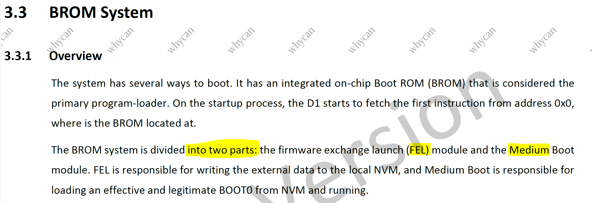
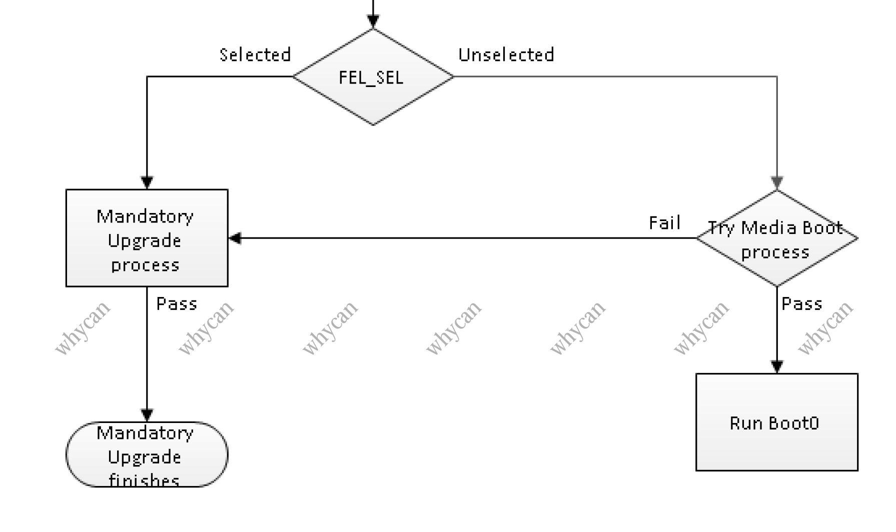
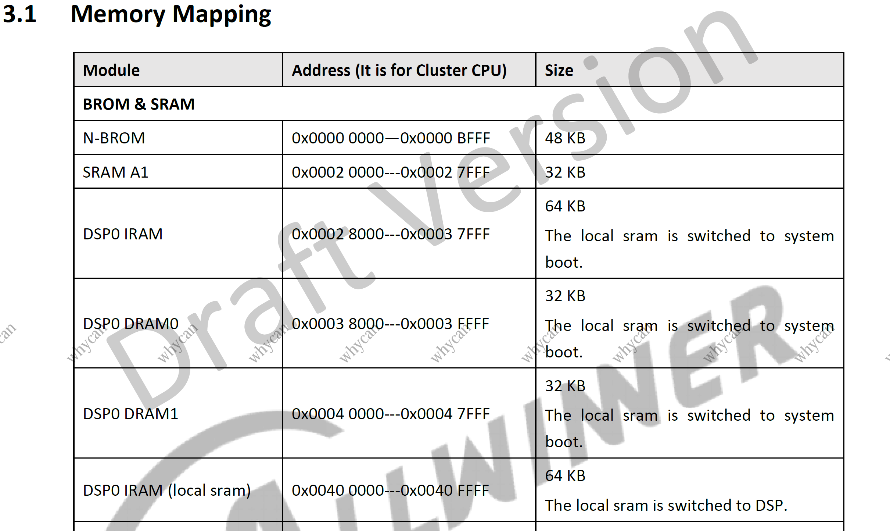
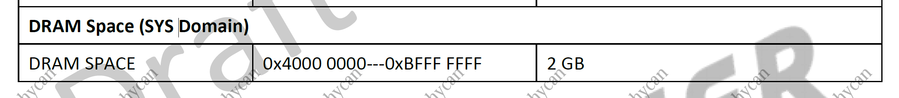
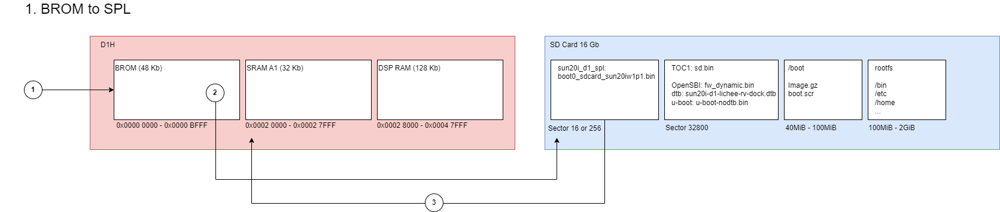
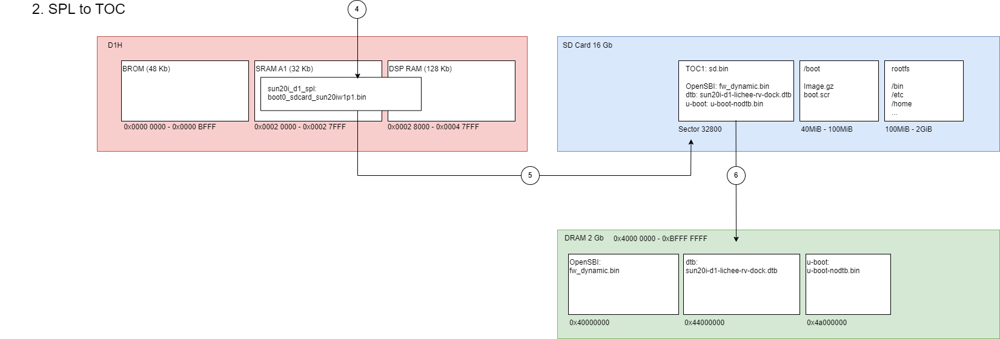
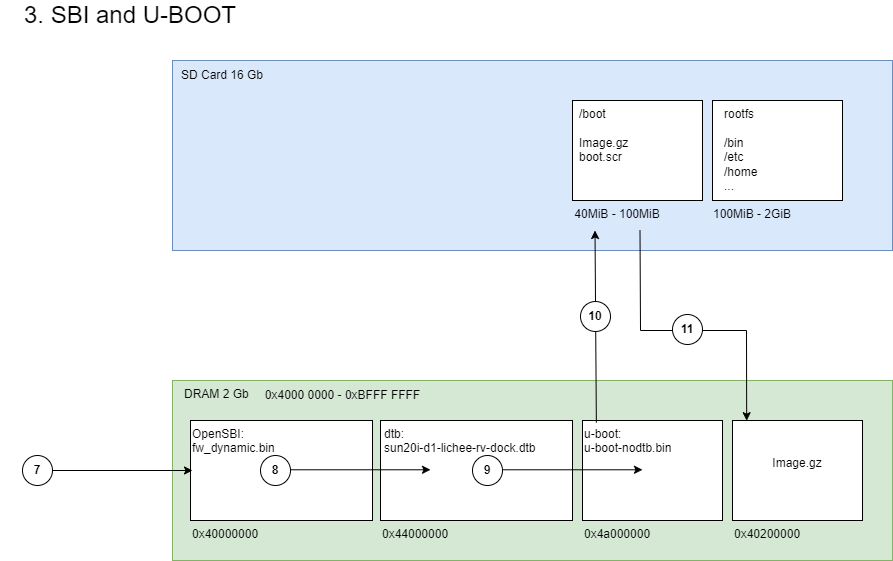
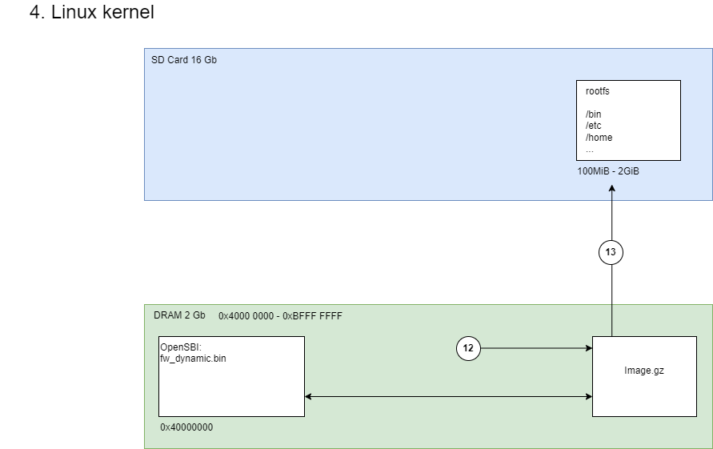
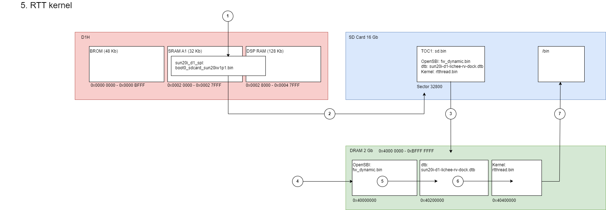

# Boot process

Lets figure out how Allwinner D1H booting.<br> 
In this chapter firstly we will look to Booting ROM, existing bootloaders best practice in example with Linux and RT-Thread, also looks to JTAG and GDB debugging.

Based on information from this articles:
* https://linux-sunxi.org/Allwinner_Nezha
* https://fedoraproject.org/wiki/Architectures/RISC-V/Allwinner
* https://andreas.welcomes-you.com/boot-sw-debian-risc-v-lichee-rv/

## BROM

D1H startup from Booting ROM or BROM. This could be considered the primary program-loader.<br>

So looking to the D1H User manual [D1_User_Manual_V0.1_Draft_Version.pdf](Allwinner_D1H/D1_User_Manual_V0.1_Draft_Version.pdf)<br>

 

We have two mode of booting: FEL and Media boot.

1. FEL is mode when D1H became special USB device communicate with PC fel tools to execute commands or upload programs.<br>
2. Media boot support fallowing media:
    * SD card
    * eMMC
    * SPI NOR FLASH
    * SPI NAND FLASH

 

Entering to FEL mode could be through a special FEL button hold it during power-up OR if the BROM doesn't find any valid boot image.<br>
According memory layout:

 

BROM placed in N-BROM section 48 Kb<br>
First program will be executed in buildin SRAM A1 32 Kb starting from 0x0000_2000 + could be used 128 Kb of DSP RAM.

External DDR DRAM space is 2 Gb starting from 0x4000_0000:

 

Is good articale about BROM https://linux-sunxi.org/BROM and deassembling of BROM https://github.com/hno/Allwinner-Info/blob/master/BROM/ffff4000.s

## FEL

Lets look in detail about FEL mode.<br>
First install FEL tools to PC, I use xfel:
```sh
$ git clone https://github.com/xboot/xfel
$ cd xfel
$ make 
$ make install
```
Then connect D1H board by USB to PC.<br> 
If device have FEL button (Sipeed Lichee RV) press and hold the FEL button then press RESET button to go to the FEL mode.
Or for device without FEL button (Clockwork Devterm) just don't insert boot SD card and press POWER button.<br>

To check if device successfully enter FEL mode execute command in host PC:
```sh
$ xfel version
AWUSBFEX ID=0x00185900(D1/F133) dflag=0x44 dlength=0x08 scratchpad=0x00045000
```
### How FEL works: 

FEL is actually communicate with BROM by special USB protocol, user can command FEL to do some:<br> 

1. FEL can execute some actions in chip like:
    ```sh
    $ xfel dump <address> <length>
    $ xfel reset
    ```
2. Or FEL could load build-in mini program to SRAM starting from 0x0000_2000 and execute.<br>

    For example to initialize external DDR DRAM need to execute command:
    ```sh
    $ xfel ddr d1
    ```  

    That actually will exec rogram with code this initialize clocks,uart and DDR DRAM:<br>
    * xfel\payloads\d1_f133\d1-ddr\source\sys-clock.c<br>
    * xfel\payloads\d1_f133\d1-ddr\source\sys-uart.c<br>
    * xfel\payloads\d1_f133\d1-ddr\source\sys-dram.c<br>
    
    In UART output (115200 baud rate) we could see debug about DRAM init:
    ```sh
    DRAM only have internal ZQ!!
    get_pmu_exist() = 4294967295
    ddr_efuse_type: 0x0
    [AUTO DEBUG] single rank and full DQ!
    ddr_efuse_type: 0x0
    [AUTO DEBUG] rank 0 row = 16
    [AUTO DEBUG] rank 0 bank = 8
    [AUTO DEBUG] rank 0 page size = 2 KB 
    DRAM BOOT DRIVE INFO: %s
    DRAM CLK = 792 MHz
    DRAM Type = 3 (2:DDR2,3:DDR3)        
    DRAMC ZQ value: 0x7b7bfb
    DRAM ODT value: 0x42.
    ddr_efuse_type: 0x0
    DRAM SIZE =1024 M
    DRAM simple test OK.
    ```
3. Or FEL could load user program to memory and execute.<br> 

### This is how we can run user program by FEL:

 

1. Init DDR DRAM:
```sh
$ xfel ddr d1
```  

2. Write program to DDR DRAM:
```sh
$ xfel write 0x4000000 app.bin 
```

3. Execute program:
```sh
$ xfel exec 0x4000000
```

This application for example can be N64 Cartridge Bus Emulator https://github.com/Hazematman/N64-Cart-Emulator<br>
Good article about FEL: https://linux-sunxi.org/FEL

## SD card boot

If FEL mode not activated BROM check media sources in default order SDcard > eMMC > SPI NOR FLASH >  SPI NAND FLASH <br>

BROM read from SD card two different locations:
* starting at sector 16
* starting at sector 256

(The location in sector 16 is incompatible with GPT partioning which by default uses 34 sectors. So it may be preferable to write boot0 starting at sector 256 instead)

Then BROM check if in this location present special eGON boot header.<br>
Take example of header from project https://github.com/peiyuanix/baremetal-lichee-rv/blob/c-language/mksunxiboot.c:
```c
typedef struct __attribute__((packed)) boot_file_head
{
	u32  jump_instruction;   // one intruction jumping to real code
	u8   magic[8];           // ="eGON.BT0" or "eGON.BT1",  not C-style string.
	u32  check_sum;          // generated by PC
	u32  length;             // generated by PC
	u32  pub_head_size;      // the size of boot_file_head_t
	u8   pub_head_vsn[4];    // the version of boot_file_head_t
	u8   file_head_vsn[4];   // the version of boot0_file_head_t or boot1_file_head_t
	u8   Boot_vsn[4];        // Boot version
	u8   eGON_vsn[4];        // eGON version
	u8   platform[8];        // platform information
} boot_file_head_t;

```
If header ok, load program from SD caed to SRAM 0x0000 2000 and execute.
This program size limited by SRAM size 32 Kb + DSP RAM 128 Kb<br>

 

1. Starting BROM
2. Scanning Sector 16 or 256 check eGON boot header.
3. Load program to memory  0x0000_2000

Good article about EGON header: https://linux-sunxi.org/EGON

## SPL

This program first time loaded from SD card by BROM, usually used as Secondary Program Loader.

Secondary Program Loader should do minimum:
* MCU Clock's for buses and peripheral
* UART output for debugging
* Initilyze DDR DRAM where main program/kernel will be executed
* Load program/kernel from SDcard/Flash to DRAM and handover execution

As SPL can be used U-BOOT that compatible to run Linux karnel.

lates U-BOOT include eGON header support https://github.com/smaeul/u-boot d1-wip branch.
But as for RT-thread U-BOOT not needed so I will use old approach: Samuel Holland SPL and old U-BOOT. More in https://linux-sunxi.org/Allwinner_Nezha.

So how to use Samuel Holland SPL. <br>
First install riscv compiler. I use t-head patched gcc:

```sh
TOOLCHAIN_INSTALL_DIR ?= $(shell pwd)/toolchain
wget -P $(TOOLCHAIN_INSTALL_DIR) https://github.com/YuzukiHD/sunxi-bsp-toolchains/releases/download/1.0.0/riscv64-glibc-gcc-thead_20200702.tar.xz
tar -C $(TOOLCHAIN_INSTALL_DIR) -xf $(TOOLCHAIN_INSTALL_DIR)/riscv64-glibc-gcc-thead_20200702.tar.xz

RISCV64_GLIBC_GCC_DIR = $(TOOLCHAIN_INSTALL_DIR)/riscv64-glibc-gcc-thead_20200702
RISCV64_GLIBC_GCC_BIN = $(RISCV64_GLIBC_GCC_DIR)/bin/riscv64-unknown-linux-gnu-
```

Complie SPL:
```sh
git clone https://github.com/smaeul/sun20i_d1_spl.git
cd sun20i_d1_spl
make CROSS_COMPILE=$(RISCV64_GLIBC_GCC_BIN) p=sun20iw1p1 mmc
```

Flash to SD card:
```sh
sudo dd if=sun20i_d1_spl/nboot/boot0_sdcard_sun20iw1p1.bin of=/dev/sdX bs=8192 seek=16
```
Sector 256 = (8192 * 16) / 512

Ok when we power board BROM load SPL from SDcard check eGON header and execute SPL.<br>
Then SPL initialize clocks, uart, and DDR DRAM. <br> 

UART output:
```sh
[158]HELLO! BOOT0 is starting!
[161]BOOT0 commit : 0ad88bf
[163]set pll start
[165]periph0 has been enabled
[168]set pll end
[170]board init ok
[172]DRAM only have internal ZQ!!
[175]get_pmu_exist() = -1
[177]ddr_efuse_type: 0x0
[180][AUTO DEBUG] single rank and full DQ!
[184]ddr_efuse_type: 0x0
[187][AUTO DEBUG] rank 0 row = 16
[190][AUTO DEBUG] rank 0 bank = 8
[193][AUTO DEBUG] rank 0 page size = 2 KB
[197]DRAM BOOT DRIVE INFO: V0.24
[200]DRAM CLK = 792 MHz
[202]DRAM Type = 3 (2:DDR2,3:DDR3)
[206]DRAMC ZQ value: 0x7b7bfb
[208]DRAM ODT value: 0x42.
[211]ddr_efuse_type: 0x0
[214]DRAM SIZE =1024 M
[217]DRAM simple test OK.
[220]dram size =1024
```

After this SPL trying to load from SD card Sector 32800 special TOC1 image and upload application from TOC to DDR memory. 

UART output:
```sh

[222]card no is 0
[223]sdcard 0 line count 4
[226][mmc]: mmc driver ver 2021-04-2 16:45
[235][mmc]: Wrong media type 0x0
[238][mmc]: ***Try SD card 0***
[256][mmc]: HSSDR52/SDR25 4 bit
[258][mmc]: 50000000 Hz
[261][mmc]: 15193 MB
[263][mmc]: ***SD/MMC 0 init OK!!!***
[312]Loading boot-pkg Succeed(index=1).
[315]Entry_name        = opensbi
[318]Entry_name        = dtb
[321]Entry_name        = u-boot
[324]Adding DRAM info to DTB.
[329]Jump to second Boot.
```

TOC1 image can include:

1. OpenSBI, which runs in machine mode and provides a standard "SBI" interface to less privileged modes. Is like system call wrapper between M machine mode and S system mode.
2. DTB file is binary representation of DTS is Linux Device Tree Source file that describes the system's hardware layout. DTB used by OpenSBI to determine platform.
3. U-Boot which initializes additional hardware and loads Linux from storage or the network.

 

4. Run SPL
5. Check Sector 32800 for TOC1 image
6. Load TOC1 image to memory

## OpenSBI and U-BOOT

As described before TOC1 image could include OpenSBI, DTB, U-Boot. Lets compile this stuff.

OpenSBI:
```sh
$ git clone https://github.com/riscv-software-src/opensbi
$ cd opensbi
$ make CROSS_COMPILE=$(RISCV64_GLIBC_GCC_BIN) PLATFORM=generic FW_PIC=y FW_OPTIONS=0x2
```

U-Boot:
```sh
$ git clone https://github.com/smaeul/u-boot -b d1-2022-04-05
$ cd u-boot
$ make CROSS_COMPILE=$(RISCV64_GLIBC_GCC_BIN) lichee_rv_defconfig
$ make CROSS_COMPILE=$(RISCV64_GLIBC_GCC_BIN) ARCH=riscv OPENSBI=opensbi/build/platform/generic/firmware/fw_dynamic.bin
```

Create TOC1 image configuration defined what binary should be included and what address in DDR memory should be used.<br>
toc1.cfg:
```conf
[opensbi]
file = opensbi/build/platform/generic/firmware/fw_dynamic.bin
addr = 0x40000000
[dtb]
file = u-boot/arch/riscv/dts/sun20i-d1-lichee-rv-dock.dtb
addr = 0x44000000
[u-boot]
file = u-boot/u-boot-nodtb.bin
addr = 0x4a000000
```

To create TOC1 image need to use u-boot tool mkimage:
```sh
$ u-boot/tools/mkimage -T sunxi_toc1 -d toc1.cfg sd.bin
```

Then flash it ti SDcard:
```sh
$ dd if=sd.bin of=/dev/sdX bs=512 seek=32800
```

In Linux boot partition need to be present:
* Image.gz - Linux kernel
* boot.scr - Script for U-boot

Where boot.scr will generated from bootscr.txt file:
```sh
echo "Loading kernel from mmc 0:1 to address $kernel_addr_r"
load mmc 0:1 ${kernel_addr_r} Image.gz
setenv bootargs "earlycon=sbi console=ttyS0,115200n8 root=/dev/mmcblk0p2 rootwait cma=96M"
echo "Booting kernel with bootargs as $bootargs; and fdtcontroladdr is $fdtcontroladdr"
setenv kernel_comp_addr_r "0x44000000"
setenv kernel_comp_size "0xb000000"
booti ${kernel_addr_r} - ${fdtcontroladdr}
```

To generate boot.scr need to use u-boot tool mkimage:
```sh
u-boot/tools/mkimage -T script -O linux -d bootscr.txt boot.scr
```

So due booting process SPL jump to OpenSBI.<br>
<details><summary>UART output:</summary>

```sh
OpenSBI v0.9-188-gd78eef3
   ____                    _____ ____ _____
  / __ \                  / ____|  _ \_   _|
 | |  | |_ __   ___ _ __ | (___ | |_) || |
 | |  | | '_ \ / _ \ '_ \ \___ \|  _ < | |
 | |__| | |_) |  __/ | | |____) | |_) || |_
  \____/| .__/ \___|_| |_|_____/|____/_____|
        | |
        |_|

Platform Name             : Sipeed Lichee RV Dock
Platform Features         : medeleg
Platform HART Count       : 1
Platform IPI Device       : aclint-mswi
Platform Timer Device     : aclint-mtimer @ 24000000Hz
Platform Console Device   : uart8250
Platform HSM Device       : ---
Platform Reboot Device    : sunxi-wdt-reset
Platform Shutdown Device  : ---
Firmware Base             : 0x40000000
Firmware Size             : 252 KB
Runtime SBI Version       : 0.3

Domain0 Name              : root
Domain0 Boot HART         : 0
Domain0 HARTs             : 0*
Domain0 Region00          : 0x0000000014008000-0x000000001400bfff (I)
Domain0 Region01          : 0x0000000014000000-0x0000000014007fff (I)
Domain0 Region02          : 0x0000000040000000-0x000000004003ffff ()
Domain0 Region03          : 0x0000000000000000-0xffffffffffffffff (R,W,X)
Domain0 Next Address      : 0x000000004a000000
Domain0 Next Arg1         : 0x0000000044000000
Domain0 Next Mode         : S-mode
Domain0 SysReset          : yes

Boot HART ID              : 0
Boot HART Domain          : root
Boot HART ISA             : rv64imafdcvsux
Boot HART Features        : scounteren,mcounteren,mcountinhibit,time
Boot HART PMP Count       : 16
Boot HART PMP Granularity : 2048
Boot HART PMP Address Bits: 38
Boot HART MHPM Count      : 0
Boot HART MIDELEG         : 0x0000000000000222
Boot HART MEDELEG         : 0x000000000000b109
```
</details>
<br>
OpenSBI then jump to U-Boot.<br>
When U-boot loaded is will try to found boot partition and execute boot.scr script.<br>
U-boot will check that Image.gz have special booting image header. Then load Linux kernel to DDR memory.<br>
<details><summary>UART output:</summary>

```sh
U-Boot 2022.04-rc2-33696-gac8ca120a5 (Mar 05 2022 - 15:05:03 +0100)

CPU:   rv64imafdc
Model: Sipeed Lichee RV Dock
DRAM:  1 GiB
sunxi_set_gate: (CLK#24) unhandled
Core:  43 devices, 18 uclasses, devicetree: board
WDT:   Started watchdog@6011000 with servicing (16s timeout)
MMC:   mmc@4020000: 0, mmc@4021000: 1
Loading Environment from nowhere... OK
In:    serial@2500000
Out:   serial@2500000
Err:   serial@2500000
Net:   No ethernet found.
Hit any key to stop autoboot:  0 
switch to partitions #0, OK
mmc0 is current device
Scanning mmc 0:1...
Found U-Boot script /boot.scr
469 bytes read in 1 ms (458 KiB/s)
## Executing script at 4fc00000
Loading kernel from mmc 0:1 to address 0x40200000
8096384 bytes read in 1401 ms (5.5 MiB/s)
Booting kernel with bootargs as earlycon=sbi console=ttyS0,115200n8 root=/dev/mmcblk0p2 rootwait cma=96M; and fdtcontroladdr is 7faffd70
   Uncompressing Kernel Image
## Flattened Device Tree blob at 7faffd70
   Booting using the fdt blob at 0x7faffd70
   Loading Device Tree to 0000000049ff6000, end 0000000049fff07e ... OK

Starting kernel ...

[    0.000000] Linux version 5.17.0-rc2-379425-g06b026a8b714-dirty (yury@yury) (riscv64-unknown-linux-gnu-gcc (C-SKY RISCV Tools V1.8.4 B20200702) 8.1.0, GNU ld (GNU Binutils) 2.32) #20 PREEMPT Mon Sep 9 07:05:32 UTC 2024
```
</details>
<br>
 

7. Start SBI
8. Load DTB
9. Start U-BOOT
10. Find boot partition and boot.scr
11. Load Linux image

## Linux kernel

After Linux kernel stared is mount root fs partition from SDcard.<br>
Linux kernel work in S System mode and interacts with OpenSBI that work in M Machine mode.

 

12. Starting kernel
13. Load root fs

## How to compile Linux kernel byself

According article https://andreas.welcomes-you.com/boot-sw-debian-risc-v-lichee-rv we can download precompiled image:

```sh
$ wget https://andreas.welcomes-you.com/media/files/licheerv-bootsw-linux-kernel_2022-03-07.tgz
$ tar -xvzf licheerv-bootsw-linux-kernel_2022-03-07.tgz
```

That archive contain all files needed for booting:
* sun20i_d1_spl
* linux-build    
* boot.scr  
* u-boot.toc1

And root fs:
```sh
$ wget  https://andreas.welcomes-you.com/media/files/licheerv-debian-rootfs_2022-03-11.tar.xz
```

To compile Linux kernel from source:
```sh
$ git clone https://github.com/smaeul/linux sunxi-linux -t d1-wip-v5.17-rc2
$ make ARCH=riscv -C sunxi-linux/ O=$PWD/linux-build licheerv_defconfig
$ make -j `nproc` -C linux-build ARCH=riscv CROSS_COMPILE=$(RISCV64_GLIBC_GCC_BIN)
```

To create SDcard:
```sh
$ parted -s -a optimal -- /dev/sdX mklabel gpt
$ parted -s -a optimal -- /dev/sdX mkpart primary ext2 40MiB 100MiB    
$ parted -s -a optimal -- /dev/sdX mkpart primary ext4 100MiB -2GiB    
$ parted -s -a optimal -- /dev/sdX mkpart primary linux-swap -2GiB 100%

$ mkfs.ext2 /dev/sdXp1
$ mkfs.ext4 /dev/sdXp2
$ mkswap    /dev/sdXp3

$ dd if=sun20i_d1_spl/nboot/boot0_sdcard_sun20iw1p1.bin of=/dev/sdX bs=8192 seek=16
$ dd if=u-boot.toc1 of=/dev/sdX bs=512 seek=32800

$ mkdir -p /mnt/sdcard_boot
$ mkdir -p /mnt/sdcard_rootfs

$ mount /dev/sdXp1 /mnt/sdcard_boot
$ cp ../linux-build/arch/riscv/boot/Image.gz /mnt/sdcard_boot
$ cp boot.scr /mnt/sdcard_boot

$ mount /dev/sdXp2 /mnt/sdcard_rootfs
$ tar xfJ licheerv-debian-rootfs_2022-03-11.tar.xz -C /mnt/sdcard_rootfs

$ umount /mnt/sdcard_boot
$ umount /mnt/sdcard_rootfs
```

The login for Linux via ssh is rv/licheerv and via serial interface root/rootpwd.

## Booting RT-Thread kernel

RT-Thread use OpenSBI for syscals so is needed to be in SDcard.<br>
U-boot is not nessesery, also U-boot check for Linux booting image header that absent in RTT image so we just not use U-boot.<br>
So lets create TOC1 image where instead U-boot used RTT kernel image:

toc1_D1H.cfg file:

```conf
[opensbi]
file = opensbi/build/platform/generic/firmware/fw_dynamic.bin
addr = 0x40000000
[dtb]
file = u-boot/arch/riscv/dts/sun20i-d1-lichee-rv-dock.dtb
addr = 0x40200000
[u-boot]
file = rt-thread/bsp/allwinner/d1s/rtthread.bin
addr = 0x40400000
```

Flash SDcard:
```sh
$ u-boot/tools/mkimage -T sunxi_toc1 -d toc1_D1H.cfg sd.bin
$ sudo dd if=sun20i_d1_spl/nboot/boot0_sdcard_sun20iw1p1.bin of=/dev/sdX bs=8192 seek=16
$ sudo dd if=sd.bin of=/dev/sdX bs=512 seek=32800
```

UART output:
```sh
 \ | /
- RT -     Thread Smart Operating System
 / | \     5.0.2 build Jun  9 2024 17:11:05
 2006 - 2022 Copyright by RT-Thread team
hal_sdc_create 0
card_detect insert
Initial card success. capacity :15200MB
sdmmc bytes_per_secotr:200, sector count:1db0000
not found partition of mbr, construct sd0 at offset 8M, size:0xffffffffb5800000
[D/FAL] (fal_flash_init:47) Flash device |                  sdcard0 | addr: 0x00000000 | len: 0xb6000000 | blk_size: 0x00000200 |initialized finish.
[I/FAL] ==================== FAL partition table ====================
[I/FAL] | name       | flash_dev |   offset   |    length  |
[I/FAL] -------------------------------------------------------------
[I/FAL] | download   | sdcard0   | 0x00800000 | 0x00800000 |
[I/FAL] | easyflash  | sdcard0   | 0x01000000 | 0x00100000 |
[I/FAL] | filesystem | sdcard0   | 0x01100000 | 0x00c00000 |
[I/FAL] =============================================================
[I/FAL] RT-Thread Flash Abstraction Layer initialize success.
Hello RISC-V
msh />Mount "sd0p0" on "/" fail
msh />
msh />
```

 

1. Run SPL
2. Check Sector 32800
3. Load TOC1 image to memory
4. Start OpenSBI
5. Load DTB
6. Start RTT
7. load bin partition with applications

Usefull articles:

https://github.com/RT-Thread/rt-thread/blob/master/bsp/allwinner/d1s/README-M7.md
https://github.com/RT-Thread/rt-thread/blob/master/bsp/allwinner/d1s/README-MQ.md
https://club.rt-thread.org/ask/article/389ac36250b57737.html

## Debbuging GDB via JTAG

Allwinner D1H have JTAG pins that could be handled by CKLink adaper and T-Head-DebugServer that will route data to GDB.<br>
So instead usually used OpenOCD I use T-Head-DebugServer software.<br>
CKLink hardware quite expensive it could be replaced by Sipeed RV-Debugger or even STM32F103 with special firmware https://github.com/cjacker/cklink-lite-fw-convertor.<br>
Problem that JTAG pins mapped to the same pins as used for SDcard so I use MicroSD breakout board to connect this pins to Sipeed RV-Debugger (will explain all needed hardware modifiactions in other chapter).<br>

Install T-Head-DebugServer:
```sh
wget https://occ-oss-prod.oss-cn-hangzhou.aliyuncs.com/resource//1666331533949/T-Head-DebugServer-linux-x86_64-V5.16.5-20221021.sh.tar.gz
tar -xvzf T-Head-DebugServer-linux-x86_64-V5.16.5-20221021.sh.tar.gz 
T-Head-DebugServer-linux-x86_64-V5.16.5-20221021.sh -i
```

As now we will don't have SDcard, need to do work that SPL do:
- init DDR
- Load OpenSBI, DTB, Kernel to DDR
- and also configure pins to JTAG

Execute commands:

```sh
xfel ddr d1
xfel jtag
T-HEAD_DebugServer/DebugServerConsole.elf&
$(RISCV64_GLIBC_GCC_BIN)gdb -x .gdbinit
```

Where in .gdbinit defined:

1. Connection to T-HEAD_DebugServer
```conf
target remote localhost:1025
```

2. Define addresses in memory
```conf
set $opensbi_addr = 0x40000000
set $dtb_addr = 0x40200000
set $kernel_addr = 0x40400000
set $dyninfo_addr = 0x43000000
```

3. Load binnary
```conf
restore bootloaders/opensbi/build/platform/generic/firmware/fw_dynamic.bin binary $opensbi_addr
restore build/sun20i-d1-lichee-rv-dock.dtb binary $dtb_addr
restore rt-thread/bsp/allwinner/d1s_d1h/rtthread.bin binary $kernel_addr
```

4. Load elf for symbols information
```conf
file rt-thread/bsp/allwinner/d1s_d1h/rtthread.elf
```

Was used OpenSBI Firmware with Dynamic Information (FW_DYNAMIC). Nedd to proped init this firmware due GDB session.

https://github.com/riscv-software-src/opensbi/blob/master/docs/firmware/fw_dynamic.md :
"Is a firmware which gets information about next booting stage (e.g. a bootloader or an OS) and runtime OpenSBI library options from previous booting stage. The previous booting stage will pass information to FW_DYNAMIC by creating struct fw_dynamic_info in memory and passing its address to FW_DYNAMIC via a2 register of RISC-V CPU."

https://github.com/riscv-software-src/opensbi/blob/master/docs/firmware/fw.md:
"The previous booting stage will pass information via the following registers of RISC-V CPU:
* hartid via a0 register
* device tree blob address in memory via a1 register. The address must be aligned to 8 bytes."

5. Add fw_dynamic_info and load a0 a1 a2 

```conf
#Set opensbi dynamic info param
#- Magic
#- Version
#- Next booting stage address
#- Next booting stage mode 1 - S, 3 - M
#- Options for OpenSBI library 
#- boot_hart

set $a0 = 0
set $a1 = $dtb_addr
set *(unsigned long *)($dyninfo_addr)      = 0x4942534f
set *(unsigned long *)($dyninfo_addr + 8)  = 2
set *(unsigned long *)($dyninfo_addr + 16) = $kernel_addr
set *(unsigned long *)($dyninfo_addr + 24) = 1
set *(unsigned long *)($dyninfo_addr + 32) = 0
set *(unsigned long *)($dyninfo_addr + 40) = 0
set $a2 = $dyninfo_addr
```

Also with default config OpenSBI will not output debug information to UART but instead try to put it to GDB.<br>
I figureout that if change CONFIG_SERIAL_SEMIHOSTING to not set then is start work properly, out to UART.

6. Change OpenSBI config and re-compile
comment #CONFIG_SERIAL_SEMIHOSTING in bootloaders/opensbi/build/platform/generic/kconfig/.config

7. Finnaly set brakepoint and jump to OpenSBI

```conf
b rt_hw_uart_init
j *$opensbi_addr
```

Now we can debug code execution. Problem that in RTT we can easely debug in GDB board initialisation but after this mostly all stuff done inside threads. GDB could operate with Linux threads, I can't figure out how to configure to debug RTT threads.

```sh
GNU gdb (C-SKY RISCV Tools V1.8.4 B20200702) 8.2.50.20190202-git
Copyright (C) 2019 Free Software Foundation, Inc.
.
.
.
Breakpoint 1 at 0x4040660a: file /mnt/hgfs/allwinner_d1/RT-Thread-on-Allwinner-D1H/rt-thread/bsp/allwinner/libraries/drivers/drv_uart.c, line 1029.
Breakpoint 1, rt_hw_uart_init () at /mnt/hgfs/allwinner_d1/RT-Thread-on-Allw
   inner-D1H/rt-thread/bsp/allwinner/libraries/drivers/drv_uart.c:1029
1029    {
(gdb) i r
ra             0x4044d954       0x4044d954 <rt_hw_board_init+146>
sp             0x4053a760       0x4053a760
gp             0x4052a960       0x4052a960 <sun8iw20_hw_clks+920>
```

Usefull articles:
- https://github.com/orangecms/RV-Debugger-BL702/tree/nezha
- https://github.com/bouffalolab/bouffalo_sdk/tree/master/tools/cklink_firmware
- https://gist.github.com/btashton/6af120ff16d6beeccbbde74e6733535c
- https://github.com/cjacker/cklink-lite-fw-convertor
- https://github.com/XUANTIE-RV/zero_stage_boot/tree/master